## If an Agent Can Only Search the Web, It Is Still One Step Away from the Real World

Many trends today no longer begin with official announcements, press releases, or research reports.

A new consumer product may first gain traction on Xiaohongshu. An AI hardware device may first be torn down on Douyin. An overseas app may first break out on TikTok. A brand crisis may first brew in comment sections. Whether a new product is truly popular may depend more on e-commerce reviews and local service feedback than on a single media report.

That is why QVeris integrated TikHub: to help agents understand public signals from content platforms.

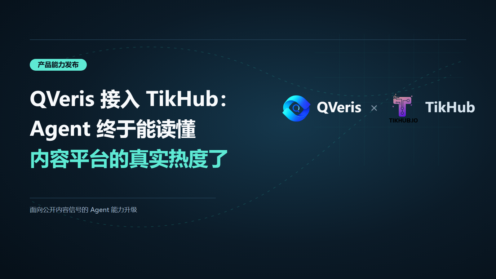

In the past, agents were good at answering questions like “What does this company do?”, “When was this product released?”, or “What news is there about this industry?” But when users ask more specific questions, such as “Where exactly is this trend taking off?”, “Who is driving the conversation?”, “What is the real user feedback?”, or “Has short-video momentum carried over into product sales and reviews?”, ordinary web search is not enough.

TikHub fills precisely this layer of fresher, more fragmented data that is closer to real user behavior.

> After QVeris integrates TikHub, agents can move beyond “searching for information” toward “understanding platforms”: looking at accounts, videos, notes, comments, products, engagement metrics, and how a topic moves across different platforms.

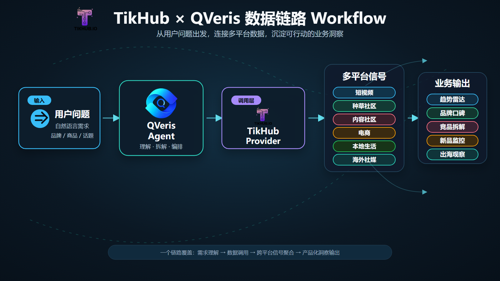

## TikHub Brings More Than an API. It Brings a Map of Content Platforms

What makes TikHub distinctive is that it does not cover a single data type. It covers a broader content platform ecosystem. Short video, lifestyle discovery communities, content communities, overseas social media, e-commerce, and local service platforms have often been fragmented: operations teams look at Xiaohongshu, marketing teams look at Douyin, global expansion teams look at TikTok, product managers look at e-commerce reviews, and strategy teams manually piece everything together.

After the integration with QVeris, these public platform signals can be called, organized, and cross-analyzed by agents through unified workflows.

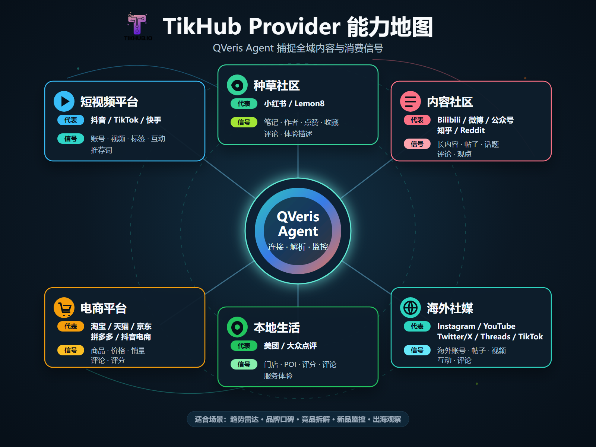

| Platform Type | Representative Platforms | What Agents Can Focus On | Typical Use Cases |
| --- | --- | --- | --- |
| Short-video platforms | Douyin, TikTok, Kuaishou, etc. | Accounts, videos, titles, tags, engagement, suggested terms, creator profiles | Trend tracking, viral content breakdowns, creator monitoring, content case libraries |
| Lifestyle discovery communities | Xiaohongshu, Lemon8, etc. | Notes, authors, likes, saves, comments, shares, user experience descriptions | Brand reputation, user feedback, consumer trends, content topic inspiration |
| Content communities | Bilibili, Weibo, WeChat Official Accounts, Zhihu, Reddit, etc. | Long-form content, posts, topics, comments, reposts, community discussions | Public opinion monitoring, deep discussion summaries, opinion thread analysis |
| E-commerce platforms | Taobao, Tmall, JD.com, Pinduoduo, Douyin E-commerce, etc. | Products, stores, prices, sales volume, reviews, ratings, new listings | New product research, competitor analysis, review mining, consumer feedback summaries |
| Local services | Meituan, Dianping, etc. | Stores, POIs, ratings, reviews, service experience, consumption scenarios | Urban consumption insights, store reputation, regional trend analysis |
| Overseas social media | Instagram, YouTube, Twitter/X, Threads, TikTok, etc. | Overseas accounts, videos, posts, engagement, comments, propagation rhythm | Global expansion trends, cross-platform diffusion, overseas user feedback |

---

## Short Video: Helping Agents Understand Where Momentum Comes From

Short-video platforms are often the first scene where today’s trends appear. Whether a product has viral potential, whether a topic is beginning to form a content template, and whether an account is influencing user judgment often show up first in video titles, tags, comments, and engagement data.

After integrating TikHub, QVeris agents can run more complete short-video analysis: search for relevant accounts, inspect public video lists, drill into video details, and then organize titles, tags, engagement, suggested terms, and creator profiles into a trend observation report.

For example, around the topic of “AI toys,” an agent can first find relevant creator and solution provider accounts, then enter public videos to observe whether the content concentrates on plush toys, voice interaction, movement modules, companion robots, children’s education, and related directions. If multiple videos show similar tags, it suggests this is not isolated content, but may already be forming a platform-level content narrative.

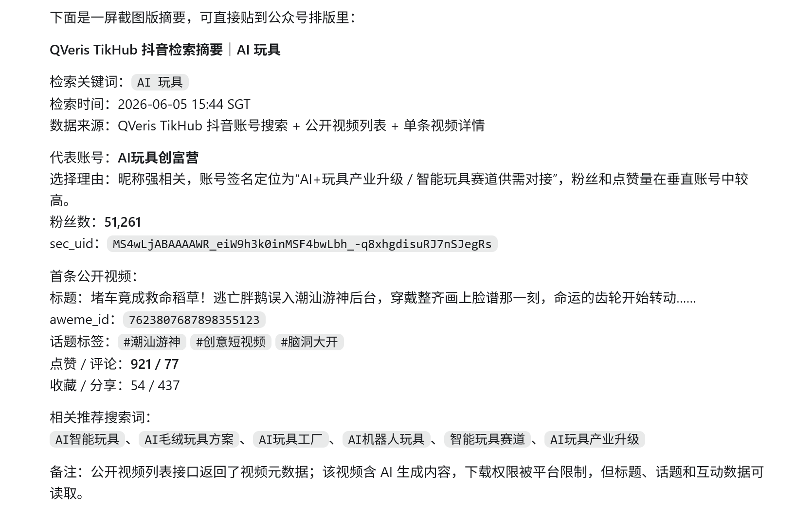

This capability is useful across content operations, brand marketing, investment research, and product teams. Operations teams can identify topics. Marketing teams can observe propagation paths. Product teams can see which features users care about. Investment teams can treat short-video signals as early trend indicators.

> The value of short-video data is not just “how many likes this video has.” It is that agents can judge who created the momentum, what themes it revolves around, and which words attract users.

---

## Lifestyle Discovery Communities: Helping Agents Understand Why Users Feel Drawn In

If short video acts more like an amplifier for trends, lifestyle discovery communities such as Xiaohongshu and Lemon8 act more like a magnifying glass for user emotion and real experience.

The same AI toy may be framed on short-video platforms as “cutting-edge tech,” a “companion robot,” or a “novel gift.” But in lifestyle discovery communities, users write in more specific terms: whether children are willing to play with it, whether voice interaction feels natural, whether battery life is enough, whether the price feels worthwhile, whether it ends up unused after purchase, and even whether it creates emotional dependence.

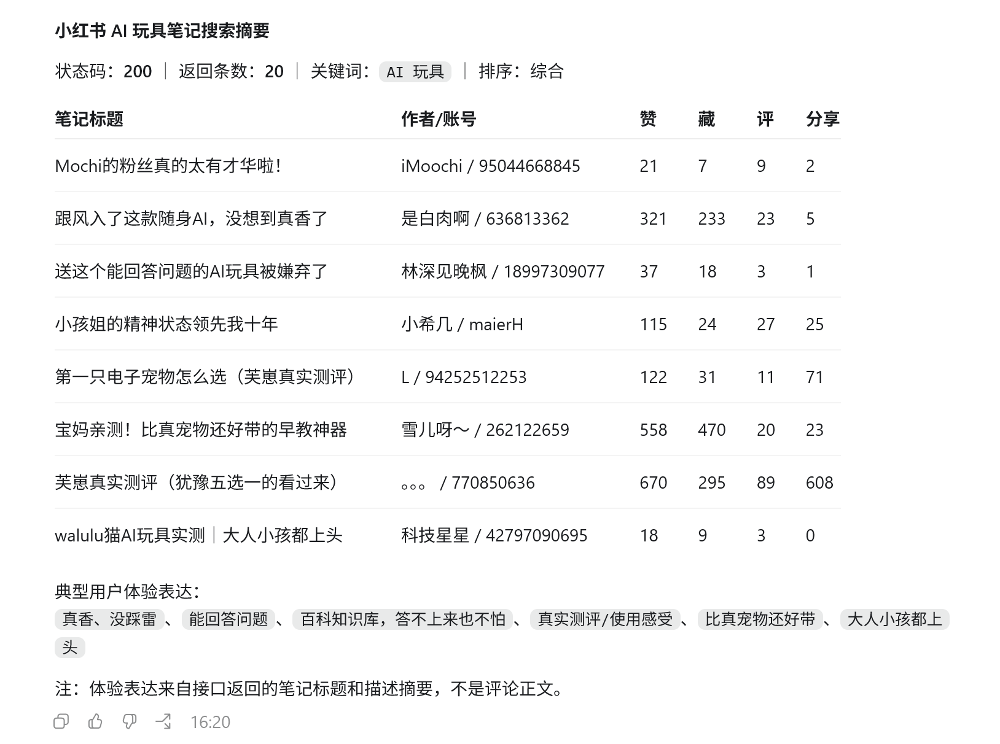

This content is critical for agents because it is not a cold list of product specifications. It is experience written by users in their own language. After QVeris integrates TikHub, agents can organize public note signals such as titles, authors, likes, saves, comments, shares, and body text clues into trend reports that are closer to the user’s point of view.

This is especially useful for brand and product teams. In the past, summarizing user feedback often meant manually reading many notes, taking screenshots, copying comments, and then relying on experience to classify them. Now agents can complete the first round of aggregation: which notes receive more attention, which experiences are repeatedly mentioned, which complaints may affect conversion, and which expressions are suitable as topics for the next round of content.

---

## Content Communities: Helping Agents See Not Just Buzz, but Depth of Discussion

Short video and lifestyle discovery communities often create momentum, but content communities and long-form platforms are often where a topic is fully unpacked.

Bilibili may have long-form video reviews. Weibo may contain event propagation chains. WeChat Official Accounts may publish industry analysis. Zhihu may host long Q&A threads. Reddit may contain real discussions from overseas users. What they share is higher content density, more complex viewpoints, and better suitability for agents to summarize, compare, and organize context.

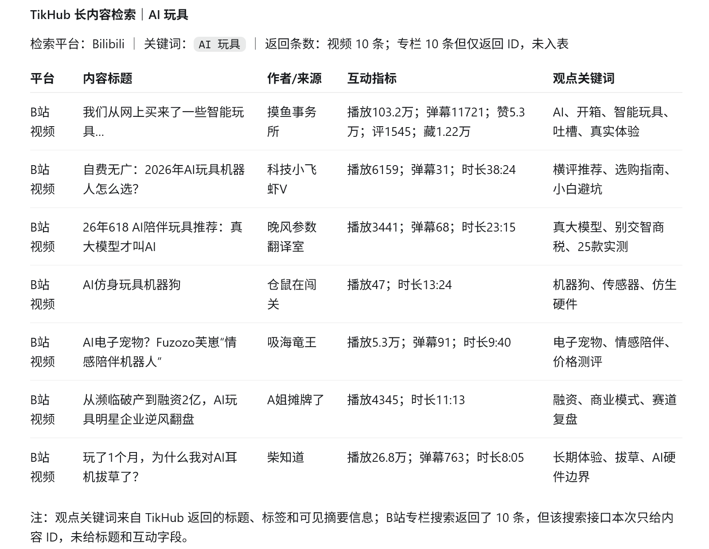

After integrating TikHub, QVeris can bring these public content platforms into the same analytical framework. For example, when a new product goes viral on Douyin, an agent can continue into content communities to look for longer reviews and debates. When an overseas trend appears on Reddit or YouTube, an agent can compare whether there is already corresponding discussion on domestic platforms. When a brand incident spreads on Weibo, an agent can analyze reposts, comments, and long-form viewpoints separately.

This means an agent’s output no longer stops at “the topic is very hot.” It can go further and answer: Does this momentum have depth of discussion? What are the reasons users support or oppose it? Which platform did the viewpoint start spreading from? Which pieces of content became propagation nodes?

---

## E-Commerce and Local Services: From “What People Are Talking About” to “How People Buy and Use It”

Many content trends eventually land in consumer behavior. Users may be inspired by short videos, do research on Xiaohongshu, and then place an order on an e-commerce platform or visit an offline store. Looking only at content platforms misses a final, critical step: whether users actually bought, and how they evaluated the experience afterward.

This is one of the most promising parts of TikHub for QVeris. E-commerce and local service data allow agents to trace content trends onward into products and consumption scenarios: whether products have already been listed, what the price band looks like, which issues appear frequently in reviews, whether store ratings are stable, and whether local service merchants are capturing this demand.

For consumer goods, new brands, local services, retail, and content commerce teams, this chain is highly practical. If a new product suddenly becomes popular on short-video platforms, an agent can first look at the propagation content, then examine Xiaohongshu experiences, and finally review e-commerce comments and store feedback. The result is not a “hot topic summary,” but a complete evidence chain from content to consumption.

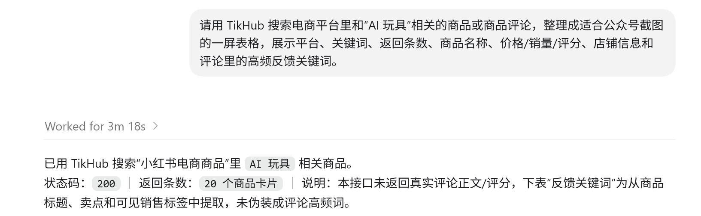

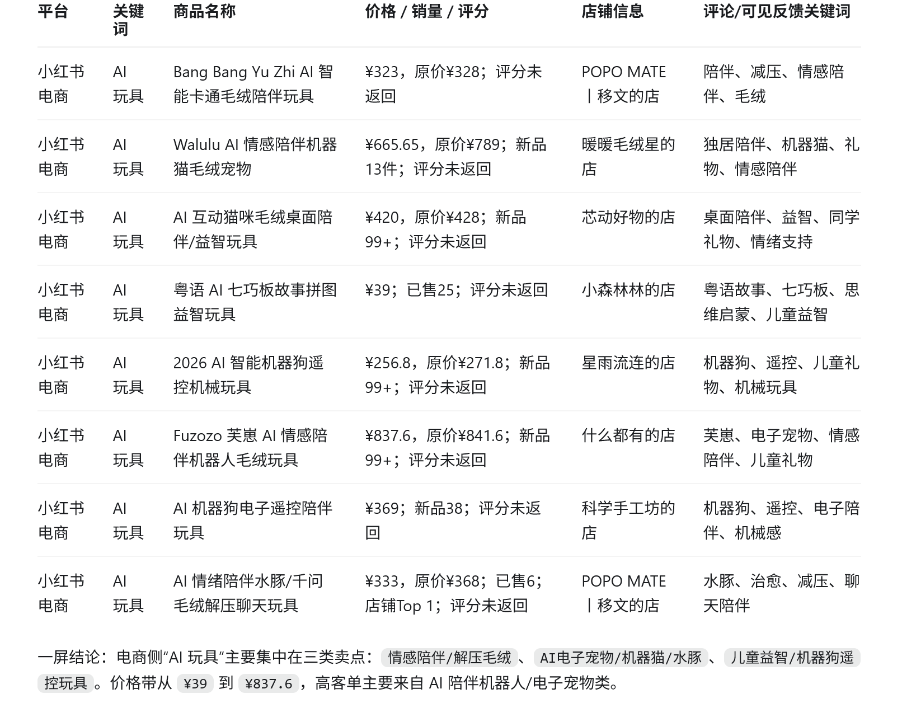

In the future, QVeris agents can combine these capabilities into more workflows: new product launch monitoring, competitor review analysis, price-band observation, negative review root-cause analysis, store reputation summaries, urban consumption trend observation, and more.

---

## Overseas Platforms: Helping Agents See Cross-Market Diffusion

Many trends do not stay within one country or one platform. AI products, new consumer brands, games, designer toys, film and television content, and creator challenges may first appear on overseas platforms and then flow back into the domestic market. They may also first form content templates domestically and then be reinterpreted by overseas creators.

TikHub’s coverage of overseas platforms gives QVeris agents the opportunity to bring public content signals from TikTok, Instagram, YouTube, Twitter/X, Threads, and other platforms into the same analysis process. Agents can compare how the same keyword takes shape across platforms: TikTok may lean toward short-video challenges, YouTube toward long-form reviews, Instagram toward visual posts, and Twitter/X toward opinion diffusion.

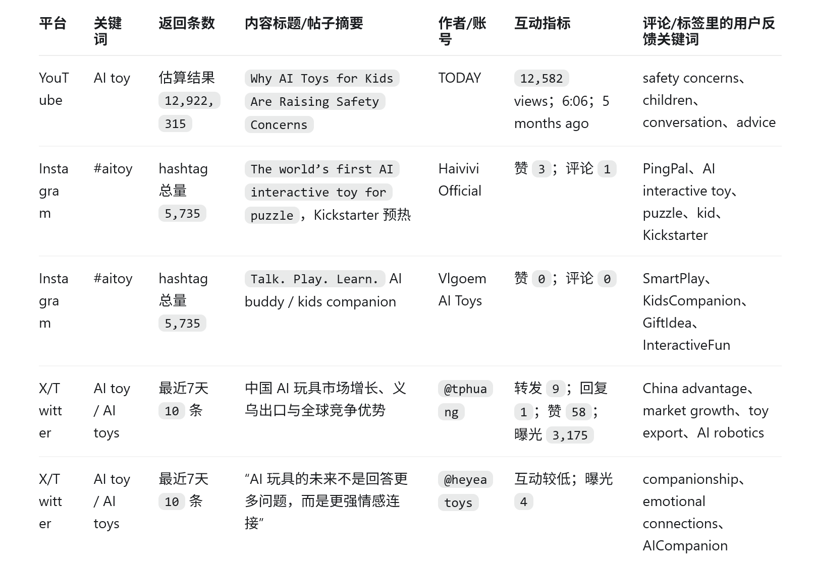

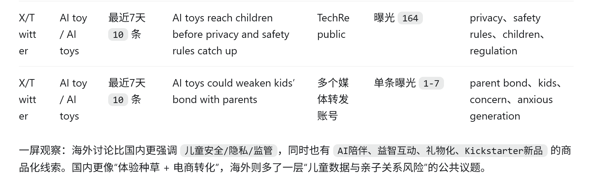

This is highly useful for global expansion teams. Whether a product is being discussed overseas is not just a matter of search result volume. It depends on how creators present it, how users comment, which platform has stronger engagement, and whether the content creates secondary propagation. If agents can organize these signals across platforms, they can produce overseas market observations faster.

---

## How QVeris Agents Can Use TikHub

After the TikHub integration, QVeris agents can build not just one-off queries, but a set of workflows that are closer to real business scenarios.

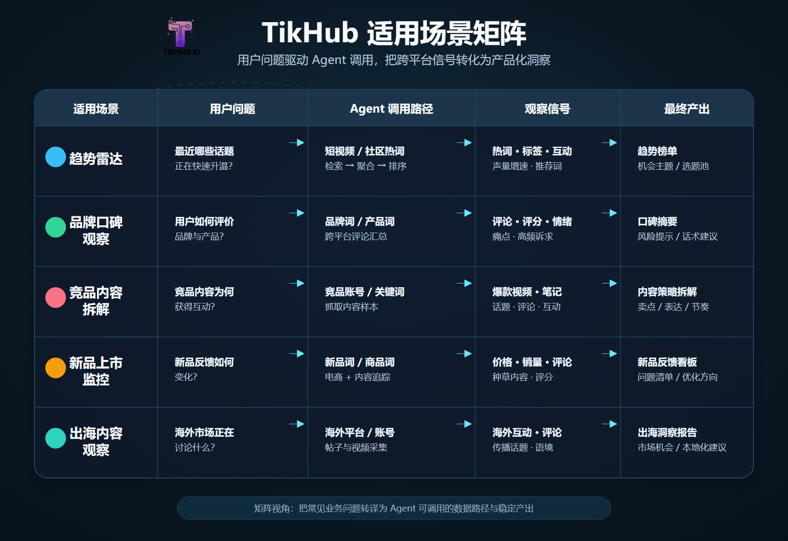

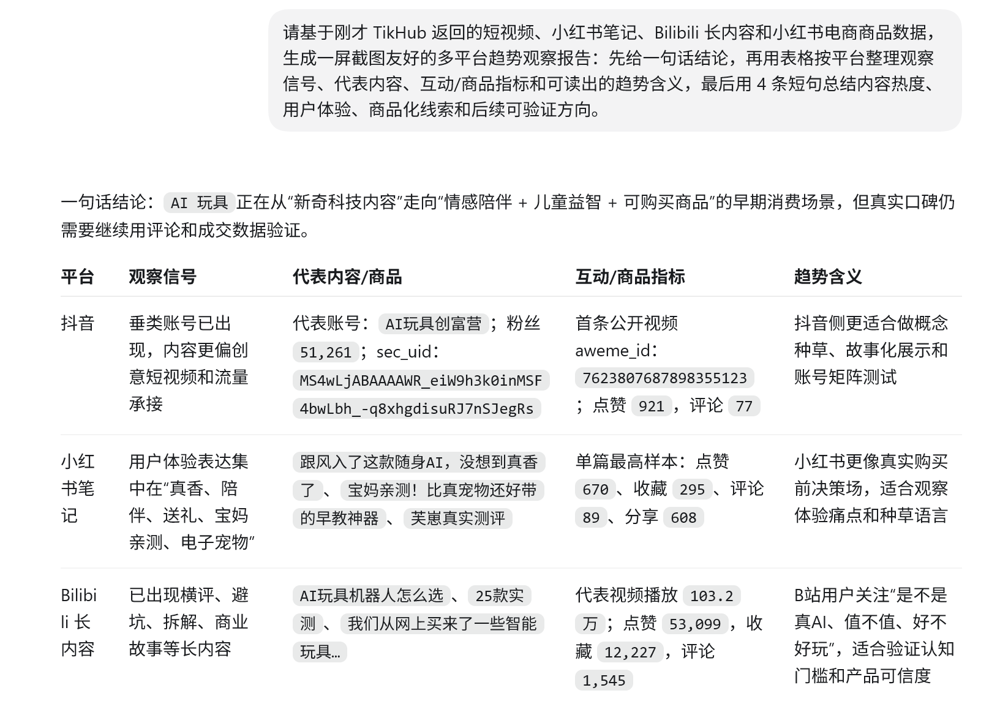

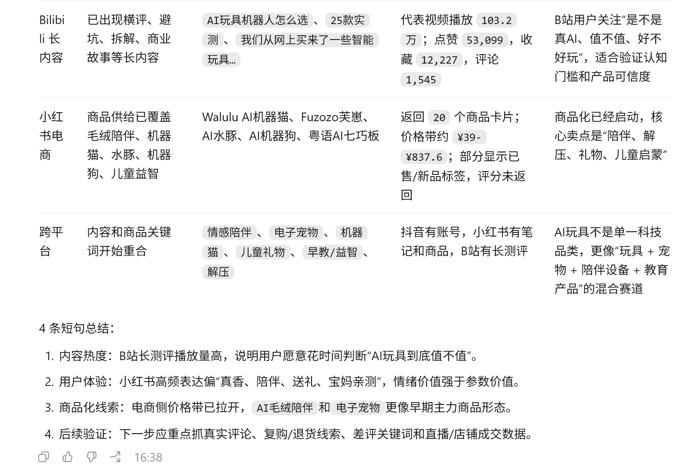

> For QVeris, TikHub matters because it brings agents one step closer to real users. It lets agents see how content appears, how it spreads, how it is discussed, and how it affects consumption, instead of staying limited to web summaries and static materials.

## Three Changes Worth Watching in This Integration

1. **Agents now have a broader data horizon**. They can expand from traditional web pages and structured data into short video, lifestyle discovery, communities, e-commerce, local services, and overseas social media.

1. **Agents now analyze more dynamic objects**. Not just companies, news, and reports, but also accounts, videos, notes, comments, products, stores, and user expressions.

1. **Agents now support more specific business scenarios**. They can serve use cases closer to everyday work, including content operations, brand marketing, consumer investment research, overseas market observation, competitor monitoring, and new product feedback.

If earlier agents were more like assistants for organizing materials, then after integrating TikHub, QVeris hopes to make agents more like observers of content platforms: able to enter the platform environment, capture real signals, and turn fragmented content into insights that users can apply directly.
