QVeris has integrated professional financial data interfaces to provide comprehensive data query capabilities for the A-share market. Below is an overview of the new tools and how to use them:

Basic Conventions

Before using any of the tools, please note the following common rules:  

- Stock codes: Use the unified format. Shanghai Stock Exchange tickers use the .SH suffix, such as 600519.SH; Shenzhen Stock Exchange tickers use the .SZ suffix, such as 000001.SZ. Tools that support batch queries accept up to 50 codes per request, separated by English commas.  

- Date formats: Three formats are supported: 20260414, 2026-04-14, and 2026/04/14. Any one of them can be used.  

- Numeric handling: All numeric values are automatically converted to floating-point numbers. Fields with no data return null.

I. Historical Stock Quotes -- Adjusted Price Query

Use cases: quantitative backtesting, long-term trend analysis, technical indicator calculation

Query historical price series adjusted for stock splits and dividends. For long-term analysis across dividend and ex-rights dates, adjusted prices remove price jumps caused by corporate actions, allowing you to see the true investment return curve.

Data available: daily open, high, low, close, price change, percentage change, volume, turnover, turnover rate, and adjustment factor.

How to Use

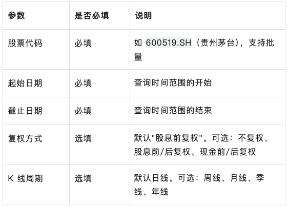

Adjustment Method Guide

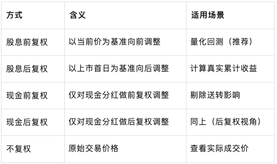

Example

**Query forward-adjusted daily data for Kweichow Moutai during the first 10 trading days of January 2025**:

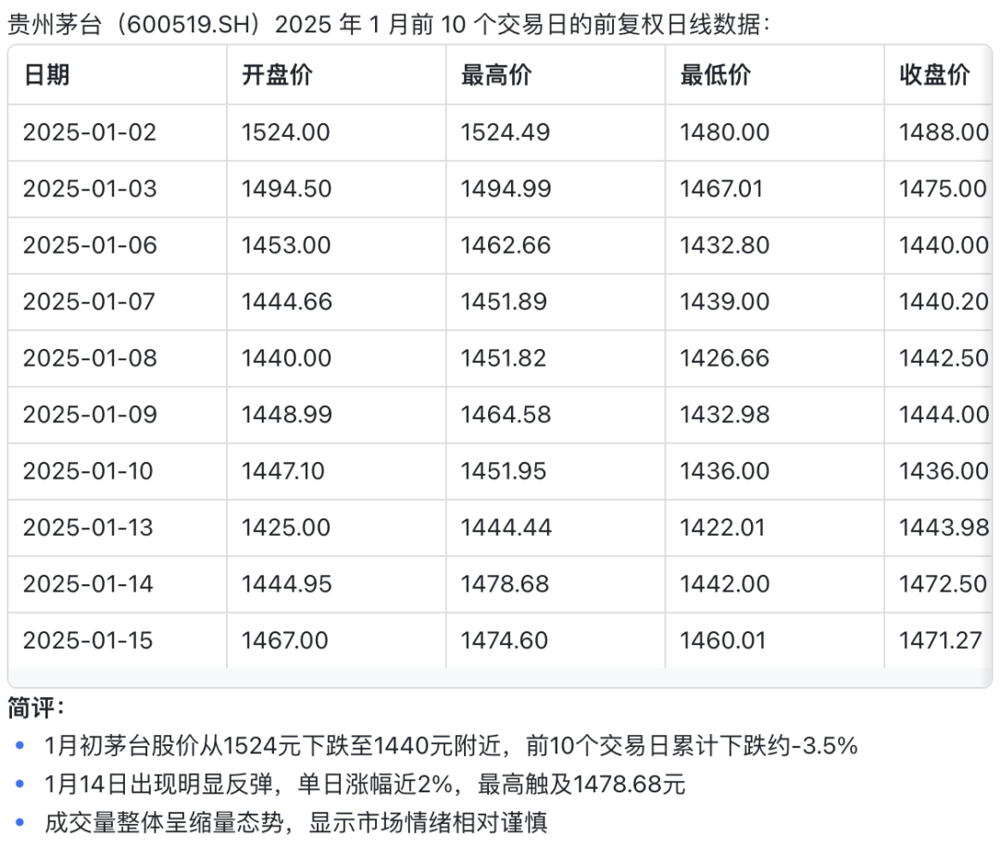

II. Gainers and Losers Rankings

Use cases: post-market review, hotspot discovery, market sentiment monitoring

Query the market-wide daily gainers list, losers list, and active stock rankings sorted by turnover, volume, or turnover rate. The tool covers roughly 5,500 A-shares across the Shanghai, Shenzhen, and Beijing stock exchanges, and supports filtering by exchange or sector.

Data available: stock code, name, latest price, percentage change, turnover, volume, turnover rate, total market capitalization, industry, and ranking.

How to Use

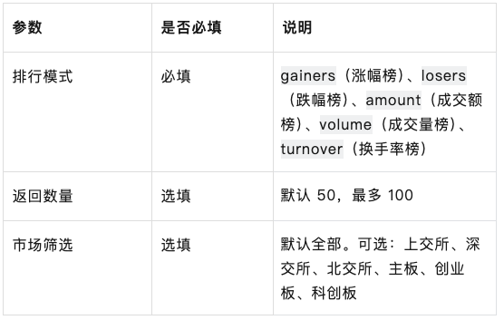

Example

**Query the top 10 ChiNext gainers today**:

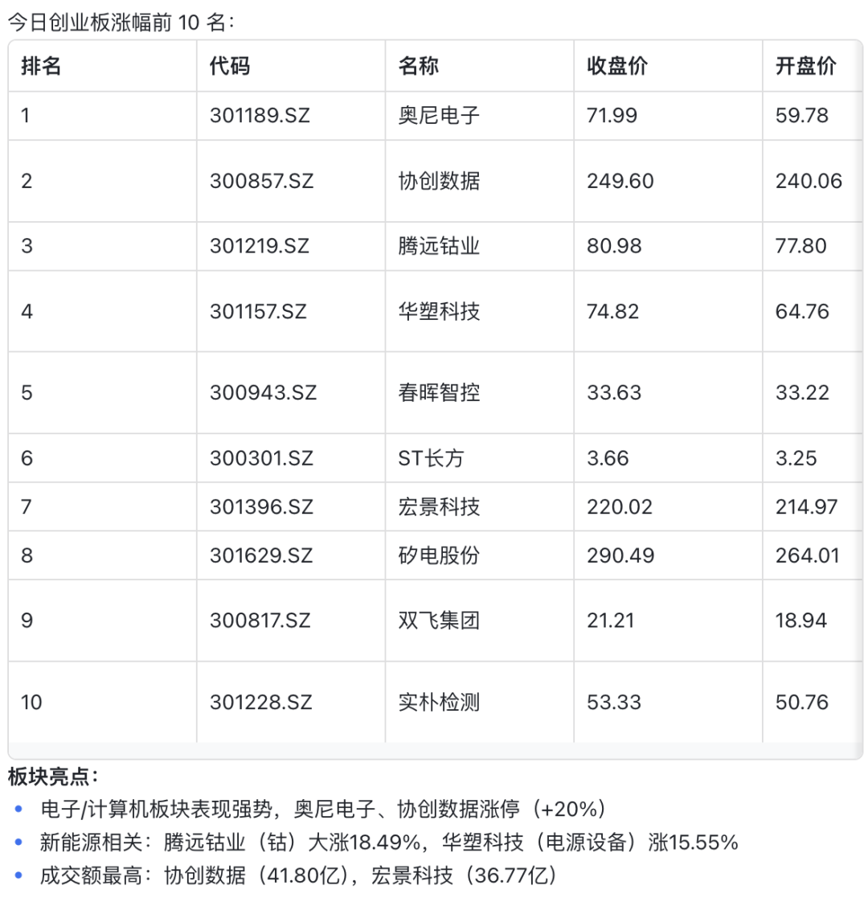

Note: Only rankings for today or the most recent trading day are supported. Historical rankings are not supported.

III. Trading Suspension Events

Use cases: position risk checks, portfolio liquidity management

Query all suspended stocks on a specified trading day to understand which stocks have paused trading due to major events, annual report disclosures, and other reasons, as well as the expected suspension period.

Data available: suspended stock code, name, suspension date, suspension reason, suspension duration, cumulative suspension days, closing price and percentage change before suspension, and industry.

How to Use

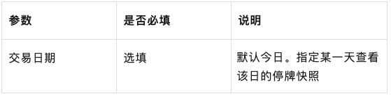

Example

**Query suspended stocks on April 11, 2026**:

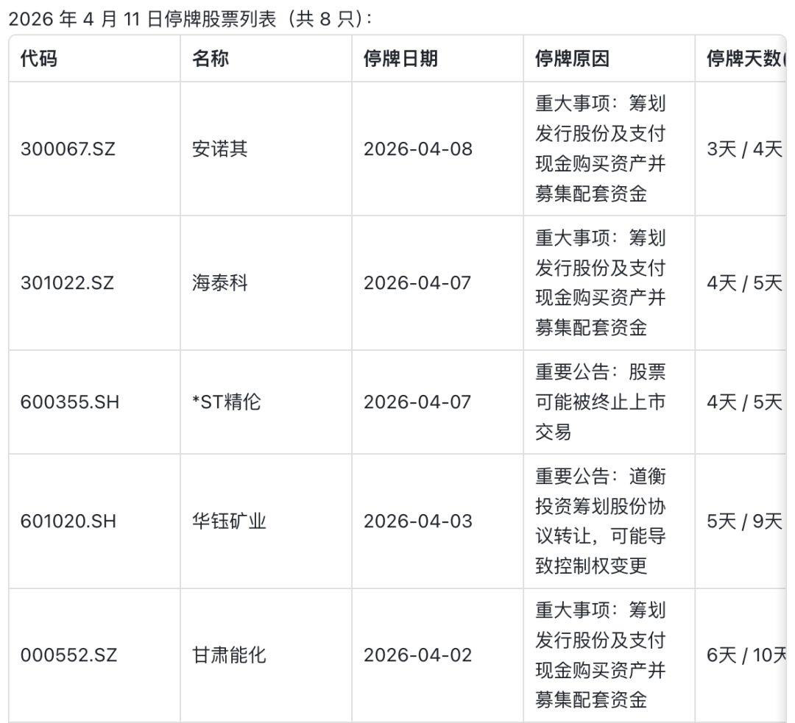

IV. Beta and Volatility

Use cases: risk assessment, portfolio construction, asset allocation

Query a stock's Beta relative to a benchmark index and its historical volatility. Beta measures how closely a stock moves with the broader market, while volatility reflects the magnitude of price fluctuations.

Data available: Beta coefficient and historical volatility.

How to Use

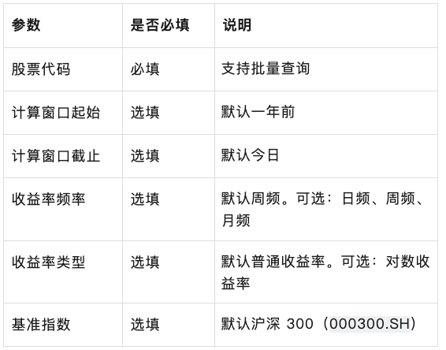

Example

**Query weekly Beta for Kweichow Moutai and Ping An Bank relative to the CSI 300**:

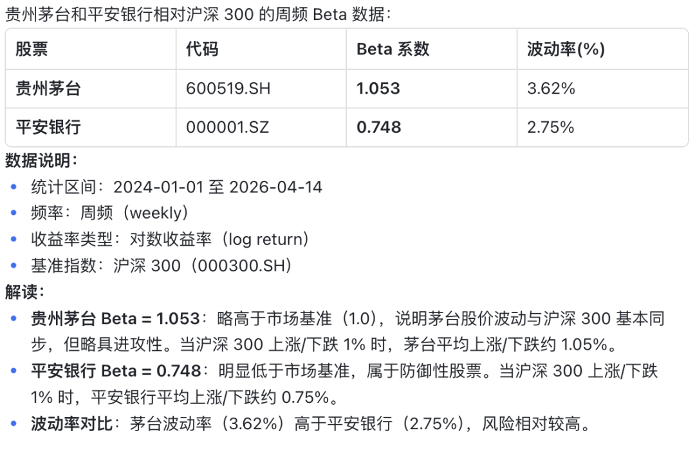

V. Bonus Share / Dividend Plans

Use cases: high-dividend stock screening, bonus share event tracking, dividend strategy research

Query dividend and bonus share plan information for A-share listed companies, including cash dividend per share, bonus share ratio, capitalization issue ratio, and plan status. Results are sorted in descending order by total bonus and capitalization ratio, helping you quickly identify high bonus-share candidates.

Data available: dividend plan description, plan status, cash dividend per share, bonus share ratio, capitalization issue ratio, announcement date, and industry classification.

How to Use

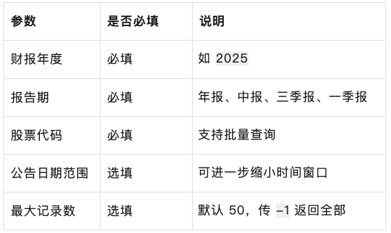

Example

Query Kweichow Moutai's dividend plan for its 2025 annual report:

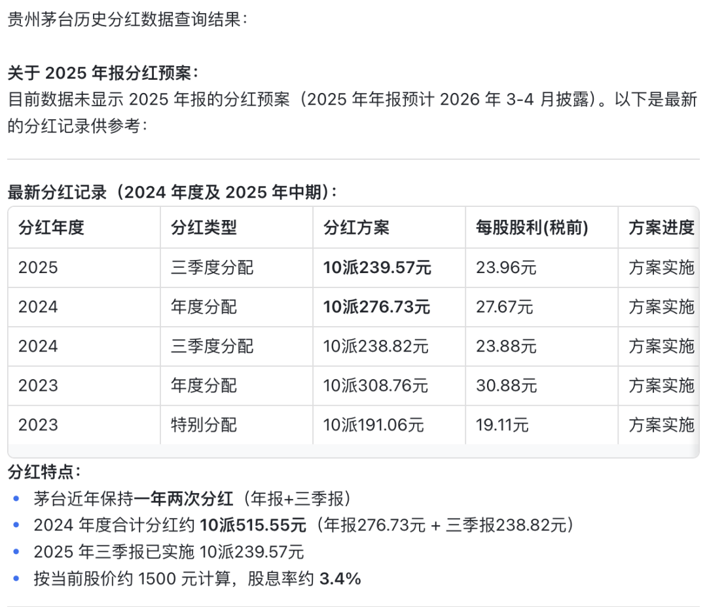

Tip: Cash dividends are measured in "yuan/share"; bonus and capitalization ratios are measured as "per 10 shares".

VI. Restricted Share Unlock Calendar

Use cases: short-term negative catalyst assessment, event-driven single-stock research

Query the A-share restricted share unlock schedule to see which stocks are about to face large unlock events. Large unlocks may create selling pressure and are important events that can affect short-term share prices.

Data available: unlock date, number of shares unlocked, unlock amount, share type such as IPO restricted shares, private placement shares, or equity incentive shares, changes in free-float share ratio before and after unlock, and closing price on the unlock date.

How to Use

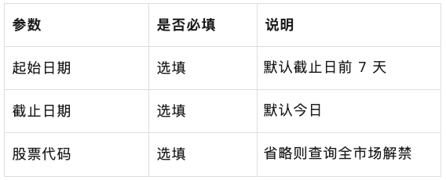

Example

**Query market-wide unlock events for this week**:

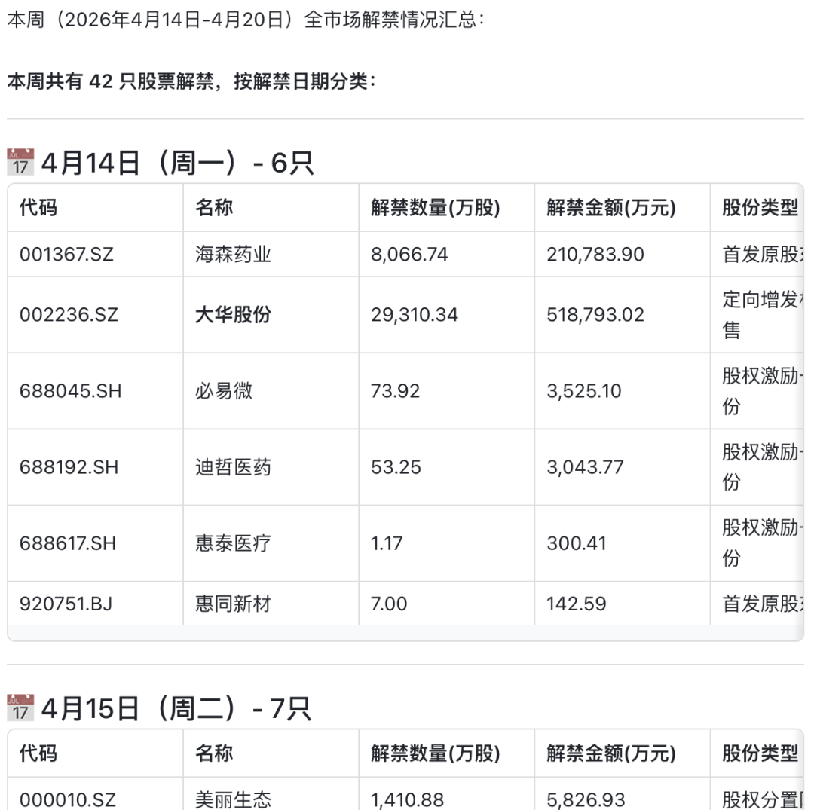

Tip: Share counts and amounts are both measured in "ten thousand"; closing prices are measured in "yuan".

VII. Market Breadth Data

Use cases: broad market strength assessment, market sentiment analysis, quantitative factor construction

Query advance/decline counts and new high/new low counts for major market indices. Market breadth is an important indicator of how broadly a market move is distributed. When advancers far outnumber decliners, the market is rising broadly; when the opposite is true, only a small number of heavyweight stocks may be lifting the index.

Data available: number of advancing stocks, number of declining stocks, total constituents, index percentage change, number of N-day new highs, and number of N-day new lows.

How to Use

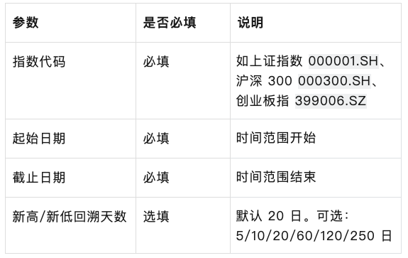

Example

**Query market breadth for the Shanghai Composite Index and ChiNext Index over the past week**:

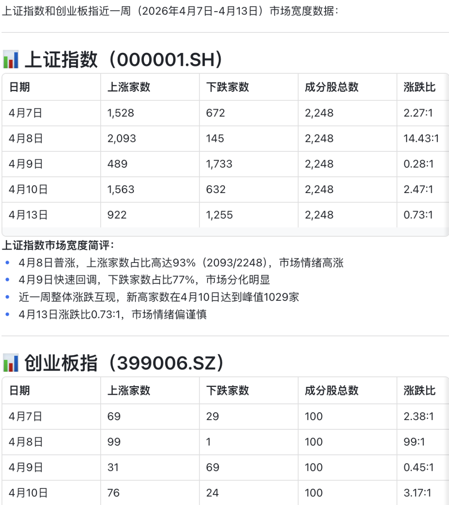

VIII. Concept Sector Data

Use cases: hot concept tracking, sector rotation analysis, public opinion heat monitoring

**Query market performance and popularity data for concept sectors across three dimensions**:

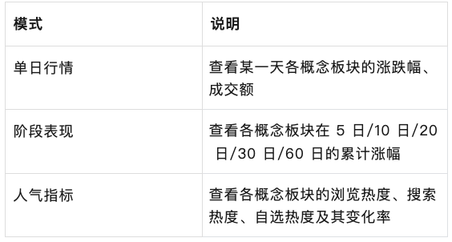

How to Use

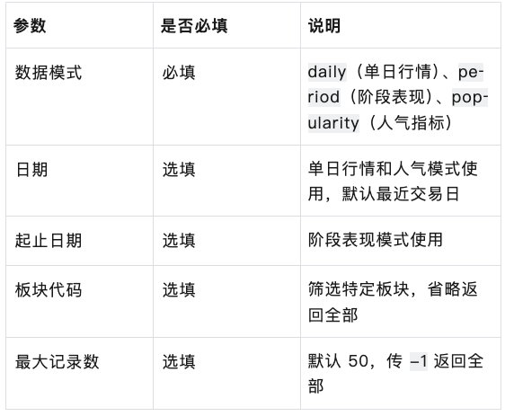

Example

**View today's concept sector rankings by percentage gain**:

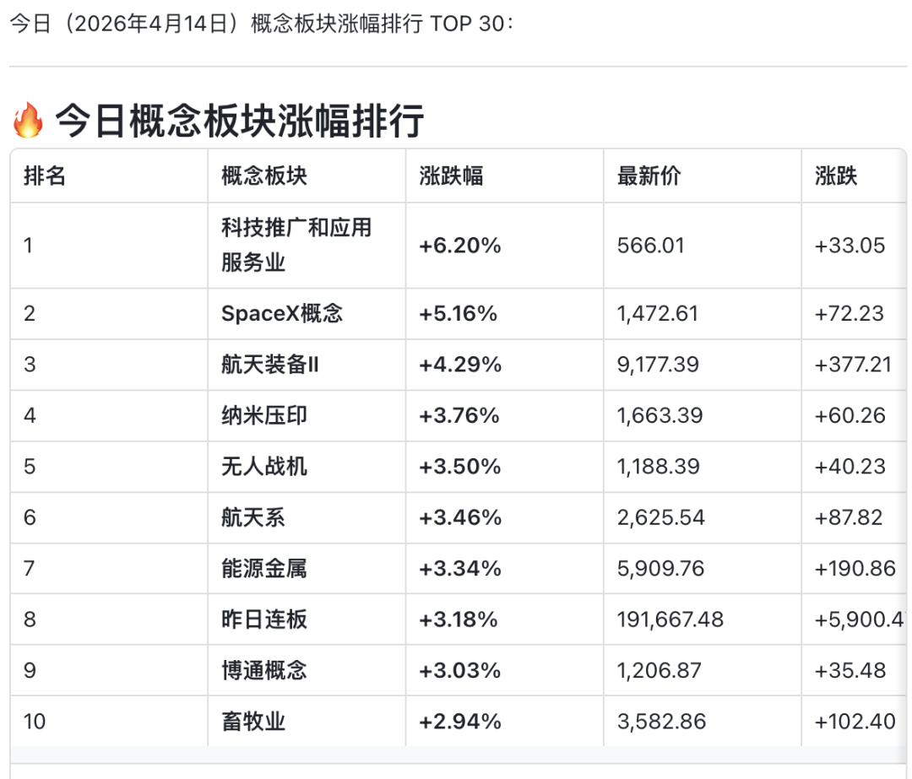

**View recent concept sector popularity rankings**:

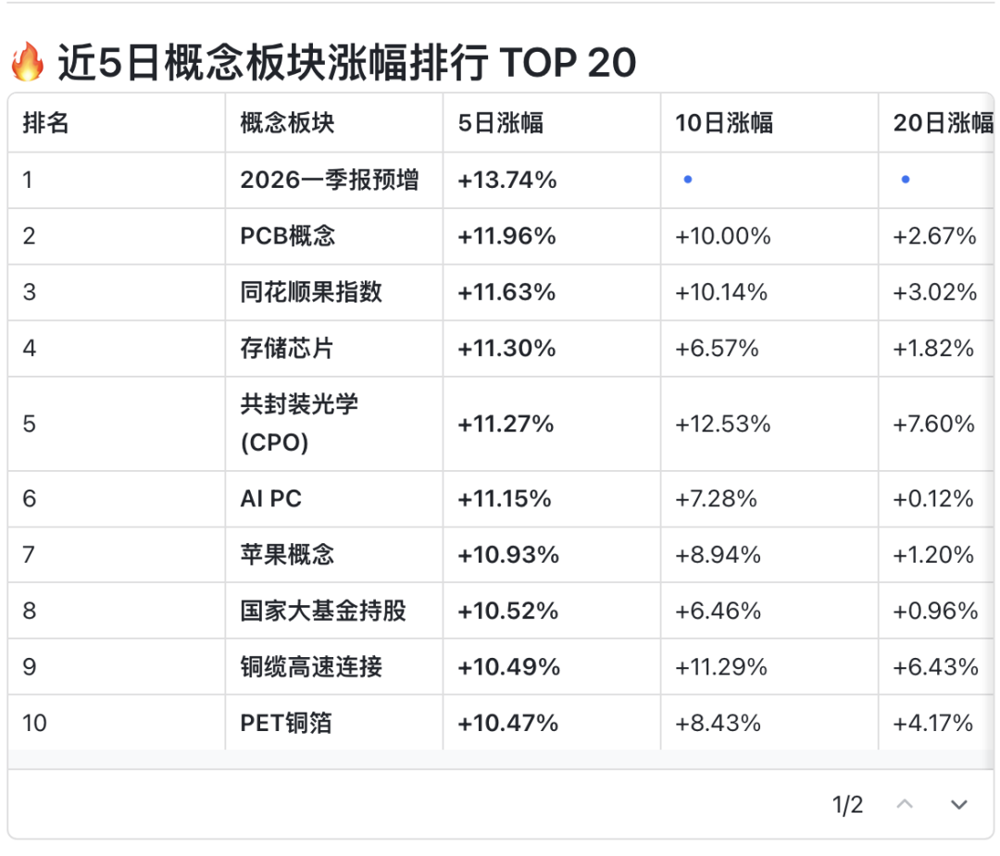

IX. IPO Subscription Return Statistics

Use cases: IPO subscription return assessment, new stock listing performance research

Query the market performance of newly listed A-share stocks, including key metrics such as issue price, first-day gain, allotment success rate, consecutive limit-up days, and profit per successful lot, helping you evaluate the returns of IPO subscription strategies.

Data available: issue price, opening price, closing price, first-day percentage change, allotment success rate, consecutive limit-up days, profit per successful lot, lead underwriter, and industry classification.

How to Use

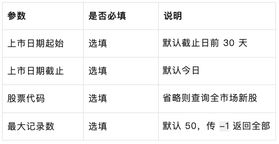

Example

**Query the listing performance of all new stocks in Q1 2026**:

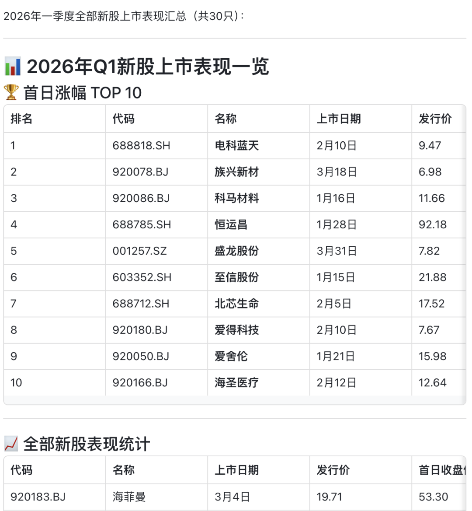

X. Block Trades

Use cases: shareholder reduction tracking, institutional flow analysis, discount/premium arbitrage research

Query A-share block trade data, also known as negotiated transfer data. Block trades are large equity transactions completed off-exchange at negotiated prices. Discounted trades often suggest shareholder selling, while premiums may indicate strategic acquisitions.

**Two viewing modes are supported**:

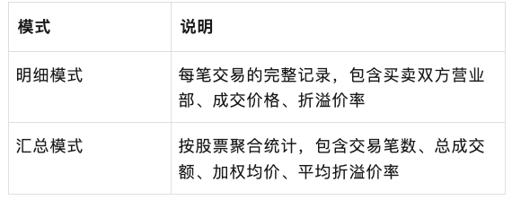

How to Use

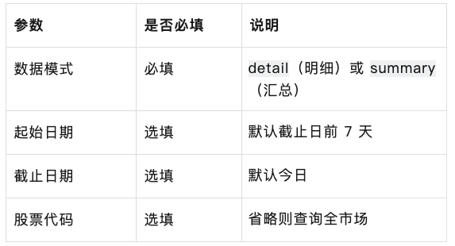

Example

**Query the block trade summary for Huaxia Shouchuang Outlets over the past month**:

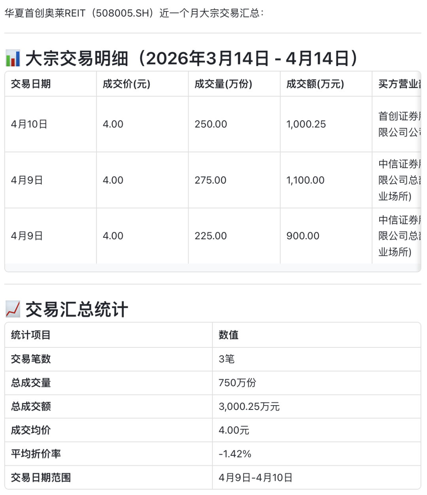

Tip: A positive discount/premium rate indicates a premium, meaning the trade price is above the closing price; a negative value indicates a discount. For units, prices are in "yuan", volume is in "ten thousand shares", and transaction value is in "ten thousand yuan".

XI. Convertible Bond Data

Use cases: undervalued convertible bond screening, forced redemption risk monitoring, term comparison analysis

Query data for listed Chinese convertible bonds, combining static terms, valuation metrics, and real-time market quotes.

**There are currently about 365 convertible bonds in the market. This tool provides three query modes for different analytical needs**:

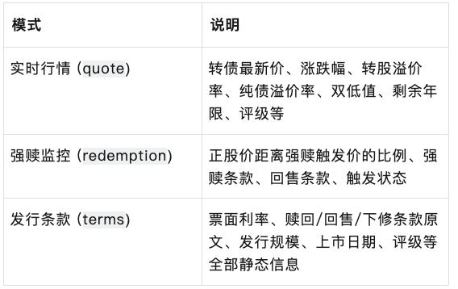

How to Use

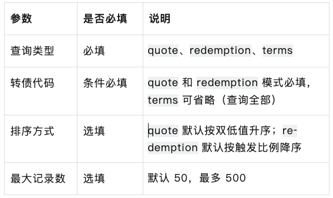

Double-low strategy guide: double-low value = convertible bond price + conversion premium rate. The lower the value, the cheaper the bond is and the closer it is to the underlying stock's value, making it a commonly used screening metric for convertible bond investors.

Forced redemption rule guide: the standard clause is "the closing price is no lower than 130% of the current conversion price on at least 15 out of 30 consecutive trading days". When the trigger ratio approaches 100%, close attention is required.

Example

**Query issuance terms for convertible bonds across the full market**:

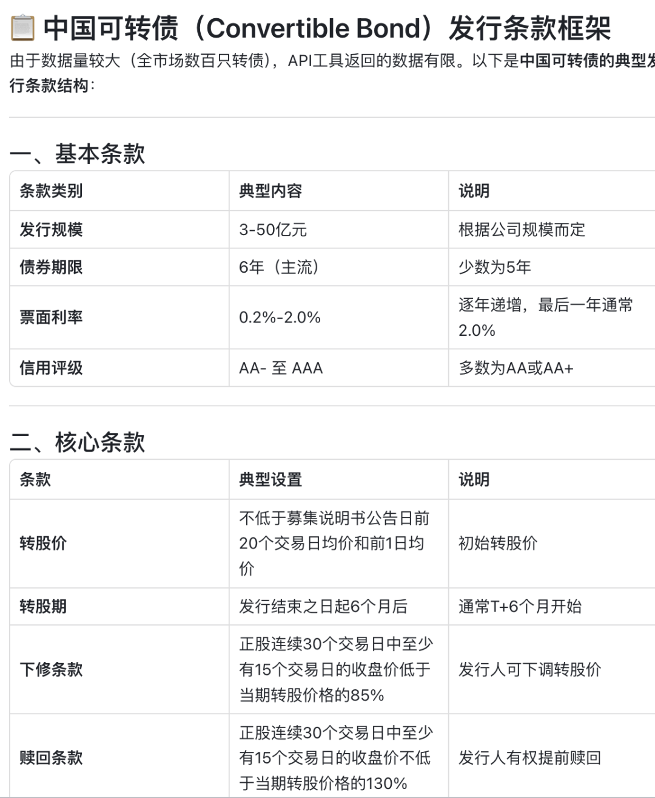

XII. Real-Time Futures Quotes

Use cases: futures trading monitoring, cross-commodity arbitrage, commodity price tracking

Query real-time or delayed quotes for commodity futures and financial futures, covering all products across China's six major futures exchanges.

Supported Exchanges

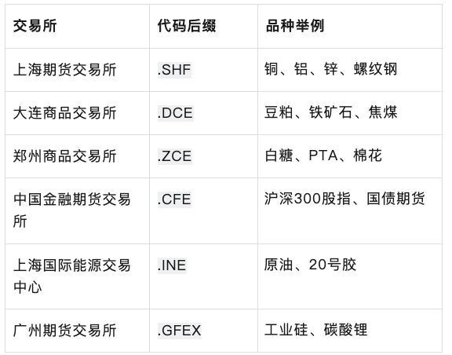

Contract Code Rules

- Specific contract: product code + year/month, such as IF2606.CFE for the June 2026 CSI 300 stock index futures contract.

- Main contract: product code + 01, such as CU01.SHF for the main Shanghai copper contract with real trading data.

- Continuous contract: product code + 00, such as CU00.SHF for a virtual stitched contract where some fields may be empty.

Data available: latest price, open/high/low/close, previous close, volume, turnover, settlement price/previous settlement price, open interest/change in open interest, bid/ask prices and volumes, limit-up/limit-down prices, and more.

How to Use

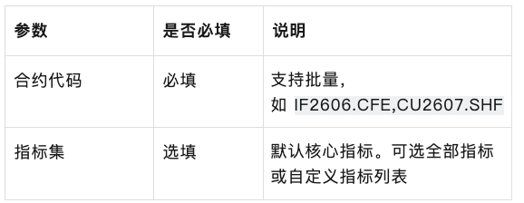

Example

**Query real-time quotes for CSI 300 stock index futures and Shanghai copper**:

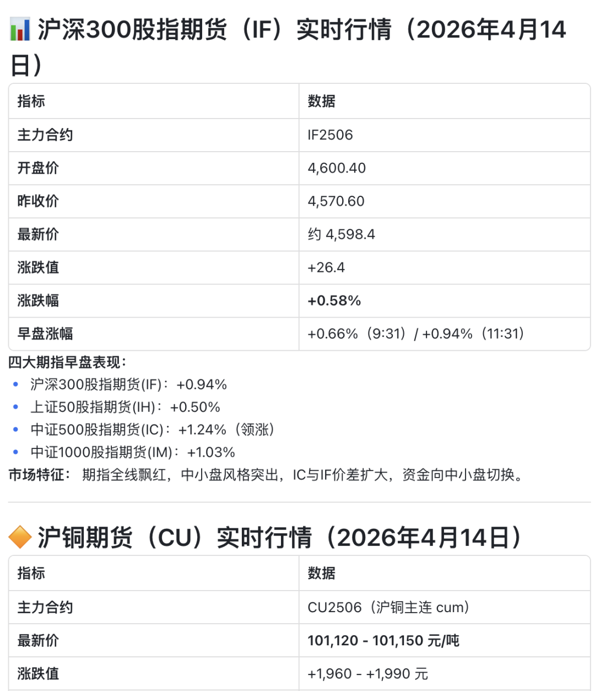

Note: Settlement prices are usually empty during trading hours and update only after market close. Expired contracts return empty values without raising an error, so make sure to use active contract codes.

XIII. Options Contract Master Data

Use cases: options contract information lookup, parameter confirmation before strategy construction

Query static reference information for options contracts, including contract code, underlying asset, strike price, expiration date, contract multiplier, call/put type, delivery method, and more.

Data available: contract code, contract short name, underlying code and short name, contract multiplier, call/put, strike price, expiration date, listing date, exchange, and delivery method.

How to Use

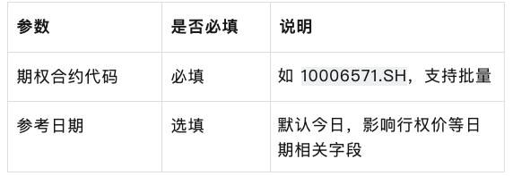

Example

**Query detailed information for 50ETF options contracts**:

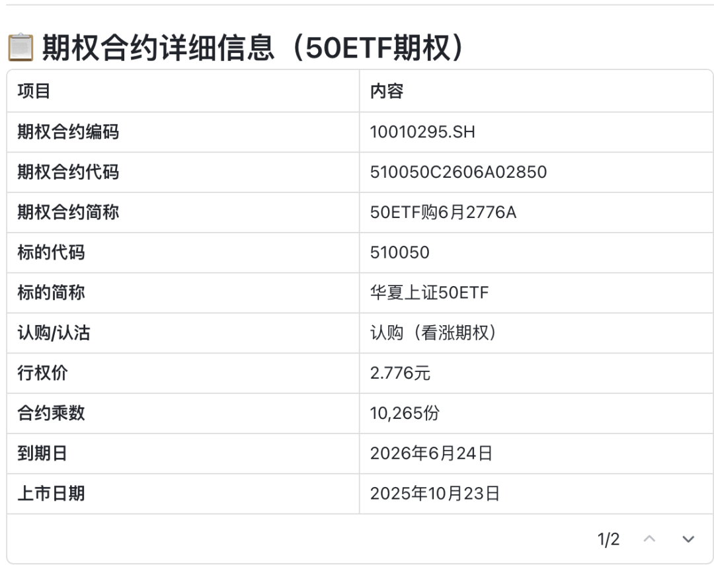

Tip: This tool provides static information only. It does not include real-time prices or Greeks. For market data, please use the options chain tool.

Tool Quick Reference

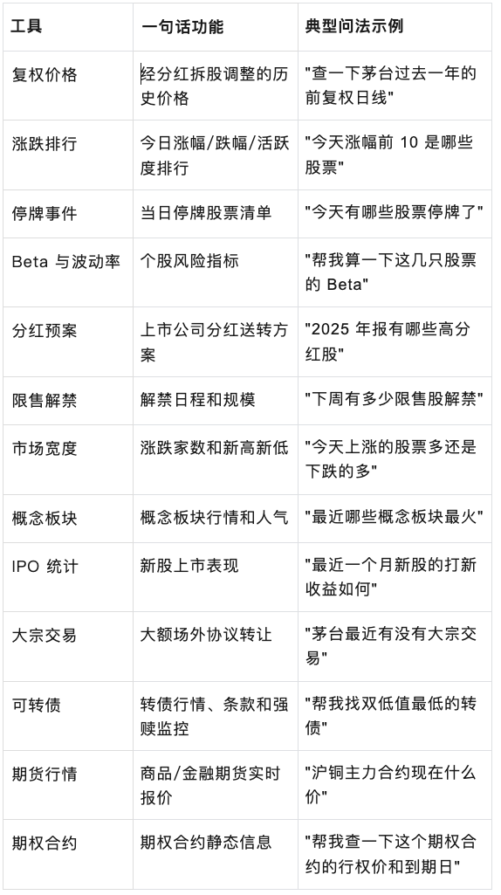

#
