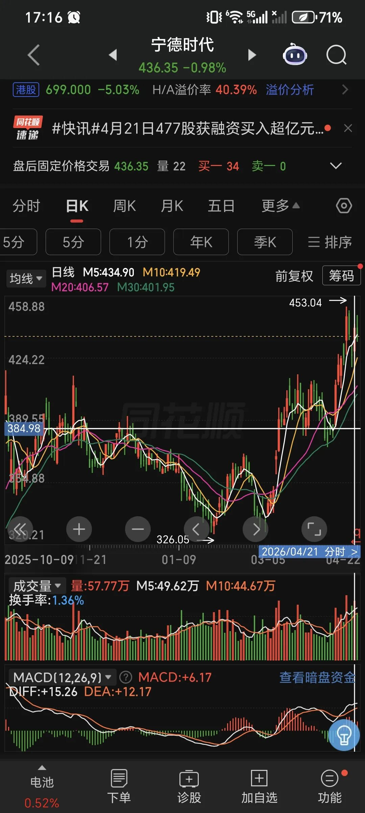
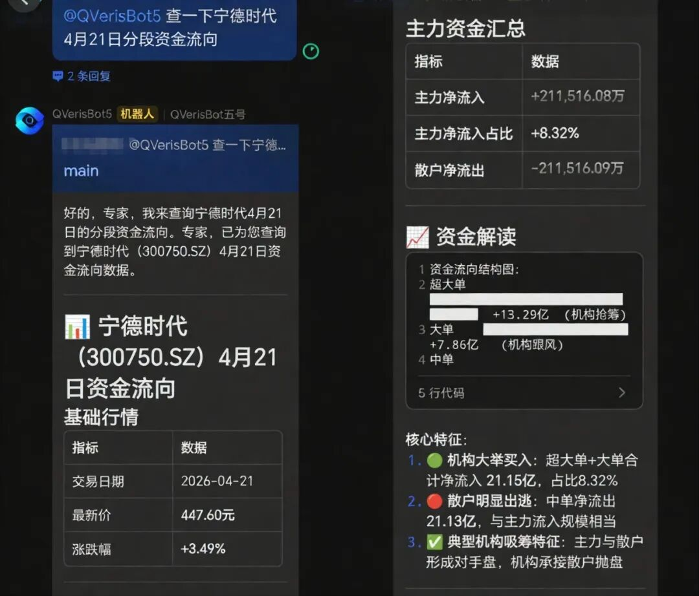
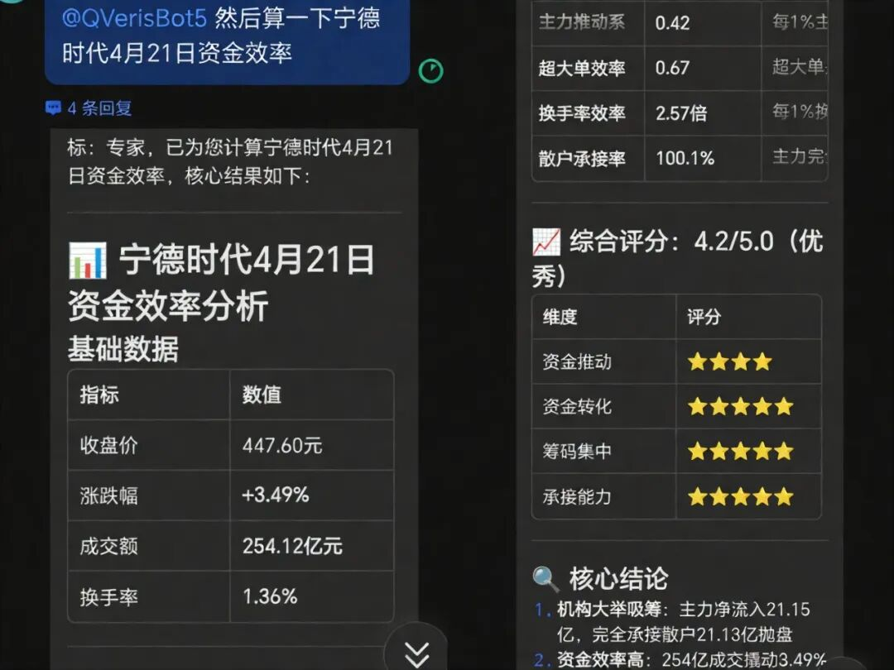

QVeris · Data Test

**The green candlestick you see may be an illusion.**

Last Friday, CATL rose 1.5% in the first 10 minutes after the open. Someone in the group asked me: "Is this a real breakout, or a bull trap?"

I did not answer right away. I opened the market software and took a quick look. The daily chart was indeed rising: one green candle, with both price and volume moving up. Looks good, right?

But here is the issue: retail investors watch daily charts; institutions watch minutes. People have been saying this for years, but most investors have never actually seen what **minute-level data** looks like.

The daily chart cannot give the answer. Today, using a set of tested data, I will show you the real contest inside the order book.

01 What Retail Investors Can See

**Open any free market data app, and CATL's April 21 move looks like this**:

Opening price: 225.46 yuan. Closing price: 231.36 yuan. Gain: 2.63%. Full-day volume: 18.68 million shares. Turnover: 4.345 billion yuan.

But that is only the result. What about the process?

From 9:35 to 9:50 in the morning, in just 15 minutes, the stock moved from 225.46 to 229.68, up 1.87%. By the close, it looked like a green candle up 2.63%. But only after opening the intraday chart do you see that more than half of that 2.63% gain was captured in the first 15 minutes after the open.

More importantly, trading volume during those 15 minutes accounted for 17% of the full day.

02 What Retail Investors Cannot See

I pulled a set of minute-level data. Not 15-minute data, but **5-minute data**: 48 candles across the full day, each one with a story inside.

**Back to the point. First, look at this comparison**:

| Time period | Price change | Volume | Turnover rate |
| --- | --- | --- | --- |
| 09:35-09:50 | +1.87% | 3.488 million | 0.89% |
| 09:50-10:30 | +0.83% | 3.652 million | 0.94% |
| 10:30-11:30 | +0.51% | 3.058 million | 0.78% |
| 13:00-14:30 | -0.16% | 1.564 million | 0.40% |
| Last half hour before close | -0.36% | 4.878 million | 1.24% |

Segmented capital flow for CATL on April 21

See it?

The first morning rally had a turnover rate of only **0.89%**, yet it delivered the biggest gain. What does that mean? **The float was tightly held, and selling pressure was not heavy**. The main players pushed the price up with relatively little capital. This is a typical sign of a stock under strong control.

But the problem appeared before the close.

In the last half hour, the turnover rate surged to **1.24%**, the highest of the day, but the stock price fell 0.36%.

High volume with stalled gains. High volume with a decline. That is not a good signal.

The green candle on the daily chart becomes a completely different picture from a minute-level perspective: early-session accumulation and price lift by major capital -> intraday consolidation -> **late-session capital divergence and profit-taking outflow**.

That said, the finer the data granularity, the more noise there is. In 5-minute fluctuations, how much is a real signal, and how much is random noise? That is worth thinking about.

03 What You Have to Calculate Yourself

The real value of minute-level data is not in watching a single candle. It is in calculating the "**structure**."

I calculated a simple metric: **capital efficiency** (price change ÷ turnover rate).

• Capital efficiency \> 1: capital-driven rally, stable chips  
• Capital efficiency \< 0.5: capital-consuming rally, heavy selling pressure  
• Negative capital efficiency: capital is withdrawing

**The results were interesting**:

| Time | Price change | Turnover rate | Capital efficiency |
| --- | --- | --- | --- |
| 09:50 | +0.84% | 0.034% | 25.0 |
| 10:00 | -0.02% | 0.033% | -0.5 |
| 14:50 | -0.08% | 0.023% | -3.6 |

Capital efficiency = price change ÷ turnover rate

At 9:50 in the morning, capital efficiency reached **25**, meaning every 1% of turnover could move 25 units of price gain. This is a classic **strongly controlled stock** pattern.

But by 10:00, efficiency had dropped to -**0.5**. With a similar turnover rate, the price no longer rose and instead fell. Selling pressure had arrived.

You will not see this metric directly in any market data app. You have to calculate it yourself.

04 Data Test

I tested this minute-level market data interface. It covers **7 granularities**: 1, 3, 5, 10, 15, 30, and 60 minutes.

**Data precision**: The returned fields are complete: open, high, low, close, trading volume, turnover, price change, and turnover rate. There were no missing fields, and data continuity was good.

**Response speed**: In testing, full-day data was returned in an average of **940 milliseconds**. Wait, 940 milliseconds refers to a single query. If you query multiple stocks, it will take longer, so real usage needs to account for concurrency.

**Coverage**: All A-share stocks are supported. A single query can cover up to 50 stocks.

**Limitations**: It is unclear how far back historical data can be queried. I tested historical data after the market close; intraday real-time push capability was not verified. There is no Level 2 data.

Applicable boundary: suitable for quant strategies that require minute-level backtesting and for medium-term investors analyzing intraday capital flow. Not suitable for millisecond-level high-frequency trading.

05 Final Thoughts

Is minute-level data useful for retail investors?

If you trade T+0 or short-term swings, yes. Wait, that needs one condition: **you must have time to watch the market**. If your holding period is longer than one week, daily data is enough.

The key is knowing what data you actually need, rather than blindly chasing precision.

To be blunt: this "capital efficiency" metric is not some mysterious indicator. It is just the simplest price-volume relationship. But most people are too lazy to calculate it, or they do not have minute-level data to calculate it with.

**Data does not lie, but you have to learn how to read it.**

**Data source**: The data in this article was retrieved in real time through the QVeris capability routing network. Test targets were CATL (300750.SZ), Kweichow Moutai (600519.SH), and Wuliangye Yibin (000858.SZ). Test date: April 22, 2026.

**Disclaimer**: This article is only a record of data tool testing and does not constitute investment advice. The stock market involves risk; invest with caution.
