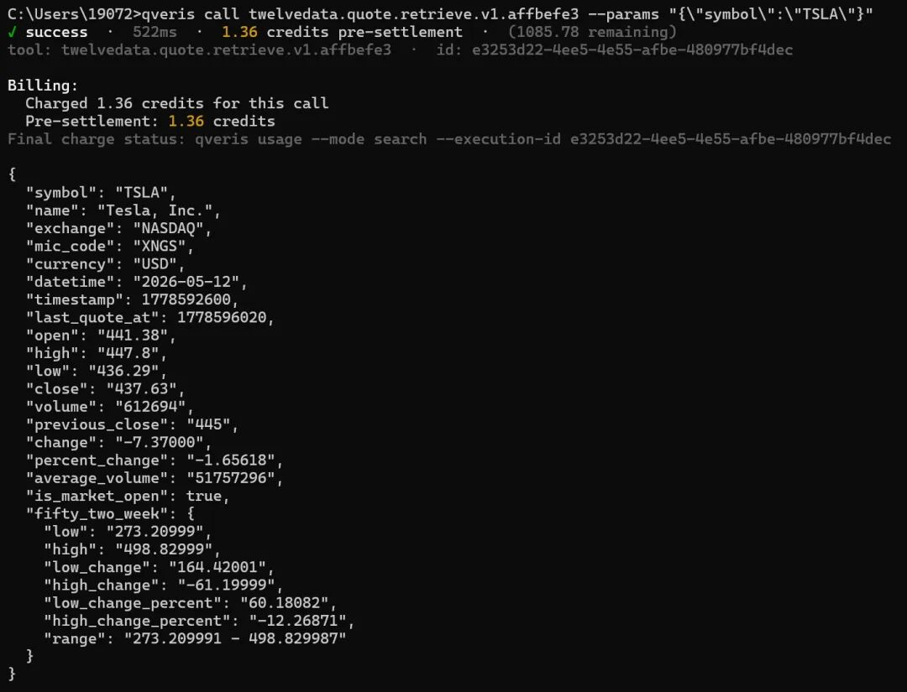
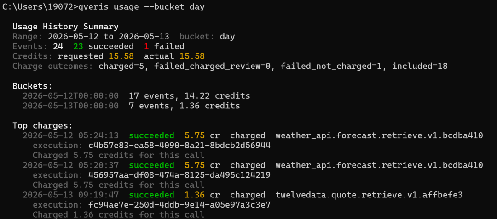
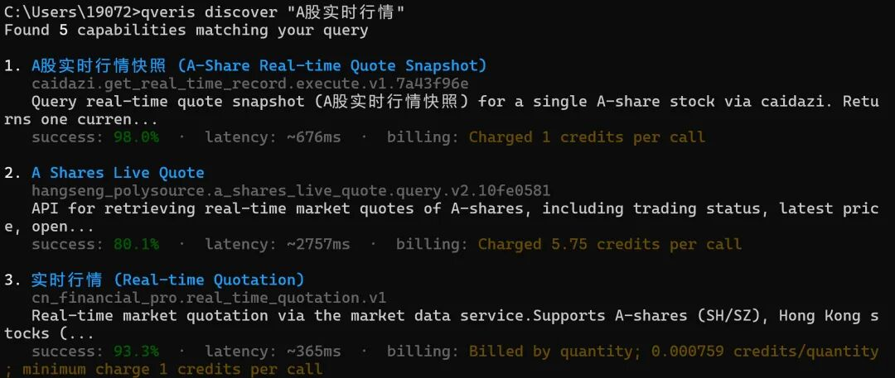
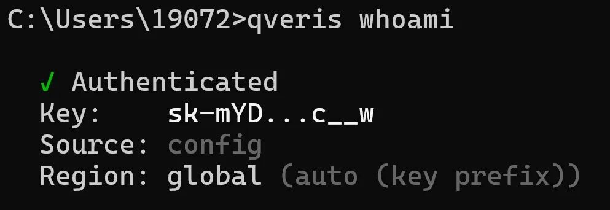
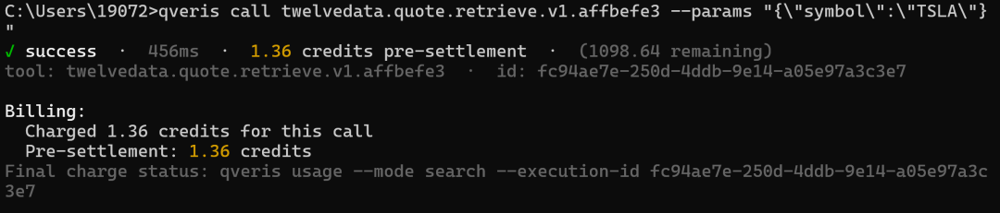
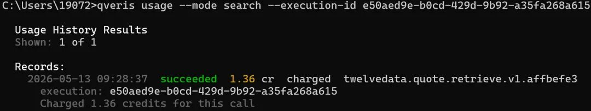

QVeris · Product Update

How much does a single stock data query actually cost?

Today, we released QVeris CLI v0.5.0. It solves one problem: when you call a financial data API, how much did it actually cost?

Not a vague “a few hundred dollars a day after amortizing the annual fee,” but a precise, auditable record for every query and every charge.

01 The Long-Standing Problem With Financial Data

If you have ever worked on quantitative trading, you know this pain:

**Scenario 1: Pulling Data Aggressively During Backtests**

You run one strategy backtest and call market data APIs tens of thousands of times. The monthly bill arrives, and data fees account for 30% of strategy returns. But the real question is: where did the money go? Which calls can be reduced?

**Scenario 2: Multi-Factor Models Consume Data Fast**

You run 50 factors at the same time. Each factor calls financial statements, capital flows, and technical indicators. The vendor only gives you a total price, so you do not even know which factor is consuming the most data.

**Scenario 3: A Team Shares One Set of Data Permissions**

Researcher A queries full-market data once. Researcher B queries the same data again. You get charged twice. The vendor will not tell you, and you have no way to check.

This is the current state of the financial data industry: **black-box billing**. Annual fees can reach hundreds of thousands of yuan, but where each charge actually goes is completely opaque.

02 Now Every Data Call Is as Clear as a Card Transaction Alert

Imagine using a credit card: every purchase sends you a message showing where you spent money, how much you spent, and your remaining balance.

That is what QVeris now does for financial data calls.

**Before:**

You query Tesla’s real-time quote. To find out how many account credits were deducted, which step triggered the charge, or whether you were charged twice, you have to dig through bills later.

**Now:**
```
qveris call twelvedata.quote.retrieve.v1.affbefe3 --params "{\"symbol\":\"TSLA\"}"
```

**Actual output:**



This line tells you five things:

1. **Whether the call succeeded or failed**

2. **How long it took** (761ms, which matters in quant workflows)

3. **How much it cost** (1.36 credits)

4. **How much remains** (1091.11 credits)

5. **The unique execution ID** (so the call can be traced precisely later)

Like a bank transaction alert, every item is listed clearly.

03 You Can Also Check Historical Bills and Find the Biggest Data Cost Drivers

Even better, you can review all historical data calls like checking a bank statement:
```
qveris usage --bucket day
```

It gives you a report. Below is an excerpt from an actual test account output:


You can see successful calls, failed calls, whether they were charged, how much was charged, and the corresponding execution_id, all in the same statement.

**The next step is obvious**: identify high-frequency, duplicate, or high-failure-rate calls, then convert them to incremental updates, local caching, or a data source with a higher success rate.

04 For Quant Teams: Make Strategy-Level Cost Allocation Real

In the past, teams used the same set of data permissions, and month-end allocation was a mess:

“Last month’s data fees were 20,000. How much should Strategy A and Strategy B each bear?”

“No idea. They both used it.”

Now, every call has a unique execution_id. You can:

**1. Trace a single call**
```
qveris usage --mode search --execution-id 0e67a7f2-ca7e-4fd2-af86-f88d98cc706c
```

**Actual output:**
```
Usage History Results Shown: 1 of 1 Records:   2026-05-12 07:57:17  succeeded  1.36 cr  charged  twelvedata.quote.retrieve.v1.affbefe3     execution: 0e67a7f2-ca7e-4fd2-af86-f88d98cc706c     Charged 1.36 credits for this call
```

**2. Export or retrieve all call records**
```
qveris usage --mode search
```

If you need strategy-level cost allocation, you can maintain a mapping table in your own strategy system: strategy_id, execution_id, tool_id, symbol, created_at. At month end, reconcile against QVeris usage records by execution_id.

**3. Calculate each strategy’s data ROI**
```
Strategy Alpha V2: - Data cost: 1,247.5 credits - Strategy return: 12,400 - Data ROI: 9.9x Strategy Beta V1: - Data cost: 892.0 credits - Strategy return: 1,200 - Data ROI: 1.3x (consider optimizing or cutting)
```

This is the fine-grained operational visibility quant teams need: QVeris provides a clear statement for every call, while the strategy side maintains the relationship between execution_id and strategy.

05 Beyond Accounting: Four Practical Upgrades for Financial Data Workflows

In addition to transparent billing, this release includes four features you will likely use:

**① Discover and Call 10,000+ Financial Data Sources in One Place**

No need to apply for separate accounts and integrate separate APIs across data vendors such as Bloomberg, Refinitiv, Twelve Data, and Yahoo Finance.

Search directly in QVeris:
```
qveris discover "A-share real-time quote"
```

**Actual output excerpt:**


At a glance, you can see that different data sources have different prices, success rates, and latency. For cost-sensitive scenarios, compare per-call price. For stability-first scenarios, compare success rate and latency. The choice is in your hands.

**② Large Results Are Automatically Stored Without Blowing Up Context**

Sometimes a single query returns tens of MB of data, such as full-market minute-level candlesticks. Pushing that directly into program memory can cause problems.

QVeris automatically stores large results in OSS and gives you a download link valid for 120 minutes. Your program keeps only the summary and link, staying clean and responsive.

**③ Data Quality Is Automatically Highlighted**

Search results directly display success rate, latency, and billing method. You can also continue using inspect \<tool_id\|index\> to view tool details, confirm parameters and pricing before calling, and avoid connecting unsuitable data sources to your strategy.

**④ Automatic Routing for Domestic and Global Nodes**

If your API Key prefix is sk-aYg..., calls go through the global node, suitable for US equities and FX. If it is sk-cn..., calls go through the domestic node, suitable for A-shares and Hong Kong stocks.

No manual configuration is required. QVeris automatically selects the fastest route.

06 Who Should Try This Tool?

| Role | Your Pain Point | How QVeris Helps |
| --- | --- | --- |
| Individual quant investor | Data fees are expensive, and annual subscriptions hurt after amortization | Pay per use, spend only for what you use, and keep costs under control |
| Quant team lead | You do not know each strategy’s data cost, so cost allocation is unclear | Reconcile by execution_id and combine it with strategy-side mappings to calculate ROI |
| Data procurement manager | Vendor billing is black-box and hard to audit | Every call has an ID, the fund flow is clear, and compliance is easier |
| Fintech developer | Integrating multiple data sources creates high maintenance overhead | 10,000+ tools through one unified interface: integrate once, call everywhere |

07 How to Get Started

**Step 1: Install the CLI (30 seconds)**
```
npm install -g @qverisai/cli@latest
```

**Step 2: Configure Your API Key (10 seconds)**

After getting an API Key from qveris.ai, choose one of the following methods based on your system.

**Windows CMD:**
```
set QVERIS_API_KEY=sk-your-key
```

**PowerShell:**
```
$env:QVERIS_API_KEY="sk-your-key"
```

**Linux / WSL / macOS:**
```
export QVERIS_API_KEY="sk-your-key"
```

You can also use the following command to confirm your current authentication status:
```
qveris whoami
```

**Actual output excerpt:**


**Step 3: Query Stock Data Once (30 seconds)**

Search first and confirm the data source you want to use:
```
qveris discover "TSLA stock quote"
```

Then call it with the full tool_id. On Linux / WSL / macOS / PowerShell, you can write:
```
qveris call twelvedata.quote.retrieve.v1.affbefe3 --params {"symbol":"TSLA"};
```

**In Windows CMD, JSON quotes need to be escaped:**
```
qveris call twelvedata.quote.retrieve.v1.affbefe3 --params "{\"symbol\":\"TSLA\"}"
```

After 30 seconds, you will receive TSLA’s real-time stock price and one line of billing record:


**Step 4: Reconcile With execution_id**

Fill in the execution_id from the previous output:
```
qveris usage --mode search --execution-id e50aed9e-b0cd-429d-9b92-a35fa268a615
```

**Actual output:**


**Recommendation for your first call**: start with free search to confirm that the tool meets your needs and the parameter format is correct, then call the data API that will actually incur charges.

08 Closing Thoughts

There is a strange pattern in the financial data industry: the more important the data is, the less transparent the billing becomes.

Wind and iFinD subscriptions costing hundreds of thousands of yuan per year will not tell you how much each query costs after allocation. They sell “unlimited packages,” but the truth is that most people do not actually need “unlimited.” They are paying a premium for ambiguity.

**QVeris is doing something different**: making financial data work like utilities. Use what you need, pay for what you use, and see every charge clearly.

For quant investors, this means:

- **Controlled costs**: no more “month-end bill shock”

- **Strategy optimization**: know which factor consumes the most data and optimize it directly

- **Team cost allocation**: calculate data cost by strategy and get ROI right

If data costs have been a headache for you, give it a try. At minimum, the next time someone asks, “How much did this data strategy cost?”, you will be able to show a clear receipt.

**Register and receive 1,000 credits. Search is free.**

Official website: https://qveris.ai

GitHub: https://github.com/QVerisAI/qveris-agent-toolkit
