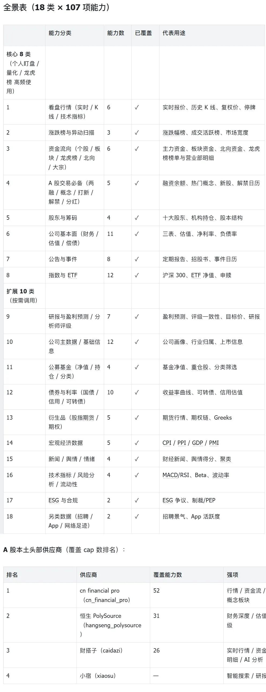

QVeris · Market Take 
## If You’re Starting to Look at A-Shares Now

Recently, many investors opened their watchlists and found that an entire page had suddenly disappeared. 

This is not just happening to you. Overnight, a large investor base has had to face a new question: **with more than 5,000 A-share stocks, how do you read the market? Where do you start? What do you use to decide whether to buy or sell?**

If you are already looking at A-shares but still feel that the workflow is awkward, this article is for you. 
## The Skill Set You Built in U.S. Stocks Covers About 40% of A-Shares

It is not that A-shares are harder. The **information structure is different**. 

U.S. stock investors are used to watching dimensions such as PE, market cap, revenue growth, cash flow, analyst ratings, options chains, and pre-market and after-hours price moves. 

**A-shares add several more effective information dimensions**:

**The daily limit-up and limit-down mechanism** means you cannot apply the U.S. stock logic of “buy the dip after a 20% drop.” If a stock is locked at limit-down, you cannot get out, and it may hit limit-down again tomorrow. 

**No pre-market or after-hours trading** means news is absorbed entirely during the 9:15-9:25 call auction. You do not get a four-hour buffer window to slowly place orders. 

**Liquidity and capital flow are central to pricing** means you cannot look only at fundamentals. The Dragon and Tiger List, northbound capital, margin financing and securities lending balances, and main-fund net inflows are **first principles** of price discovery in A-shares, not optional add-ons. 

Put simply: the U.S. stock toolkit you brought over probably covers about 40% of A-share pricing factors. The remaining 60% lives in a different data pipeline. 
## The Three Data Pillars of Systematic A-Share Stock Selection

We completed a full mapping of A-share data coverage, based on a snapshot from 2026-05-15, integrating 4 leading local providers and covering **18 categories and 107 capabilities**. This is not about showing off numbers. After breaking it all down, we found that systematic A-share investing needs three data pillars. Miss any one of them, and the workflow limps. 

### Pillar One: Quotes + Rankings — Know What Happened Today 

The first thing to ask every market open: who is rising today? Where is the money going? 

What you need is **real-time quotes + gainers/decliners rankings + market breadth**. Batch-poll your watchlist for the latest price, percentage move, turnover rate, and volume ratio, then combine that with rankings and market breadth data to identify “who is making the first move today” during the first 30 minutes of the morning session. 

>
>  Call `cn_financial_pro.real_time_quotation.v1`, pass codes such as 600519.SH and 300750.SZ, and get back latest price, percentage move, turnover rate, volume ratio, PE/PB, limit-up price, and limit-down price. One screen gives you the real-time state of a stock. 
>
What makes this more powerful than a U.S. stock screener is that A-shares also have **concept sectors** and **Shenwan industry daily data**. Often it is not one stock that is rising, but an entire theme. You can see that “fiber optic communications” is up 5% today, and then identify which stock is leading inside it. That is the real rhythm of A-share themes. 

### Pillar Two: Capital Flow — Know Where the Money Is Going 

There is a saying in A-shares: “Being right on direction matters less than following the right capital.” 

You need the full set of four: **Dragon and Tiger List + main-fund flows + northbound capital + margin financing and securities lending balances**. 

After the close, pull the Dragon and Tiger List and check whether the buy-side seats are institutions or brokerage branches. That determines whether the buying pressure is likely to persist. 

During the session, pull main-fund flows and watch the direction of super-large-order net inflows and outflows. Institutional-sized money and retail-sized money carry completely different signal quality. 

Track sector position changes in northbound capital every day. If northbound capital adds to a sector for 5 consecutive days, the probability of that direction working improves. 

Check margin financing and securities lending balances every week. If financing balances break historical highs, retail leverage sentiment is overheated, and it is time to consider reducing exposure. 

>
>  For main-fund flows, call `caidazi.get_stock_moneyflow.execute.v1`. For the Dragon and Tiger List, call `cn_financial_pro.dragon_tiger.v1`. For margin financing and securities lending, call `caidazi.get_stock_margin_detail.execute.v1`. Run these three interfaces once, and within 10 minutes you can understand a stock’s “capital profile.” 
>
### Pillar Three: Fundamentals — Know Whether It Is Worth Buying 

A-shares also have PE, PB, ROE, net margin, and debt-to-asset ratio. But what you need is not just a single-period data point. You need **multi-quarter vertical comparison + same-industry horizontal comparison**. 

The Caidazi interface can directly pull Kweichow Moutai’s balance sheet for the past 6 quarters: from 20241231 to 20260331, its debt-to-asset ratio fluctuated between 12% and 19%. You can see the trend instead of making a decision based on one static number. 

The income statement works the same way. Pull revenue, gross profit, net profit, and EPS across multiple quarters, and you can immediately see whether growth is accelerating or slowing. 

>
>  For the balance sheet, call `caidazi.get_sec_balance.execute.v1`. For the income statement, use `financialmodelingprep.stable.incomestatement.retrieve.v1` with the .SS/.SZ suffix for A-shares. Together, these two interfaces cover core A-share financial statement queries. 
>
## This Is Not “Only Look at A-Shares After U.S. Stocks Fall.” A-Shares Have Their Own Playbook

Many people start looking at A-shares because circumstances force them to. That does not matter. 

What matters is this: **A-shares have their own logic and their own dedicated data arsenal.** Limit-up and limit-down, the Dragon and Tiger List, capital flows, northbound capital, and margin financing and securities lending are not nice-to-have indicators. They are core factors in price discovery. 

When you integrate them into your system, you are operating with complete information. 

Without them, you are playing with only half the table. 
## How to Start

QVeris has already connected 107 A-share capabilities, unifying 4 local providers behind one access point. 61 tools can be called directly with standard parameters such as `600519.SH`; the rest also work by filling in their dedicated parameters according to schema. 

Install QVeris CLI with three commands, and in Claude Code / Cursor / Codex you can let AI automatically discover → inspect → call. Or use the REST API directly to write scheduled strategy jobs. 

**Related Reading:**  

From 3 Hours to 30 Seconds: With QVeris, Codex Becomes a Financial Data Analyst Instantly

One API for Comprehensive Financial Data Access

QVeris Launches the Agent Capability Map
