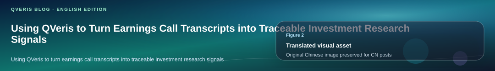
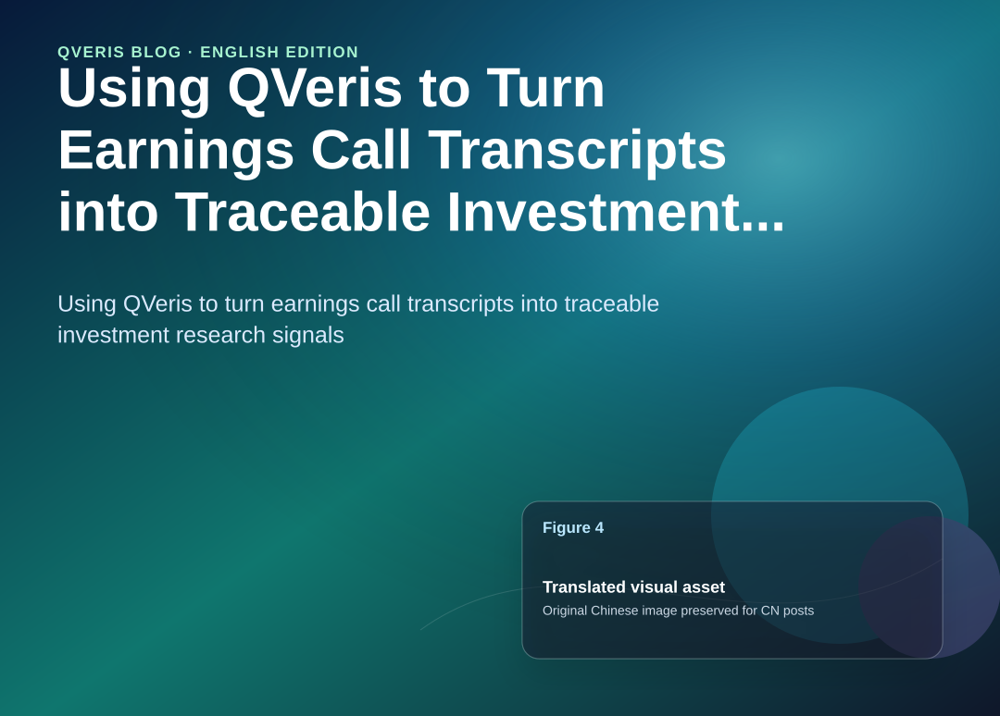
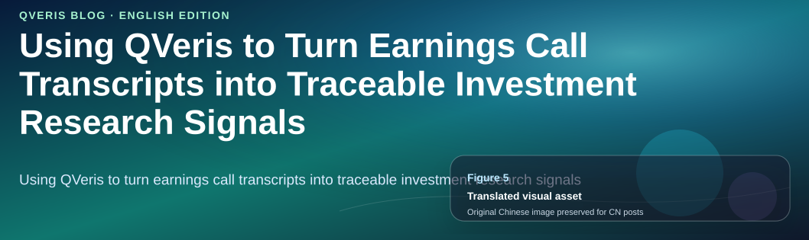
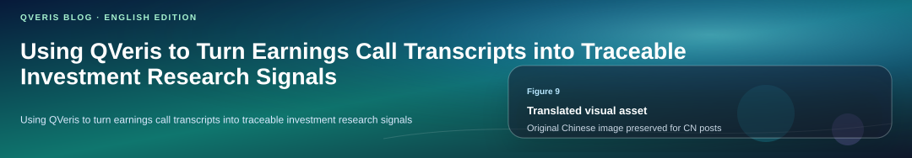
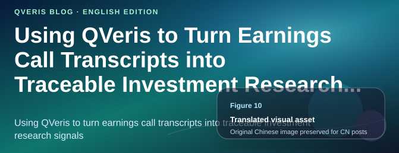
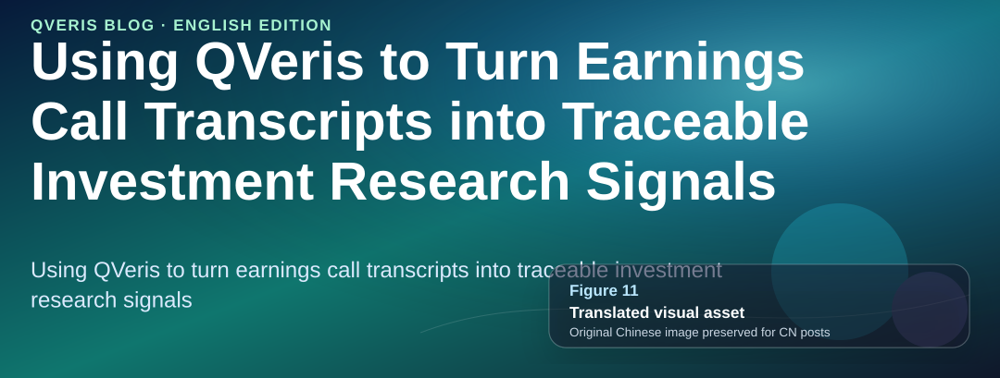
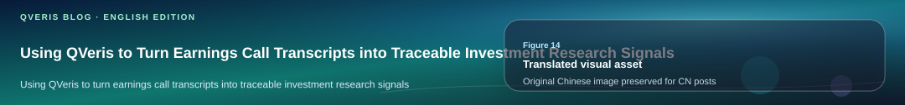
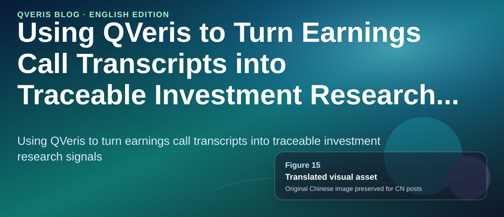
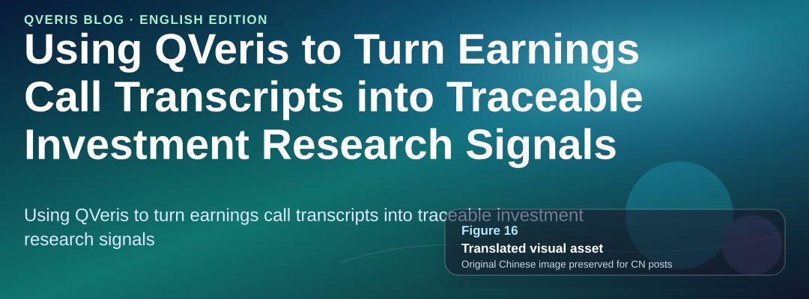
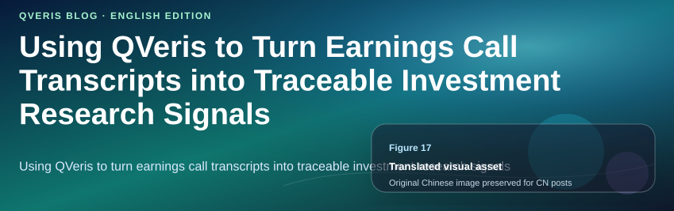

QVeris · Data Test


This is a third-party practice note. The sample program has since been extended into a full-context version: in addition to earnings call transcripts, it now brings post-call market performance, basic financial metrics, news context, semantic classification, a manual annotation template, and an LLM review pack into the same workflow.

**The core goal has not changed**:

It is not to generate investment recommendations automatically. It is to organize theme changes across companies and quarters into reviewable research signals, while preserving the original text evidence and data-call records behind every signal.


## Starting from a Real Problem


Earnings call transcripts are an excellent foundational data source for investment research agents. Compared with news, they are closer to how companies communicate firsthand. Compared with financial statement tables, they more directly reflect how management describes the business, risks, and future expectations.

But transcripts also have obvious problems. A single transcript can easily run to tens of thousands of words, and the manual reading cost becomes high when comparing multiple companies across multiple quarters. If you simply ask a model to “summarize it,” the evidence trail is easy to lose, making the final result hard to verify.


## What the Sample Program Does Now


The program is called QVeris Earnings Call Signal Demo. Its inputs are simple: stock symbols, the most recent quarters, and themes of interest. The new version runs with `--full-context`, pulling transcripts, market context, fundamental data, and news context in one pass.


 Program run overview: theme strength, evidence count, output files, and follow-up questions 



## A Real Run


I ran the program on AAPL and NVDA for their two most recent quarters, producing four transcripts. The new full run took about 12 seconds and generated 381 evidence snippets and 12 output files.



In the theme results, AI was the strongest signal, with 210 mentions led by NVDA. SupplyChain, Margin, Pricing, and Guidance also formed a comparable theme matrix. These numbers are not conclusions; they are indexes for the next round of source-text reading.
## Putting Earnings Calls into Broader Context


Looking only at transcripts can miss important external context. The new version continues to use QVeris to call fundamental and news-related tools, placing recent fiscal-year revenue, gross margin, operating margin, ROIC, and the latest news themes into the same result set.


 Context matrix: fundamental metrics and latest news themes 


The value is straightforward: when a theme heats up or cools down, analysts can view it alongside fundamental indicators and external news narratives. For example, Margin / Pricing themes can be read together with gross margin and operating margin, while AI / Product themes can be compared with recent news headlines.
## Research Timeline: Combining Themes, Market Data, and Fundamentals


`research_timeline.csv` is a key new output in this version. It organizes the strongest theme, mention count, post-call market performance, and latest fundamental metrics row by row for each earnings call, making it suitable for a first-pass screen.


 Research timeline: theme changes, market reaction, and fundamental metrics 


At the same time, `theme_timeseries.csv` outputs fields such as `mentions_per_1k_words`, opportunity/risk context, management-initiated discussion, and analyst follow-up by company, quarter, and theme. If the program is extended further, this file can be turned directly into a long-term trend chart.
## Evidence Ledger, Semantic Classification, and Manual Annotation


One of the biggest risks in investment research analysis is a result that looks like a conclusion but has no clear source. This demo generates `evidence_ledger.csv`, where each row includes the company, quarter, matched theme, keyword, speaker, prepared remarks / Q&A segment, source classification such as management-initiated discussion / analyst follow-up / management response, and the original text snippet.

The new version also adds lightweight semantic buckets, such as `demand`, `supply`, `pricing`, `margin_cost`, `competition`, `regulation_macro`, and `product_technology`. This is not the final model. It is an interpretable starting point: first make the evidence groupable, then improve it gradually through manual annotation.


 Semantic classification and manual annotation template 


The real value is not summarizing transcripts into a few paragraphs. It is getting the full chain to work: data discovery, calls, comparison, evidence retention, and human review.
## How the Call Content Is Retrieved


Market context uses a historical price tool, but that is only supplementary background. The primary data source for this demo is the earnings call transcript. Both the call periods and the transcript body are retrieved by searching for and executing tools through QVeris.

The program does not hard-code external API endpoints directly. Instead, it first asks QVeris to search for two types of tools: “earnings call dates” and “earnings call text.” After search hits are returned, the subsequent executions are associated through the returned `search_id`.



The actual flow is: first search for tools, then call the transcript dates tool for each stock symbol. For example, given AAPL, the tool returns available fiscal years, quarters, and dates. The program then selects the most recent periods based on the user-provided `--quarters` value. Finally, for each period, it calls the transcript content tool and passes `symbol/year/quarter` to retrieve the body text.



Only after receiving the `content` field does the program enter the analysis stage: speaker identification, prepared remarks / Q&A segmentation, theme matching, risk/opportunity context, semantic buckets, and the evidence ledger. Market prices, fundamentals, and news are added as context after transcript analysis is complete.

This is why the article emphasizes “traceable”: the report does not only show theme statistics. It also records the tools found by QVeris search, execution results, `execution_id`, cost, and the original text snippets corresponding to each theme signal.

### How the WeChat Official Account Article Was Used 

This demo is not a retelling of the WeChat article. It turns the product idea in that article into a runnable third-party practice.



In other words, the WeChat article provides the direction for “why QVeris is suitable as API Agent infrastructure.” This demo answers a different question: “Can we take a real investment research problem and make that path work end to end?”
## Getting Market Context Through QVeris


The program does not call an external chart API directly. Instead, it searches for and calls market data tools through QVeris to retrieve historical EOD prices. The current tool is:

financialmodelingprep.historical_price_eod.light.retrieve.v1.3f860211


 QVeris market context: next trading day and five-trading-day performance after the call 


The purpose of this step is not to use stock price reactions as proof of the call content. It is to give analysts background: which post-call market reactions are worth examining alongside theme changes. The program writes `execution_id`, cost, and `market_tool_id` into the CSV as well, making the process traceable.
## LLM Review Pack


To avoid LLM-generated conclusions without sources, the program additionally exports `llm_review_pack.json`. This file includes guardrails, theme views, market context, fundamental context, news summaries, evidence samples, and a prompt for a review memo.


 LLM review pack: guardrails, context, and evidence samples 


Its role is not to let the model produce investment advice directly. It is to let the model generate review questions based on evidence, helping humans more quickly reach the point of “which part of the original transcript should I revisit?”
## A Small Implementation Improvement: External Calls Need Graceful Degradation


During this full run, the transcript API encountered one `ReadTimeout`. The program therefore added a practical improvement: if a date or transcript call fails once, it no longer crashes the entire analysis. Instead, the failure is recorded in `missing_transcripts` and execution metadata, while other companies and quarters can continue producing results.

If this kind of demo is to become a long-running tool, external API timeouts, empty results, and partial failures should be normal branches, not terminal exceptions.
## How to Run It

```bash
uv sync
cp .env.example .env
uv run earnings-signal \
  --symbols AAPL,NVDA,TSM \
  --quarters 2 \
  --theme-set extended \
  --themes AI,Margin,Guidance,SupplyChain,Pricing,Competition \
  --full-context
```

Code repository:

https://github.com/ax2/qveris-earnings-call-signal-demo
## How the Program Is Implemented




The implementation idea behind this demo is not complicated: delegate “finding data interfaces” and “calling data interfaces” to QVeris, then focus on the investment research workflow itself. The program does not hard-code a fixed interface internally. Instead, it first searches for available tools using natural language, then selects the most suitable tool from the search results for execution.



### Several Key Concepts 



### Implementation Notes

The demo was built in stages rather than as a one-shot script. The first version focused on the smallest useful loop: search for transcript-related tools through QVeris, call them, extract evidence, and write the results to CSV and Markdown.

The second version expanded that loop into a full-context run. Market data was also retrieved through QVeris instead of relying on a separate chart API, so the output could keep a consistent record of tool IDs, parameters, execution IDs, and cost.

The final version added the web layer: a FastAPI service, a dashboard, an HTML report page, screenshots, and a lightweight service deployment. That made the demo easier to review than a command-line report alone, while keeping the underlying research artifacts reproducible.


## What Could Be Done Next


- Connect `theme_timeseries.csv` to a chart page to create a long-term trend view filterable by company and theme.

- Replace the rule-based semantic buckets with a small evaluable classification model, while still keeping the evidence ledger as the traceable foundation.

- Use `annotation_template.csv` for manual annotation and measure the differences between rule-based classification and human classification.

- Turn news events, fundamental changes, and earnings call theme changes into a clearer event timeline.

- Add more data sources, while recording the called tool, parameters, `execution_id`, and cost for every new source.

This article is only a small reproducible experiment and does not constitute investment advice. External use still requires consideration of data source terms, company announcements, and human judgment.
