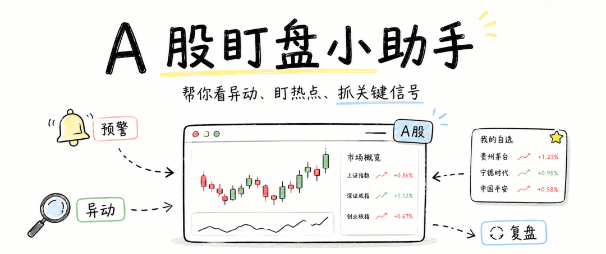
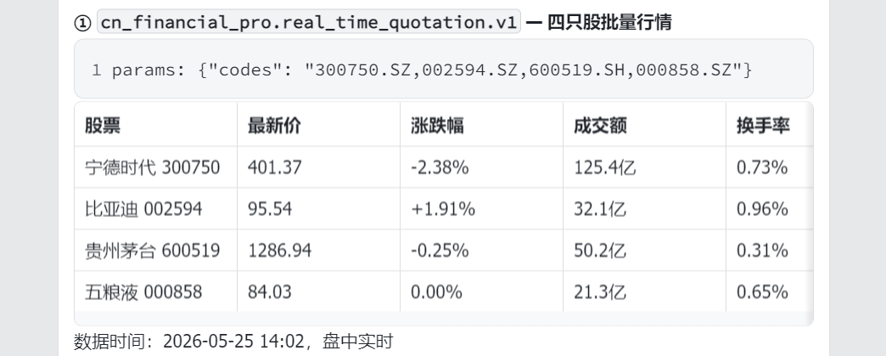
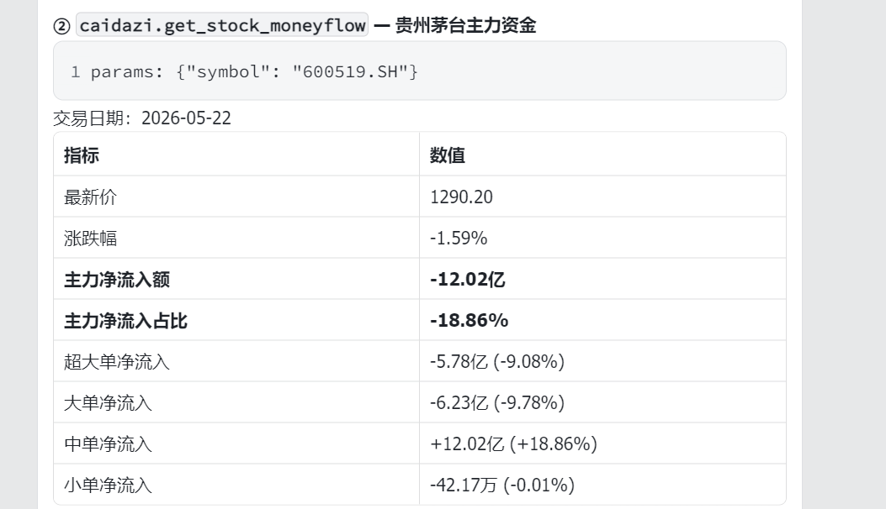
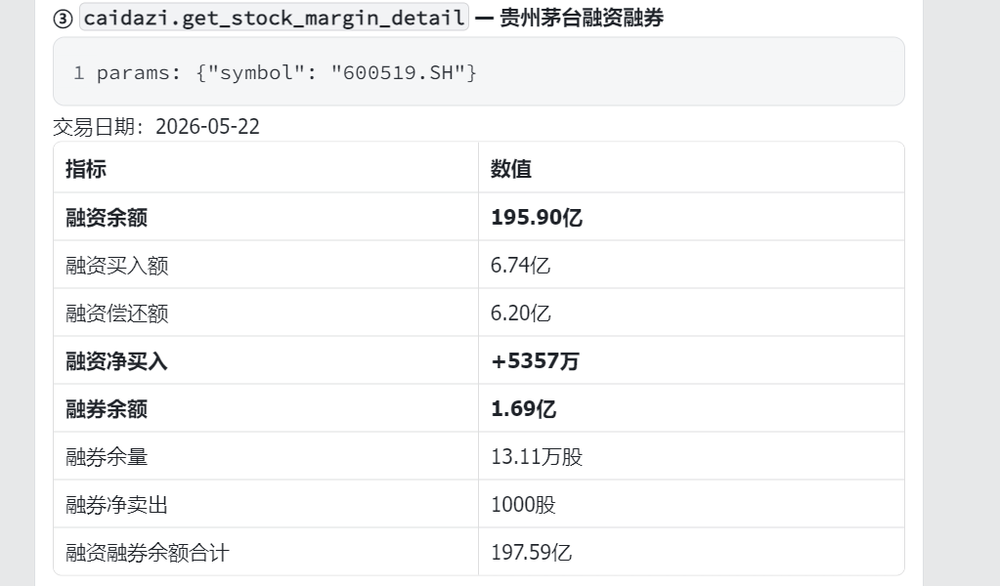
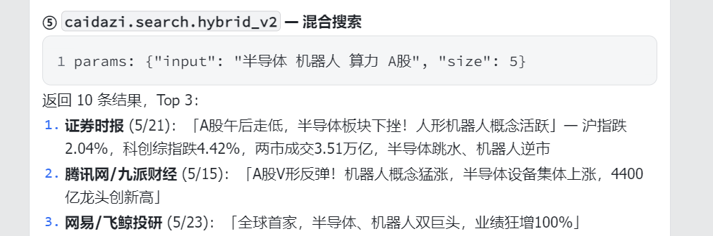
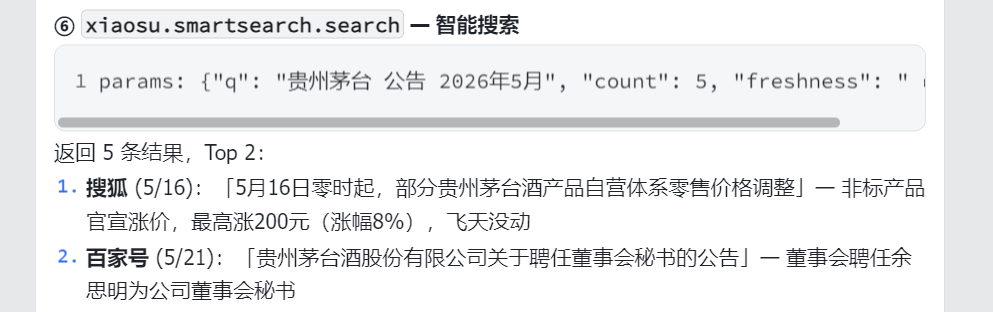
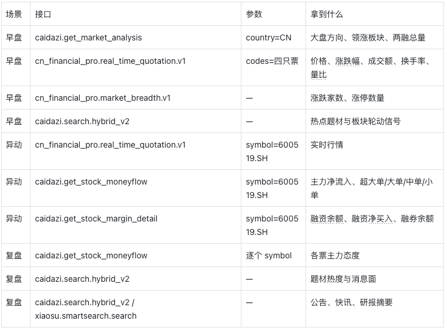

QVeris · Data Tested in Practice

Every morning at 9:30, the first thing I do is not open my watchlist. I first scan what moved yesterday, what is moving first today, and where the money is flowing.

It is not complicated. But it is fragmented. Dozens of stocks, several apps, constant switching. By the time you figure out "where should I look first today," it may already be 10:00.

More and more experienced A-share investors are starting to give themselves a small assistant.

It does not make decisions for you. Buying and selling are always your own responsibility. What it does is scan the market first, filter out unusual moves, and connect capital flows with market themes into one or two reliable observations.

By the time you sit down to watch the market, the key points are already in front of you.

If you have seen QVeris's full view of A-share data capabilities, the next question worth asking is not "how much data is covered," but how to connect these capabilities into a daily market-watching tool. Below are three scenarios I use myself.

## At 9:30, Do Not Start With Individual Stocks

The biggest fear in the morning session is being half a step too slow. The market is already trading robots and semiconductors, while you are still clicking through stocks one by one. When using QVeris for the morning session, the first step is not to stare at individual names. Start with the broader picture.

The assistant first gets today's market snapshot: intraday A-share trading is active, and technology remains the main focus. Among four watchlist stocks, BYD is the strongest with a 1.91% gain, while CATL shows the biggest divergence with a 2.38% decline. It does not dump raw text on you. It translates the signal directly: "BYD and CATL are both moving today, but in opposite directions. BYD looks more offensive, while CATL looks more like a pullback amid divergence."

Only then does it move to the watchlist.

It checks four tickers at once and directly returns the latest price, percentage change, turnover, turnover rate, volume ratio, and PE.

You can immediately see whose price moved, whose turnover expanded fastest, and whose turnover rate picked up.

At a glance: BYD is stronger today. CATL is down the most, but also has the largest turnover, which means the divergence is significant. Kweichow Moutai has 5 billion yuan in turnover, but its price barely moved and its turnover rate is low.

Data time: intraday snapshot at 14:02 on 2026-05-25, tested with cn_financial_pro.real_time_quotation.v1

Moutai's turnover is 5 billion yuan, but its percentage change is only -0.25%. Turnover rate is 0.31%, and volume ratio is 1.12. If you say it is inactive, the 5 billion yuan turnover is right there. If you say it is strong, the price has barely moved. Watching price alone can easily mislead you. The assistant also adds another layer: market breadth. There are 2,226 constituents in the Shanghai Composite Index.

When breadth is weak, it reminds you: "This looks more like concentrated positioning in a few names. Be cautious about chasing highs." When breadth starts expanding, it changes the wording: "There are signs of diffusion. The main theme is worth scanning more broadly."

Intraday advance-decline data has not yet been generated, but extreme values of 0 indicate that there is not yet a broad extreme market with a large number of new highs or new lows.

The final step: search "semiconductor robot computing power" and tag the themes.

The returned news flashes confirm the direction. Securities Times reported on 5/21 that "the semiconductor sector plunged, while the humanoid robot concept was active against the broader market," indicating that capital is rotating inside the technology line. The assistant directly concludes: "Semiconductors remain active but divergence is increasing. The robot direction has follow-on capital. This looks more like a signal of internal diffusion within the technology line."

By 9:35, you already know which direction to watch first.

What you save is not the few seconds needed to check one quote. It is the work of connecting four interfaces, "market state + watchlist + market breadth + theme classification," into one coherent clue.

## When a Watchlist Stock Suddenly Pulls Up

The biggest problem with ordinary alerts is that they only tell you a stock is up 5%.

Honestly, no. Let me put that differently.

That is only where the work begins.

The assistant gets: main capital net inflow of -1.202 billion yuan, accounting for -18.86%.

Super-large orders outflow 578 million yuan, large orders outflow 623 million yuan, and medium orders inflow 1.202 billion yuan.

It does not say "there is unusual activity." It says: "Main capital net outflow exceeds 1.2 billion yuan, and both super-large and large orders are withdrawing. This does not look like active accumulation."

That one sentence answers the most important question: is this stock worth chasing?

Data time: trading day of 2026-05-22, tested with caidazi.get_stock_moneyflow (symbol=600519)

Then it retrieves margin financing and securities lending data. Financing balance is 19.59 billion yuan, with net financing purchases of +53.57 million yuan.

Money is still coming in. Wait, securities lending balance is 169 million yuan, so some investors are also shorting.

The assistant gives a complete judgment: "Leverage is still participating, but main capital is weak."

Data time: 2026-05-22, tested with caidazi.get_stock_margin_detail (symbol=600519).

Positive net financing purchases → leveraged capital is still adding long exposure; net securities lending sales of 1,000 shares → short sellers are active, but the size is extremely small.

Continue analyzing financing: the balance is still there, and net financing purchases are positive. Money is still coming in. Wait, securities lending has also changed; someone is shorting. The assistant gives a complete judgment: "Leverage is still participating, but main capital is weak."

There is one more thing that is often overlooked.

If a stock is active but not part of the main market theme, search current hot themes inside the assistant. If it does not belong to a popular theme, it is only a local fluctuation. For the same unusual move, ordinary software only tells you how much the stock has risen.

QVeris's assistant weaves "price + capital flows + margin data + themes" into one sentence.

## After the Close, Who Should You Watch Tomorrow?

You cannot necessarily watch the market all day. The most valuable thing is not dozens of intraday alerts. It is the organized list after the close.

After the close, the assistant first pulls the daily snapshot for all watchlist stocks. It does not simply rank them by gains.

It filters the first tier using "strong price + expanding turnover + rising turnover rate."

A name like Moutai, with active turnover but weak price gains, is set aside. It is not bad. It is just not the first direction to watch tomorrow.

Then it evaluates the filtered stocks.

It does not display every field one by one. The assistant layers them itself: strong price and strong capital flows → priority watch; strong price but weak capital flows → observe, but do not rush; average price performance but capital positioning in advance → make a note first.

News search is added as well: search "semiconductor robot computing power," and it returns news flashes from Securities Times, Tencent, and other media. On 5/21, A-shares plunged in the afternoon, the semiconductor sector fell, but the robot concept was active against the broader market.

Search "Kweichow Moutai announcement," and two key pieces of information appear: on 5/16, the company officially announced price increases for non-standard products, with increases of up to 8%; on 5/21, it appointed a new board secretary.

This is not for reading news. It is to add one line of explanation: is this move driven by a theme, an announcement, or pure capital flows? After running the process, the assistant directly outputs the list.

The next day, when you open the market, you do not have to start from zero. Back to the main point: what exactly is running behind these three scenarios? Here is a quick review in one table:

If you want to run these scenarios, the experience looks roughly like this:

👤 "How is the overall A-share mood today? Which is stronger, technology or consumption?"

🤖 "Kweichow Moutai's latest price is 1286.94, down 0.25%, with turnover of 5 billion yuan and turnover rate of 0.31%. PE TTM is 19.48. Main capital net outflow is 1.202 billion yuan, accounting for -18.86%. Super-large and large orders are both withdrawing. Financing balance is 19.59 billion yuan, and net financing purchases are +53.57 million yuan, so leverage is still adding. Also, on 5/16, Moutai just adjusted prices for non-standard products, with increases of up to 8%, while Feitian was unchanged. This is not a one-sided bearish signal. It looks more like divergence: some believe valuation has reached a fair level, while others believe the profit impact of price increases has not yet been released."

👤 "Help me compare CATL and BYD. Which is stronger today?"

🤖 "CATL is currently up 2.3%, with turnover above 5 billion yuan and turnover rate of 1.2%. BYD is up 1.8%, with turnover of about 3.8 billion yuan. Looking at the speed of turnover expansion and turnover rate, CATL is more active. Both companies have net inflows of main capital, but CATL has a higher share of super-large orders, which looks more like institutional positioning."

👤 "Is today's market a local concentration trade or a broad rally?"

🤖 "From market breadth, the number of rising stocks is relatively high and the number of limit-up stocks is increasing. This is not a small group of stocks holding together. Semiconductors, robots, and computing power are active at the same time, showing signs of diffusion. However, the new energy direction has not yet caught up, so the main theme has not fully spread."

The data in the dialogue all comes from QVeris suppliers and is retrieved in real time through QVeris. You only need to ask questions in Chinese. QVeris automatically handles tool selection, interface calls, and result synthesis.

The biggest difference from your usual workflow: you do not need to know which supplier the data comes from, memorize dozens of parameter names, or switch across five web pages. It is enough to know what you want to understand.

## Scope and Limits

To be clear, this "assistant" is positioned to help you filter key points and connect clues, not to make decisions for you.

It can answer questions such as "who is rising today, where is the money flowing, and what is main capital's stance?" But it cannot answer "what price will definitely be reached tomorrow." That has little to do with data and much more to do with luck.

Also, different data types refresh at different frequencies. Quotes can be minute-level, but consensus expectations and margin financing data have their own update cycles. Do not treat it as a tick-level tool. It is not designed for that scenario. If you need a partner to organize market information for you every day, this setup is a good fit. If you need millisecond-level signals, that is not the role it is built to play.

**QVeris Data Tested in Practice** — The scenario data in this article comes from multiple suppliers including caidazi, cn_financial_pro, and xiaosu, and is retrieved in real time through the QVeris capability routing network.

For people who trade A-shares, the real opponent every day is not the market. It is time.

It is not that you do not know what to watch. It is that you do not have enough time to watch it.

The value of QVeris is not that it can query more data. The data is already there. It pulls you out of the loop of "turn pages → filter key points → connect clues." Let it watch for you, filter for you, and connect the pieces for you. You sit down and look directly at what matters.

Not flashy. Useful every day.
