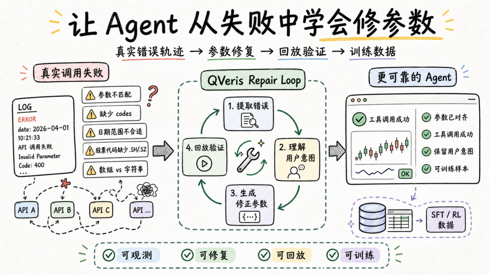
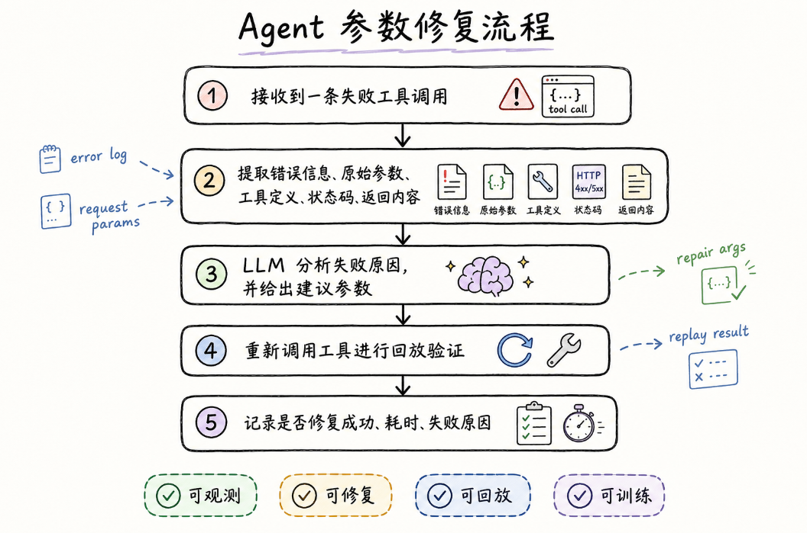

QVeris · Engineering Practice

#  



## Background


QVeris has already connected a large number of APIs and tools into the Agent execution path, enabling models to access data, call services, and complete tasks in the real world.

**As tools are used more frequently, a new issue has become increasingly important**:

An Agent must not only be able to call tools. When a call fails, it also needs to understand why, correct the parameters, and continue the task while preserving the user's original intent as much as possible.

Tool call failures are common in real-world scenarios.

Often, the problem is not that the tool is unavailable, nor that the user made a mistake. Instead, there are small but critical differences between the user's natural expression, the model-generated parameters, and the provider's standard definitions.

For example, a user may simply want to query a stock, a date range, or a class of indicators, but different providers may impose different requirements on parameter formats:

- Whether stock codes require market suffixes such as .SH or .SZ

- Whether multiple codes should be passed as an array or as a comma-separated string

- Whether date fields are named startdate/enddate or from/to

- Whether required fields must be passed explicitly

- Whether certain indicator fields only accept provider-defined enum values

- Whether certain data sources impose restrictions on permissions, regions, or instrument coverage


These differences are critical for tool calls. If an Agent cannot understand and correct them, it may fail even when the intent is right, simply because the parameters are not aligned.

A reliable alignment layer is needed between real-world user intent and the provider's executable schema.

So what I have been working on recently is turning these failed call records into an analyzable, replayable, and trainable data pipeline, so the system can learn from real errors and gradually improve its ability to repair tool parameters.

## What We Are Building


**A complete parameter repair trajectory looks roughly like this**:



The pipeline looks simple, but implementing it exposes many detailed challenges.

Real tool call logs are usually complex. They contain user intent, original parameters, tool definitions, status codes, provider responses, error messages, and execution context. For an Agent, simply stuffing the entire raw log into the model is not enough. The key is to extract the context that actually helps with repair.

**For example, after a failed call, the model needs to see all of the following**:

- What the user originally wanted to query

- What parameters were actually passed to the tool

- What field names and field types the tool definition requires

- What error message the provider returned

- Whether external constraints exist, such as permissions, resources, or data coverage


**Only when this information is clearly organized can the model determine**:

Whether the failure was caused by a missing field, a format mismatch, an unsuitable parameter value, or a provider-side data coverage or permission limitation.

This also shows that Agent parameter repair is not just about asking the model to think again. It requires a context organization mechanism designed specifically for tool execution.

## A Real Example: Error Attribution for a Market Data Tool


Take a real-time market data tool as an example. We performed cluster analysis on real failed call records.

Here, we did not manually define error types in advance. Instead, we grouped failures based on the error text that actually appeared. This makes the analysis closer to what happens in production.

**The errors we observed included**:

- 
- 
- 
- 
- 
- 

```js
API error: no data.Too many codes: maximum allowed is 50Ambiguous codes foundMissing required query parameterPermission deniedServer disconnected
```

The right repair strategy is not the same for each of these errors.

**For example**:

- `Too many codes` means the number of security codes passed in a single call exceeded the limit, so the list needs to be truncated or split into batches

- `Ambiguous codes` means the code is not specific enough, so a market suffix needs to be added

- A missing required parameter means the field name may have been passed incorrectly, or the model failed to fill in a required field

- `Permission denied` indicates a permission or data source limitation and should not simply be counted as an ordinary parameter repair failure

- `API error: no data` may require further judgment based on the instrument, date, and indicator fields

- This kind of analysis helps us break failed records down into finer-grained, tractable problems.

## A Small-Scale Experiment

We selected a batch of real failed market data tool calls and ran a parameter repair experiment.

**The process was straightforward**:

```
failed record -> key information extraction -> LLM root-cause analysis -> corrected parameters -> re-execution for validation
```


**In the experiment, we saw that the model could already identify many typical issues, such as**:

- Missing required parameters

- Stock codes missing market suffixes

- Too many codes passed in a single call, exceeding the tool limit

- Parameter field names inconsistent with the tool definition

- Some errors that were closer to permission or data source limitations


More interestingly, many failures were not caused by the model completely misunderstanding the task. Instead, they got stuck on finer-grained tool format constraints.

For example, a user may simply want to query market data for 600519.SH and 000001.SZ. The intent itself is clear. But when the LLM converts that intent into tool parameters, it must strictly match the provider's parameter format.

**For some market data tools, multiple stock codes need to be organized as a single English comma-separated string**:

`{"codes":"600519.SH,000001.SZ"}`

**Not as a JSON array**:

`{"codes":["600519.SH","000001.SZ"]}`

Semantically, both forms express multiple codes, but to the tool they are completely different data types.

This shows that parameter repair is not only a semantic understanding problem. It is also a tool schema alignment problem.

**For an Agent to use tools reliably, it cannot only know which stocks should be queried. It also needs to know**:

- 
- 
- 
- 
- 

```js
what the field should be calledwhat the field type ishow multiple values should be representedwhich suffixes the provider can recognizewhich errors should not be solved through further parameter repair
```

This gives us a clear direction for future optimization: in prompts and compressed tool definitions, we should not only tell the model what the tool can do, but also describe more clearly what shape the tool expects its parameters to have.

## From "It Runs" to "It Preserves User Intent"


This experiment also led to an important conclusion: parameter repair should not merely replace the parameters with something that succeeds. It should preserve the user's original intent as much as possible.

For example, if the user originally wanted to query a group of security codes, and the error is that the codes are missing market suffixes, the correct repair is to add the suffixes, not to replace them with a common example code.

The latter may run successfully, but it does not preserve the user's intent.

**Therefore, future prompt design for Agents should make this explicit**:

- 
- 
- 
- 

```js
read the user's original parameters firstthen determine the issue based on the error messagetry to preserve the original query instrumentsfinally output repaired parameters strictly according to the tool schema
```

Only when the original intent cannot be recovered at all should a high-coverage fallback example be used.

## Why This Matters


If the system simply returns an error message after a failure, the Agent experience is interrupted.

But if the system can understand the error, repair the parameters, and execute the call again, the Agent's capability shifts from "able to call tools" to "able to handle tool call failures."

Tool calling is only the first step. What truly determines whether an Agent can enter production is its execution reliability across a complex tool ecosystem.

What QVeris is building is a continuously improving loop that connects calls, feedback, repair, and validation.
