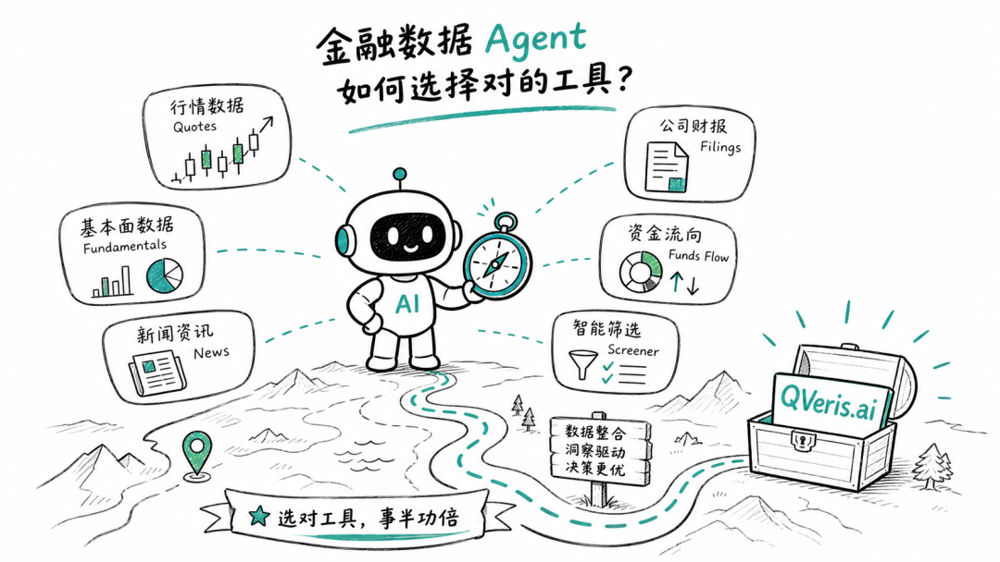
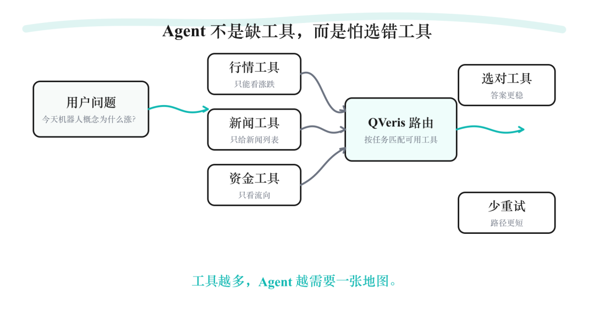
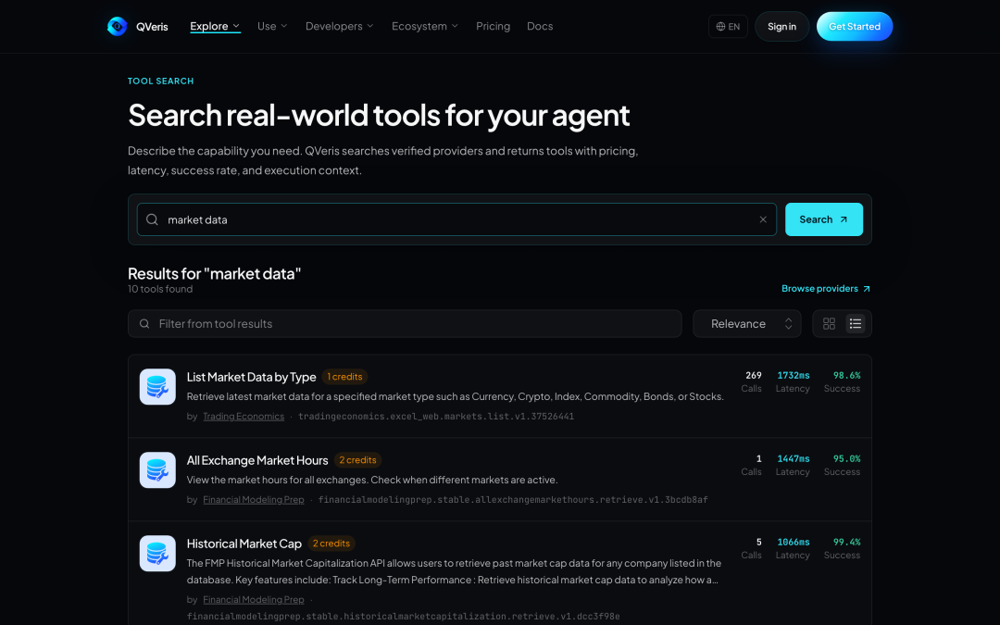
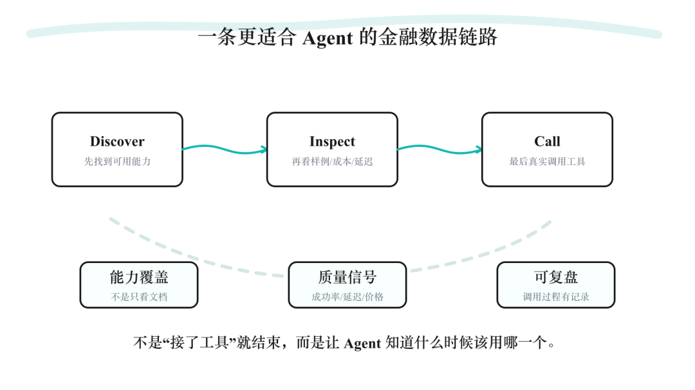
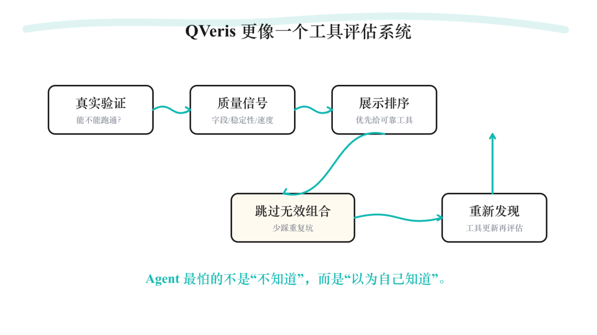
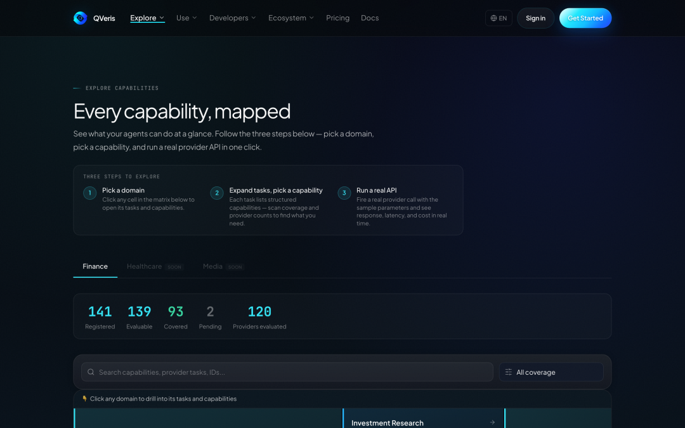

QVeris · Data-Tested

If you have built a financial Agent, you have probably run into an awkward problem:

The more tools you connect, the easier it becomes for the Agent to get lost.

To check market quotes, there is a quote tool.

To check financial statements, there is a financial reporting tool.

To check news, there is a news tool.

To check capital flows, there is a fund-flow tool.

To check company fundamentals, there is yet another set of tools.

It looks rich.

But when it comes time to use them, the real questions begin:

Which one should be called this time?

Which one has more complete fields?

Which one supports batch queries?

Which one returns more stable results?

Which one only claims support in the documentation, but is not actually useful in real calls?

This is one of the most underestimated problems in financial Agents:

Connecting tools is not hard. Choosing the right tool is.

In the past, saying that an Agent could call tools already sounded impressive.

But in finance, being able to call tools is far from enough.

Financial data is not a simple question-answering scenario.

You ask:

"Why are robotics-related stocks up today?"

Behind that question, the Agent may need to look at market quotes, sectors, trading volume, capital flows, news, announcements, research reports, financial statements, and the industry chain at the same time.

If the Agent chooses the wrong tool, it is not just a little slower.

It may go down the wrong path entirely.

That is what makes this QVeris.ai upgrade interesting.

It is not simply about connecting a few more financial APIs.

It is solving a more fundamental problem:

How can an Agent know which tool path to use for the task at hand?

## First, turn "looks usable" into "actually usable."

In financial data tools, many capability descriptions are vague.

The same phrase, market quote data, can mean very different things. Some tools can only query a single stock, while others support batch queries; some have complete fields, while others have missing fields; some work in real requests, while others only appear to be supported in the documentation.

If all of these results are mixed together, the page may look like it has broad coverage.

But when users actually use it, they still have to identify the pitfalls themselves.

What QVeris has done this time is prioritize tools that are more reliable and more thoroughly validated.

The biggest risk in a tool recommendation system is not having too little information.

It is packaging uncertain information as a certain conclusion.

## Second, break capabilities down from the provider level to the tool level.

In the past, when we looked at capability coverage, we might only know:

A certain provider supports this capability.

But when an Agent actually makes a call, it is not calling a provider.

It is calling a specific tool.

It is like going to a hospital. Knowing that "this hospital is strong" is not enough.

You also need to know:

Which department to visit.

Which doctor to see.

Which examination to run.

How to interpret the results.

QVeris breaks capability details down more granularly, so you can see the specific tool, real examples, parameters, and returned results.

This is critical for Agents.

An Agent does not need a vague statement like "this provider supports it."

It needs to know:

Which exact tool should I call next?

## Third, do not disguise "uncertain" as "certain."

This is especially important in Agent scenarios.

The biggest problem for an Agent is not that it does not know.

It is that it thinks it knows.

If the system concludes that a tool is "not supported" simply because it did not find something in the documentation once, the Agent may never try that path again.

That can unfairly exclude many tools that are actually usable.

So QVeris now distinguishes more carefully between:

Which capabilities have been verified in practice.

Which ones are only temporarily unconfirmed.

Which ones are truly unsuitable for the current task.

This is really about giving Agents an important capability:

Do not reach conclusions too early.

## Fourth, remember combinations that have already proven ineffective.

Some tool-and-task combinations have already been verified as unsuitable.

Those should not be retried every time.

This does more than save time.

It also reduces noise.

But it does not permanently shut the door.

If the tool is updated, or if the capability definition changes, the system will give it another chance.

It is like a good researcher.

They do not step into the same pit again and again.

But they also do not reject an entire direction forever because of one failed attempt.

What QVeris is building is not just a collection of financial data tools.

It is more like a financial data navigation system for Agents.

Having more tools does not automatically make an Agent smarter.

Sometimes, the more tools there are, the more the Agent needs a map.

That map needs to tell it:

Which tools are usable.

Which tools are stable.

Which tools fit the current task.

Which results have real examples.

Which paths have already been verified as difficult to use.

The next stage of competition for financial Agents may not be about model capability alone.

It may be about who can more reliably find data, understand data, call tools, and reduce misjudgments.

The next step for financial Agents is not connecting more tools. It is becoming better at choosing tools.

That is the problem this QVeris.ai upgrade addresses.

It helps people avoid repeated trial and error in a sea of tools.

And it helps Agents become more than merely "able to call tools."

It helps them truly become better at using tools.
