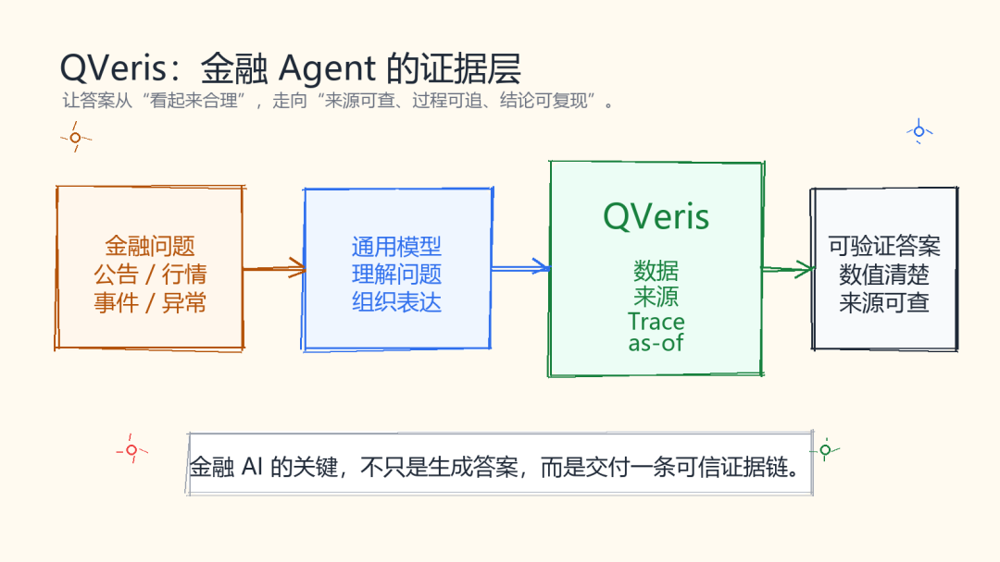
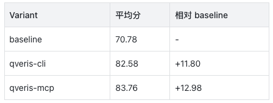
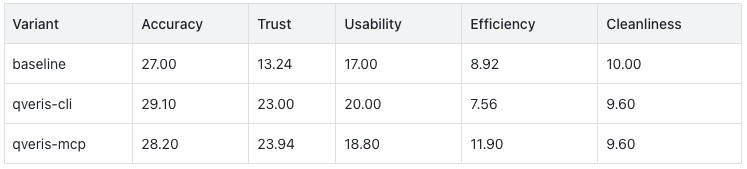

QVeris · Product Review

The most dangerous part of financial AI is not that it fails to answer. It is that it answers in a way that sounds real, while being unable to explain where the data came from.

**In financial workflows, an analysis cannot be evaluated only by how fluent the language is. It also has to show whether it can**:

provide specific numbers,

identify the point in time for the data,

leave traceable sources,

and reliably produce usable answers across complex tasks such as filings, market data, event monitoring, and anomaly detection.

This is exactly where QVeris is designed to matter.

This evaluation used Claude as the control Agent and covered 50 real financial workflow tasks. It compared three operating modes:

1.  a baseline without QVeris,

2.  qveris-cli, connected through the QVeris CLI,

3.  qveris-mcp, connected through QVeris MCP.

The tasks covered typical scenarios including financial information retrieval, market data queries, filing summaries, event monitoring, anomaly discovery, and multi-source synthesis. Scoring was performed by DeepSeek deepseek-v4-pro as the LLM Judge.

## After Connecting QVeris, Claude’s Financial Task Scores Improved Significantly

The results of this evaluation are straightforward: after connecting QVeris, Claude’s average score on financial tasks rose from 70.78 to above 82. qveris-mcp reached 83.76, the highest score among the three groups.

In other words, under the same Claude control Agent, QVeris improved the average financial task score by about 12 to 13 points.

This was not an improvement in a single isolated metric. It was an improvement in overall workflow quality. qveris-mcp achieved a completion rate of 96% and an effective result rate of 94%, while using an average of only 18.00 tool calls, much lower than the baseline’s 45.26 and qveris-cli’s 26.90.

This shows that QVeris does more than give the Agent another data interface. It helps the Agent complete higher-quality financial analysis through a shorter path.

## QVeris’s Core Value Is Filling the Evidence Chain for Financial Agents

General-purpose large models are already good at organizing language. The real gap is whether the financial conclusions they produce are trustworthy, checkable, and reproducible.

This evaluation assigned Trust a separate score of 25 points, focusing on source quality, URLs, as-of dates, tool-call evidence, and anti-hallucination capability. When the five evaluation dimensions are separated, QVeris’s advantage becomes very clear.

The baseline’s Accuracy was not poor, and its Cleanliness was even the highest. This shows that Claude itself already has strong financial common sense and text organization capabilities.

The real differentiator was Trust.

The baseline’s Trust score was 13.24, qveris-cli scored 23.00, and qveris-mcp scored 23.94.

QVeris is not solving the question of “Can AI write a piece of financial analysis?” It is solving the question of “Does this analysis have trusted sources, tool evidence, and a reproducible call chain?”

## MCP Integration Makes It Easier for Agents to Use Financial Tools Well

Among the three operating modes, qveris-mcp delivered the strongest overall performance. It not only achieved the highest score, but also required fewer tool calls.

qveris-mcp averaged 18.00 tool calls, lower than qveris-cli’s 26.90. Its average number of QVeris calls was 8.58, roughly half that of qveris-cli. It also had the lowest average latency, at 907,640 ms, and its tool success rate reached 71.33%, higher than qveris-cli’s 62.34%.

This reflects the difference in interface design.

CLI is more like asking the Agent to assemble commands, test parameters, and process text output on its own.

MCP provides a more structured tool interface.

For an Agent, a structured interface means fewer misuses, shorter paths, and lower call costs.

That is why qveris-mcp led simultaneously in total score, completion rate, effective result rate, and efficiency.

## Filing Summaries and Anomaly Detection Are High-Value Scenarios for QVeris

By task type, QVeris stood out in filing summaries, anomaly detection, and multi-source synthesis.

The baseline was not weak in event monitoring and anomaly detection, which shows that general-purpose models, when paired with public sources, can handle some open-information tasks. But the gap in filing summary tasks was very clear: the baseline scored only 41.9, while qveris-mcp reached 79.0.

These tasks naturally depend on stable data entry points, complete document content, and clear source chains. Relying only on public web search can easily lead to unstable access points, incomplete content, and unclear citations.

QVeris’s value appears precisely in these demanding tasks: it enables Agents to obtain verifiable materials through professional data and toolchains, rather than merely “finding some web pages.”

In anomaly detection tasks, qveris-mcp also reached 92.9, higher than the baseline’s 84.9 and qveris-cli’s 91.1.

This shows that QVeris is not only useful for querying data. It can also support more complex financial judgment workflows.

## This Evaluation Was Fair to the Baseline

This scoring did not treat “whether QVeris was used” as a direct bonus. The baseline could also receive a high Trust score if it provided authoritative public sources, URLs, and as-of information.

At the same time, a QVeris trace was not an automatic advantage. It only improved trustworthiness when the tool calls succeeded, the evidence was traceable, and the calls made a real contribution to the answer.

In other words, QVeris did not lead because the scoring rules favored it. It led because it provided more stable and more verifiable data and tool evidence for financial tasks.

This scoring logic was not designed to pursue “complete neutrality.” It was oriented toward verifiable evidence chains. For financial tasks, that is a reasonable value judgment.

In financial analysis, simply saying “I think” is not enough. An answer becomes closer to production-ready when it can explain what data, what point in time, and what tool calls support its conclusion.

## QVeris’s Value Is Already Reflected in the Results

Any toolchain intended for real financial scenarios needs continuous refinement in stability, coverage, and integration experience. QVeris is no exception, and it will continue to evolve.

But based on the results of this evaluation, QVeris’s value is already clear: it significantly improved the trustworthiness, completion rate, and business usability of financial Agents. qveris-mcp, in particular, delivered the best overall performance across total score, completion rate, effective result rate, and tool efficiency.

This means QVeris is not merely a “data interface.” It helps Agents build more reliable financial analysis workflows: from asking the question, to obtaining data, to forming traceable conclusions.

For financial AI, this shift from language generation to evidence-driven analysis is a key step toward production readiness.

## Final Judgment: QVeris Brings Financial Agents Closer to Real Business Use

This evaluation supports three clear conclusions.

First, if final quality is the priority, qveris-mcp is currently the best option. It had the highest total score, the highest completion rate, the highest effective result rate, and the best call efficiency.

Second, if answer completeness and structural usability are the priority, qveris-cli is very strong. Its Accuracy and Usability performance stood out, making it suitable for scenarios that require stronger structured output.

Third, the baseline performed adequately, but its weaknesses were clear. It is low-cost and produces clean output, but it still lags behind in financial evidence chains, filing summaries, and data-source traceability.

QVeris’s core value can be summarized in one sentence: it moves financial Agents from “able to write an answer” toward “able to provide answers that are verifiable, traceable, and ready to enter business workflows.”

That is exactly the threshold financial AI must cross when moving from demo to production.

General-purpose large models solve the language capability problem. What QVeris adds is the layer financial scenarios need most: data, evidence, toolchains, and reproducibility.

This is also the value of QVeris that deserves to be seen in the era of financial Agents.
