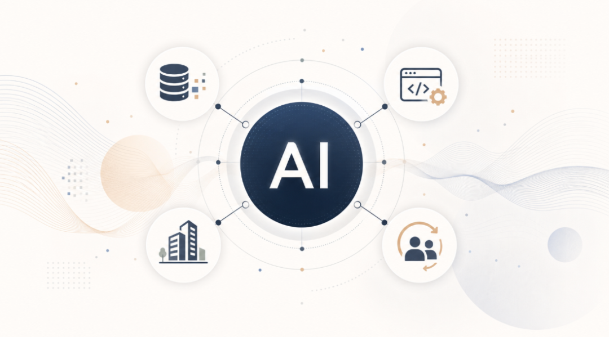
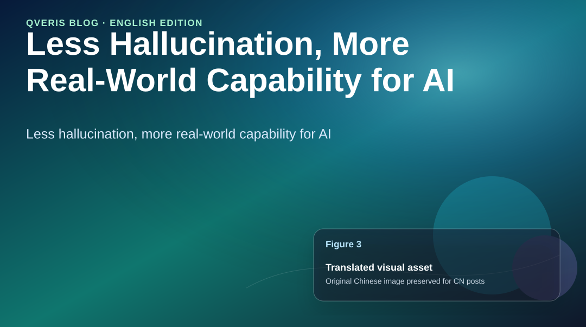
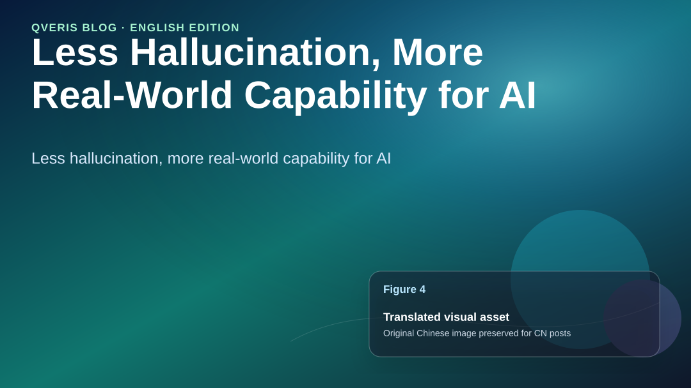

QVeris · Industry Observations

Figure 1: The next step for AI is not better conversation, but a more reliable connection to the real world.

Over the past year, many people have stopped asking whether AI can write articles, write code, or produce summaries. The answer to those questions is now largely clear. AI can do these things, and often does them well.

But when we actually try to put AI into a workflow and ask it to help complete a real task, the problem quickly becomes more complex.

A financial analyst wants AI to analyze the opportunity in a particular stock or ETF.

AI can write a logically coherent analysis. But has it pulled the latest market data? Has it checked company announcements? Has it verified news sources? Has it examined capital flows, industry data, and similar historical events?

A business operator wants AI to help analyze operational anomalies.

AI can summarize a few “possible causes.” But can it truly connect to CRM, ERP, finance systems, and ticketing systems? Does it know which data it is allowed to access and which data it is not? Can its reasoning process be reviewed?

An industrial investor wants AI to judge whether a complex asset is worth continued attention.

AI can explain concepts and provide an industry view. But has it systematically checked key evidence, compliance constraints, the competitive landscape, transaction cases, and potential demand? Can its value judgment be traced back to an evidence chain?

**In these scenarios, the problem with AI is often not that it is “not good enough at talking,” but that it is “not good enough at doing.” More precisely, AI still lacks a stable, trustworthy, and low-cost way to connect with real-world capabilities.**

## Hallucination Is Often Not About AI Being Unintelligent

We often say AI “hallucinates.” But in real business settings, many so-called hallucinations are not simply caused by insufficient model capability. They often come from more basic issues: AI has not obtained the latest data, does not know which tool to call, does not understand API parameters and limitations, does not know whether returned results are trustworthy, and does not understand enterprise boundaries around permissions, auditability, and compliance.

It is like putting a very smart person in a room with no internet, no tools, and no reference library, then asking them to answer every real-world question. They may produce an answer that sounds reasonable, but that answer may not be reliable.

Large models themselves are becoming stronger. That much is clear. But if a model cannot reliably connect to data, tools, systems, and processes, it will struggle to move from “answering questions” to “getting work done.”

Figure 2: As AI moves from answering questions to completing tasks, the core challenge also shifts from generation quality to real-world connectivity.

## The Real World Is Not a Chat Box

Real-world tasks usually cannot be solved with a single prompt.

A real task often contains many steps: understand the objective, break down the task, find the data, choose the tools, verify the results, generate the conclusion, and then make the process reviewable, accountable, and continuously improvable.

**For example:**

Financial research is not “searching for materials.”

It requires finding signals across news, announcements, market data, capital flows, industry data, and public sentiment, then judging whether those signals truly affect asset prices.

Public governance is not “looking at public opinion.”

It requires identifying risk events, relationships among entities, risk levels, and recommended actions from large volumes of public information, while keeping the process explainable and traceable.

Complex industrial asset evaluation is even less about “asking AI to write a report.”

It requires placing technical materials, public evidence, compliance rules, the competitive landscape, transaction cases, potential demand, and resource windows into one value judgment framework.

These tasks all have one thing in common: they require AI to connect with real-world capabilities, not merely generate a passage of text.

## Who Does This Matter To?

Figure 3: The value of a real-world capability network ultimately shows up in the work efficiency and decision quality of different groups.

If AI is only a chat tool, it mainly affects scenarios such as writing, customer service, programming, and knowledge Q&A. But if AI begins to truly call tools, connect systems, and participate in task execution, it will affect far more people.

It matters to developers.

Today, when developers want an AI Agent to call external capabilities, they often need to read documentation, register accounts, write adapter code, handle authentication, tune parameters, write exception logic, and maintain integrations as interfaces change.

A large amount of time is spent on repetitive “glue work,” rather than business innovation.

It matters to enterprises.

Enterprises do want to use AI, but they cannot casually let AI enter core processes. The reasons are practical: How are permissions managed? How is data controlled? Which tools were called? Where did the results come from? Who is responsible if something goes wrong? How is cost calculated? Without answers to these questions, AI will struggle to enter production systems.

It matters to data, API, and SaaS providers.

There are many high-quality data sources and tool services on the internet today, but most of them are designed for people and programmers. In the Agent era, these capabilities need to be discovered, understood, and correctly called by AI.

It matters to professionals. Financial analysts, lawyers, doctors, consultants, researchers, and business operators do not necessarily need an AI that “replaces” them.

They need an assistant that can help collect evidence, call tools, organize materials, detect anomalies, and form preliminary judgments.

## Real Cases We Have Seen

Figure 4: Both scenarios show that AI’s value is not only in generating content, but in organizing evidence, state, and feedback.

QVeris did not start from an abstract concept. We were repeatedly pushed toward this problem by many real-world scenarios.

**In an event-driven asset value discovery and investment research project, the problem we faced was:**

There is too much market information, too much noise, and too much speed. Public information, market data, industry developments, sentiment changes, and entity relationships may each be useful on their own, or they may simply be noise.

The system’s job is not to pile materials in front of analysts. It is to identify which events may affect asset value, which signals are worth validating, and which changes may form strategic opportunities.

**In an early risk identification and warning-response project based on large-scale public information analysis:**

Public information, entity data, policy rules, event text, and expert experience were mixed together.

Risks are often hidden in weak signals, and they need to be identified, classified, and handled as early as possible.

This system is not a simple information dashboard. It organizes risk events, entity relationships, risk semantics, expert rules, and feedback results into an operational closed loop.

**Scenarios like these remind us:**

**The true value of AI is not in “writing an analysis” on someone’s behalf, but in helping people turn complex information into a judgment process that can be verified, traced, and reviewed.**

## Why This Matters Now

Because AI Agents are moving from experimentation to production.

In the experimental stage, a demo only needs to run end to end to be exciting.

**But in the production stage, the questions are completely different:**

Can calls be made reliably?

Can results be explained?

Can permissions be controlled?

Can the process be audited?

Can costs be evaluated?

Can enterprise systems be integrated?

Can expert feedback be written back?

Can the system recover when errors occur?

None of these problems can be solved by a large model alone.

The model is responsible for understanding and reasoning. The Agent is responsible for planning and execution. But between the model and the real world, another layer of infrastructure is needed: one that helps Agents discover capabilities, inspect capabilities, call capabilities, record the process, evaluate results, and continuously calibrate.

Figure 5: QVeris aims to become the routing layer between models, Agents, and real-world capabilities.

## What Does QVeris Aim To Build?

We are building QVeris because we want to create a real-world capability network for AI Agents.

This network is not just APIs. It also includes data sources, tools, enterprise systems, professional methods, cloud services, industry knowledge, and executable workflows.

We want AI Agents, when facing a task, to do more than generate an answer from nothing. They should be able to find the right data and tools, understand their parameters, capabilities, and boundaries, call them within permitted access controls, record the calling process, hand results to human experts for review, and write feedback back into the system.

This is why we keep emphasizing a few keywords: capability discovery, capability evaluation, capability invocation, trusted execution, and feedback governance. They may not sound as exciting as “one all-powerful AI,” but they are much closer to real production.

QVeris has already built a capability network around 10,000+ callable capabilities, and we continue to advance it across product forms such as REST API, MCP Server, CLI, QVerisBot, Skill Hub, and Capability Map.

## We Want This To Be Useful To Others

If QVeris were only building a product for ourselves, the work would not be meaningful enough. What we truly want is for it to be useful to more people.

- For developers, it should reduce the cost of repeatedly connecting tools, writing adapters, and reading documentation.

- For enterprises, it should lower the risk of bringing AI into production systems.

- For data and tool providers, it should provide a new entry point for distribution and invocation.

- For professionals, it should amplify judgment rather than replace it.

- For everyday users, it should make complex capabilities easier to call through natural language.

This is also what we mean by “being beneficial to others.” It is not about how many people AI will replace. It is about enabling more people to use capabilities that used to be expensive, complex, and scattered.

**Search engines made information easier to access.**

**Cloud computing made computing power easier to access.**

**The mobile internet made services easier to access.**

**Large models made intelligence easier to access.**

**In the Agent era, real-world capabilities also need to become easier to access.**

That is what QVeris wants to do: give AI less hallucination and more real-world capability. Make AI not only better at speaking, but more reliable at helping people get things done.

We sincerely welcome peers in the AI industry, industrial partners, and collaborators across the data, tools, API, SaaS, cloud service, and developer ecosystems to exchange ideas and work with us.

QVeris hopes to work with more builders of real-world scenarios to connect scattered capabilities, organize verifiable data, tools, and professional methods into infrastructure that AI can reliably call, and together help AI move from demo to production, and from isolated applications to real deployment across industries.
