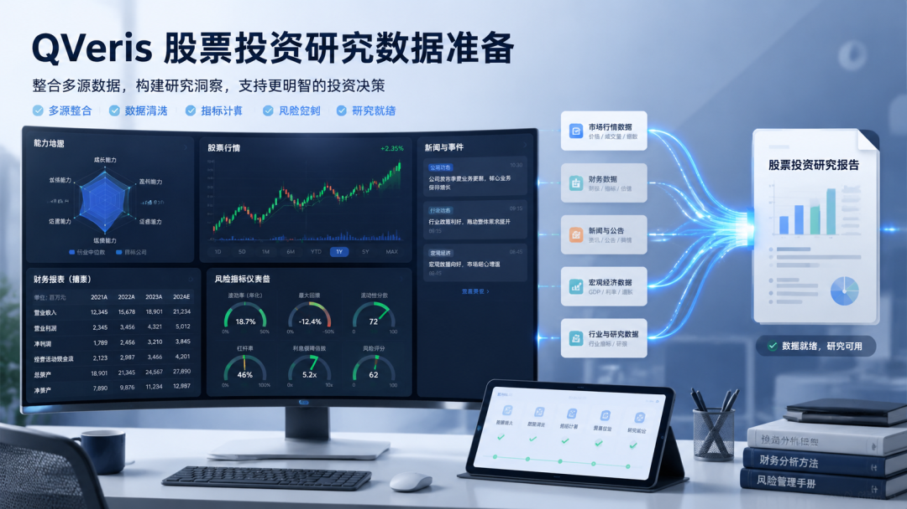
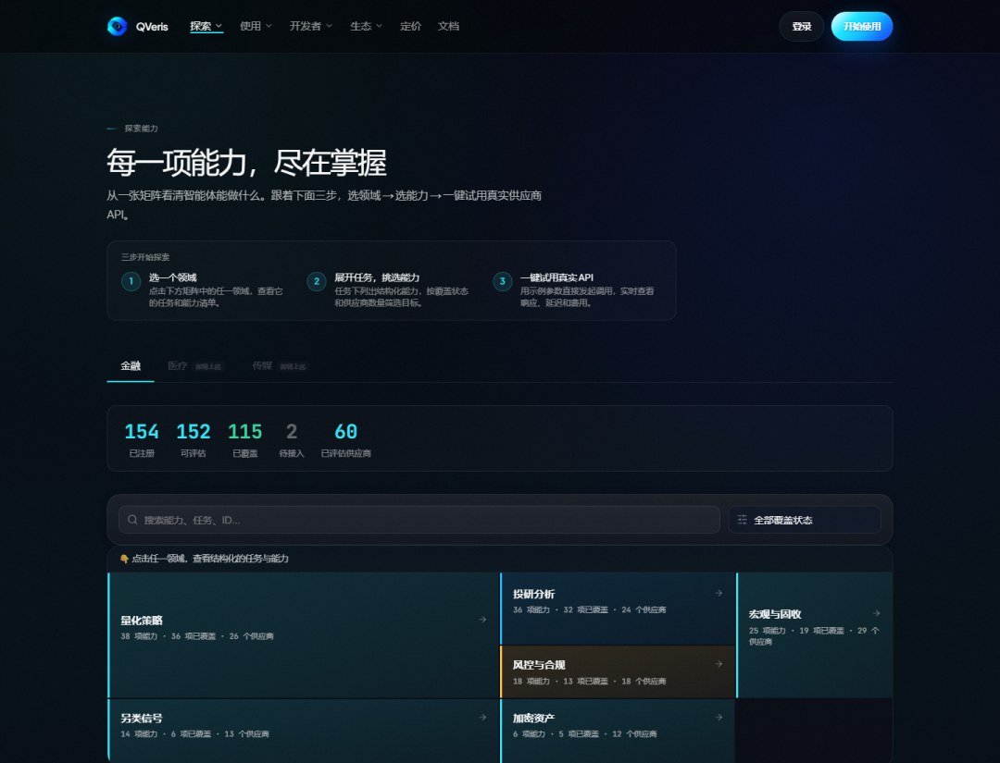
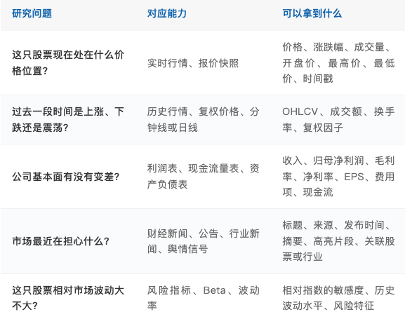
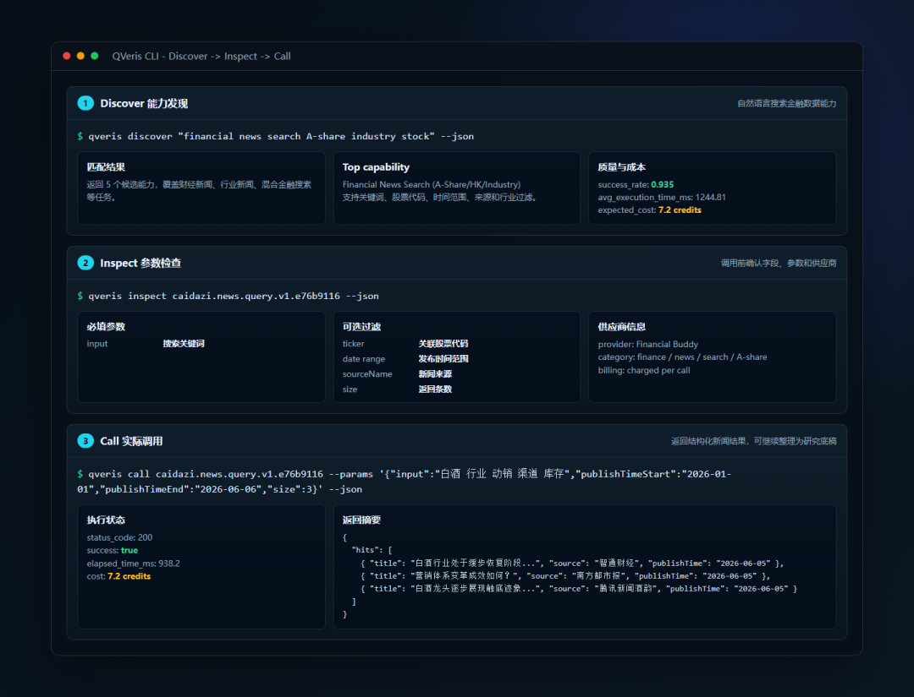
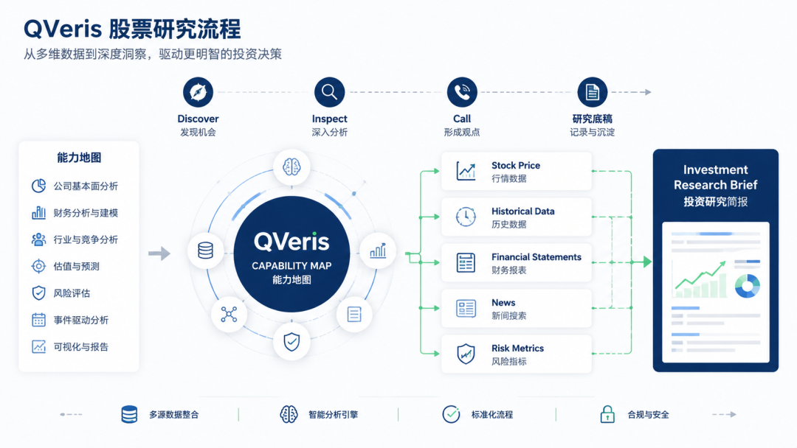

QVeris · Data Test

Using QVeris for AI stock research starts with getting data preparation right.

In stock research, the most underestimated part is often not the opinion itself, but the data preparation that comes before it. What QVeris is well suited for is precisely the process from "what do I want to look up?" to "I have source-backed material I can review."

Many stock analyses begin by asking, "Can I buy this?" But real research usually does not start that directly.

More often, you first confirm where the price is, then review historical movement. After reading the income statement, you still need to compare it with cash flow. For changes that do not show up clearly in the financial statements, you have to look for clues in news and announcements. None of these steps is complicated on its own, but the materials are scattered, and switching back and forth takes time.

This is where I see QVeris creating value: it does not make investment conclusions for you. Instead, it brings together the upfront work of finding capabilities, checking parameters, retrieving data, and reviewing sources into one workflow.

## Start with the Capability Map: Do Not Query Before You Know What Can Be Queried

In actual use, I do not start by guessing the name of a particular interface. I look at the capability map first.

The capability map breaks financial tasks down in a fairly detailed way: market data, historical prices, investment research analysis, macro and fixed income, risk and compliance, alternative signals, and financial news are all visible.

For the user, this step answers the question: "Is there an existing capability for this task?"

The benefit is that the research question is naturally separated into parts: stock price belongs with price data, financial reports belong with financial statements, and news and announcements belong with news and announcements. Once the pieces are separated clearly, later queries are less likely to get mixed together.

## Then Use the CLI in Three Steps: Discover, Inspect, Call

After reviewing the capability map, I move into the CLI. Here I care most about three actions: find first, inspect second, and call last.

Step 1: Discover

Use natural language to find capabilities. I tried searching with descriptions such as "financial news search A-share industry stock". The result was not just a tool name. It also listed candidate capabilities, success rate, average latency, call cost, and provider information.

Step 2: Inspect

I find this more important than calling directly. Even for news search, some capabilities support stock-code filtering, some support industries, and some only accept keywords. Checking the parameters and pricing model first saves a lot of wasted effort later.

Step 3: Call

For example, when searching for "白酒 行业 动销 渠道 库存", the returned results include news titles, sources, publication times, and highlighted snippets. These can go directly into the "recent variables" section of a research draft, instead of being manually copied one by one from search results.

Inspect is easy to skip, but it can expose two issues in advance: whether the capability can retrieve the fields I need, and whether this call is worth spending credits on.
## What QVeris Can Provide in Stock Research

Once the workflow is broken down into specific stages, QVeris's role becomes more intuitive. It does not just return a single answer. It retrieves different types of data separately.

### 1. Market Data: Establish Price and Trading Status First

Market data is the first thing to check. Current price, percentage change, trading volume, open, high, low, previous close, exchange, and timestamp help confirm where the stock currently stands.

This step is not meant to produce a conclusion. It sets the coordinates. The same financial report can be interpreted very differently depending on whether the stock is at a high level with expanding volume or at a low level with shrinking volume.

### 2. Historical Trends: Determine Whether a Price Move Is Just One Day's Volatility

Next, look at historical trends. Daily bars, adjusted prices, minute-level data, volume, turnover rate, plus Beta and volatility, can put "one day's rise or fall" back into a longer time window.

For example: Is the price close to a recent high? Has trading volume suddenly expanded? Is the trend moving in line with the industry? These questions all require historical data.

### 3. Company Basics: Confirm What You Are Researching

Company basics may look simple, but they are easy to overlook. Company name, stock code, main business, key products, founding date, registered capital, and concept tags first make the research subject clear.

This section does not need to be long, but it is better not to skip it. Many later judgments are ultimately tied to how the company actually makes money.

### 4. Financial Statements and Annual Reports: Check Whether Revenue, Profit, and Cash Flow Align

Financial statements are the backbone of fundamental research. The income statement, balance sheet, cash flow statement, as well as revenue, cost, expenses, net profit attributable to shareholders, EPS, gross margin, net margin, and year-over-year growth can all serve as core fields in a research draft.

The biggest risk here is looking at only one number. If revenue rises but profit does not, you need to examine costs and expenses. If profit looks good but cash flow cannot keep up, you should not assume the quality is strong. Only by putting the statements together can you see the operating condition.

### 5. News and Announcements: Fill the Time Lag in Financial Data

News and announcements add timeliness. Financial reports reflect what has already happened. News is more likely to show the variables the market is currently discussing, such as earnings previews, product prices, channel inventory, regulatory penalties, dividends and buybacks, or industry policy.

This information cannot determine an investment conclusion on its own, but it often explains why the stock price moved and can indicate which table or metric to go back to next.
## The Final Output Is Not a Conclusion, but a Research Draft

After completing one round of queries, I do not recommend writing a conclusion immediately. A better output is to first organize a research draft.

The draft can include company overview, current market data, historical trends, risk indicators, changes in revenue and profit, cash flow quality, recent news, positive factors, and risk factors. Put the facts in order first; then later discussions about valuation and judgment have a foundation.

## How I Understand This Workflow

For individual users, it saves time spent finding materials. For researchers, it makes data sources and parameters easier to review. For teams, it reduces differences in methodology caused by everyone searching separately.

So I would not describe QVeris as "AI that helps you trade stocks." It is more like an entry point for capabilities, bringing data sources, tool capabilities, and invocation processes that were previously scattered across different platforms into one chain.

The final judgment still comes back to valuation, cycles, risk preference, and human experience. What QVeris does well is make the messy data preparation before that judgment more orderly.

> If you remember only one sentence: QVeris does not write the investment conclusion for you. It makes the material preparation, data calls, and information organization before the conclusion faster and clearer.
