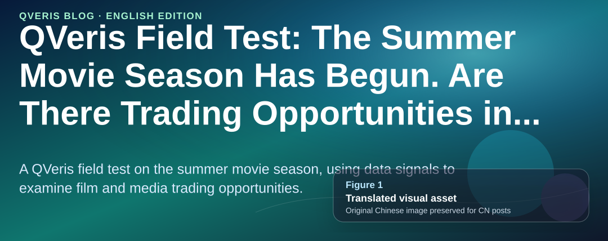
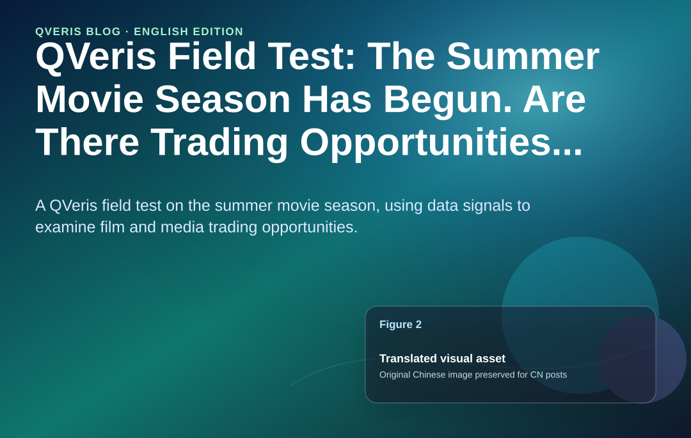
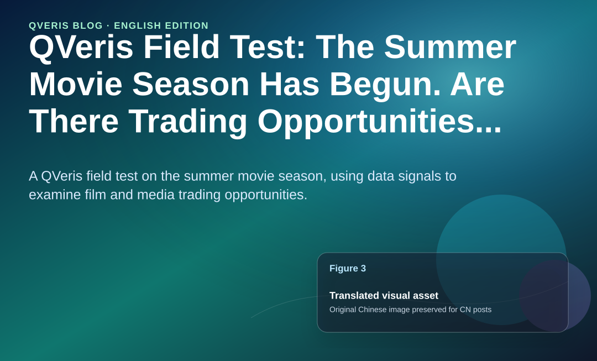

QVeris · Data Field Test

The Dragon Boat Festival box office reached RMB 392 million, while the number of screenings hit 1.44 million. Both set new records. More than 60 new films are lined up for the summer season. The "2026 Film Economy Promotion Year" has brought RMB 1.2 billion in moviegoing subsidies for the full year.

The news flow is lively. But have film and media stocks actually reacted? I used QVeris to pull box office data and company market data, and the answer is more complicated than the headlines suggest.
## First, the Box Office Fundamentals: Policy Is Working, and the Data Is Speaking

The "2026 Film Economy Promotion Year" was jointly promoted by the China Film Administration, China Media Group, and the Ministry of Commerce, and launched in Beijing in February. This was not just a slogan. Consumer subsidies were already deployed during the Spring Festival season, helping total box office for the period reach RMB 5.752 billion, while the average ticket price fell from above RMB 50 to RMB 47.8.

The same intensity has continued into the summer season. As of June 21, total summer box office had exceeded RMB 1.182 billion. Nearly 20 films were released during the three-day Dragon Boat Festival holiday, setting a new high for the same period over the past decade.

Among the hits, *A Letter to Grandma* has exceeded RMB 1.587 billion in cumulative box office, temporarily ranking second for the year. *Pegasus 3* and *Blades of the Guardians* are also near the top of the annual box office rankings. China Securities' research view is that both the quantity and quality of leading summer releases are better than last year, and box office revenue is expected to continue growing.

With both policy and box office acting as tailwinds, film and media stocks should be taking off, right?

Wait a moment. After looking through the stock price data pulled from QVeris, the picture is not that simple.
## Film and Media Stocks: One Sector, Four Very Different Faces

Using QVeris to connect directly to cn_financial_pro, I pulled daily data for four core film and media names over the past month, from May 20 to June 23:

China Film is the only one with a positive monthly return, and it rose 7.88% in a single day on June 23, with trading volume surging. Wanda Film and Enlight Media both fell 12% over the month, but both showed signs of a rebound over the past two trading days, June 22-23.

Here is the interesting part: the policy support is broad-based. Every company can benefit from moviegoing subsidies and strong seasonal demand. But the stock price reactions are completely different.

This suggests the market is not trading the broad concept of "positive news for the film and media sector." It is selecting specific names.

## Capital Flows: Who Is Buying, and Who Is Leaving?

**Stock prices are only the surface. I then pulled main-fund net inflow data on QVeris, and that is where the real divergence appeared**:

| Stock | 6/15 | 6/16 | 6/17 | 6/18 | 6/22 | Weekly Total |
| --- | --- | --- | --- | --- | --- | --- |
| Wanda Film | -18.37m | -0.51m | -56.24m | -7.62m | +26.32m | -66.42m |
| Enlight Media | -19.05m | -10.24m | -37.54m | -28.43m | -23.01m | -118m |
| China Film | +27.20m | -9.45m | -95.77m | +15.25m | +14.02m | -48.75m |
| Hengdian Entertainment | -20.21m | -20.04m | -13.40m | -5.73m | -26.52m | -85.90m |

Look at Wanda. On June 22, main-fund flow suddenly turned positive, with a net inflow of RMB 26.32 million, accounting for 15.6% of that day's turnover. This was the first meaningful return of main funds over the past two weeks.

Enlight Media was the weakest. Its five-day cumulative main-fund net outflow was RMB 118 million, and its 20-day cumulative outflow was RMB 444 million. The capital-market message was clear: not participating.

China Film is the one most worth watching. Although it was hit with a RMB 95.77 million outflow on June 17, when the whole sector was falling, it still saw net inflows on June 15 and June 22. Combined with today's 7.88% gain, this suggests capital is building positions in batches.

To be honest, I initially thought Enlight Media should be the leader. After all, *A Letter to Grandma* broke RMB 1.5 billion, and Enlight is one of the main producers. But the data shows money moving toward China Film. I checked the capital-flow data three times before accepting it. This feedback changed how I understood "how the market thinks."

Although Enlight has a blockbuster, the market may be worried about concentration risk from a single film's box office. If one film accounts for most of the revenue expectation, visibility into the follow-up content pipeline may not be enough. China Film, by contrast, is an integrated platform spanning distribution, exhibition, and production. The policy dividend, especially the RMB 1.2 billion in subsidies that mainly flows through cinema channels, transmits more directly to it.

That said, one week of data has limited explanatory power. The real peak of the summer season comes in mid-to-late July. At that point, the box office data and capital flows will be worth pulling again in QVeris.
## How to Track This Yourself in QVeris

If you also want to monitor the film and media sector in real time, the experience looks roughly like this:

👤 **"Help me pull the one-month price trends and capital flows for Wanda Film, Enlight Media, and China Film."**

🤖 **"From 5/20 to 6/23, Wanda fell from 9.40 to 8.26 (-12.1%), Enlight fell from 13.50 to 11.87 (-12.1%), and China Film rose from 14.68 to 15.34 (+4.5%). On the capital side, Enlight saw five-day main-fund net outflows of RMB 118 million. China Film had five-day net outflows of RMB 48.75 million, but recorded a single-day net inflow of RMB 14.02 million on 6/22. Hengdian Entertainment continued to see outflows, with a five-day cumulative total of -RMB 85.90 million."**

👤 **"Can we query summer box office data?"**

🤖 **"At present, cn_financial_pro on QVeris mainly covers A-share market data and capital-flow data. Real-time box office rankings need to be obtained through Beacon Professional or Maoyan Professional, and are not covered by the current data source. But you can track capital movements in film and media stocks to reverse-check box office expectations. If institutions are optimistic about a certain film in advance, they usually begin positioning in related companies 1-2 weeks before release."**

👤 **"China Film rose 7.88% on 6/23. Is it sustainable?"**

🤖 **"On 6/23, China Film closed at 15.34 (+7.88%), with a significant increase in volume. But from the capital-flow perspective, 20-day DDE remains at -RMB 227 million, indicating that medium- and long-term capital is still reducing positions. The short-term rebound may be driven by expectations around the summer season. Whether it can continue depends on whether subsequent box office data can exceed expectations. For now, it can only be said that short-term capital is paying attention, while the medium-term trend has not yet confirmed a reversal."**
## Scope and Boundaries

The data window for this article is May 20 to June 23. It covers the early launch stage of the summer movie season, but not the peak season. The real box office high point usually comes from mid-to-late July through August. Current data can only reflect market expectations during the warm-up phase.

Several limitations should be noted. This article does not cover box office revenue-sharing data, profitability estimates by individual film producer, or comparisons with Hong Kong-listed film and media companies such as Alibaba Pictures and Maoyan Entertainment. QVeris currently covers A-share market data and capital flows through cn_financial_pro. For a more complete industry-chain analysis, it is recommended to also pull Hong Kong stock data and other financial-reporting data sources.

This article provides a set of verifiable observational data and does not constitute investment advice.

>
> Disclaimer: The data in this article comes from real-time API calls on the QVeris platform and is for reference only. It does not constitute investment advice. Markets involve risk; investors should act with caution. Data cutoff date: June 23, 2026.
>
