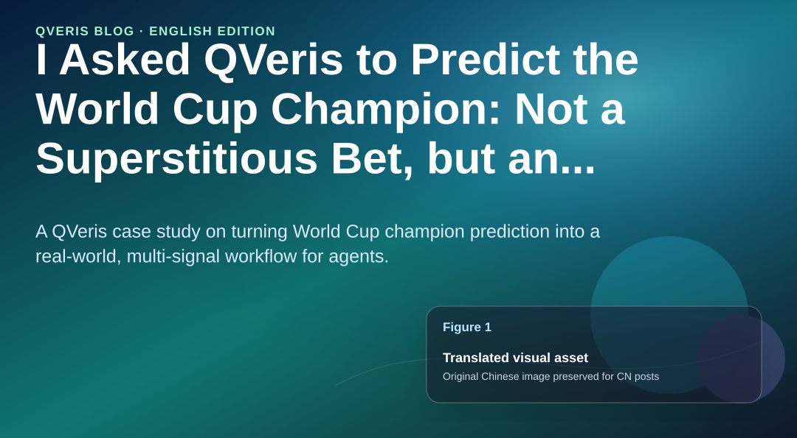
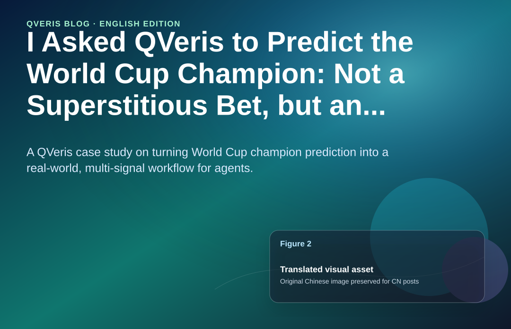
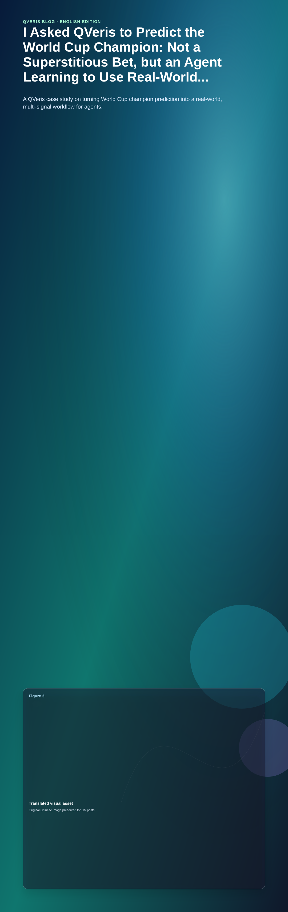

QVeris · Case Demo

>
> Core idea: predicting a champion is not about asking a large model to bet on a team by instinct. It is about enabling an Agent to call real-world signals through QVeris and continuously update its judgment of who is more likely to win.
>
> QVeris
>
**Use QVeris Discover · Inspect · Call to turn World Cup champion prediction into an updatable, multi-signal workflow**
## Why “Guessing the Champion” Is a Strong Use Case for QVeris

Once the World Cup begins, the question that sparks the most debate is always the same: who will win it all?

Traditional answers usually fall into three categories. The first is to look at betting odds and back the favorite. The second is to follow fan sentiment and assume the loudest team has the best chance. The third is to ask a large model to guess directly. The problem is that none of these methods is stable enough. Odds reflect market expectations, not match outcomes. Fan sentiment can be amplified by a single performance. And if a large model relies only on memory and linguistic reasoning, it can easily produce an answer that sounds plausible but lacks real-time evidence.

The valuable thing is not for AI to say, “I like Spain” or “France has the highest probability.” The valuable thing is for an Agent to work like a tournament intelligence analyst, continuously connecting to real-world data: fixtures, results, lineups, injuries, player form, odds movement, news events, social-media momentum, host-city weather, travel distance, historical knockout-stage performance, and even sentiment reversals and breaking incidents.

This is exactly where QVeris is easiest to understand. It does not ask an Agent to “predict by feel.” It enables an Agent to discover, inspect, and call a set of real-world capabilities, turning scattered data sources into an executable champion-prediction workflow.
## Case Setup

##  

##  

##  

##  

##  

Suppose a sports media company, content platform, or brand marketing team wants to build a World Cup Champion Intelligence Agent. An operator only needs to enter one sentence:

“Based on the latest match results, team form, injuries, odds, news, and social-media signals, determine which team is most likely to win this World Cup and explain why.”

A normal chatbot might immediately return a team name. But in a QVeris workflow, the Agent first decomposes the question into multiple subtasks: Which teams are market favorites? Which teams are in the best recent form? Which teams have an easier group-stage path? Which teams have injury risks in their squad? Which teams have stronger knockout-stage experience? Are there major positive signals or risks emerging from social media and news?

The final output is not just an answer, but a “championship probability radar” that can be updated over time: first contender, second contender, dark horses, risk teams, and the data sources and signal strength behind each judgment.

## How QVeris Turns an Agent from “Can Talk” into “Can Search, Calculate, and Verify”

The core capability highlighted on the QVeris website is a capability routing network: enabling AI Agents to Discover, Inspect, and Call real-world capabilities through a unified protocol. In the context of World Cup champion prediction, this mechanism can be broken down into three steps.

First, Discover: the Agent uses natural language to find capabilities. For example, it may search for capabilities such as “real-time World Cup fixtures and scores,” “national-team injury news,” “team Elo / FIFA rankings,” “odds movement,” “social-media popularity,” and “weather and host-city information.” Developers do not need to hard-code every interface in advance. The Agent dynamically finds candidate tools based on the task.

Second, Inspect: the Agent checks each capability’s parameters, response structure, latency, success rate, and cost. For example, does a fixture tool support filtering by national team? Does a news tool support time ranges? Can an odds tool return historical movement? Can a social-media tool aggregate popularity by keyword?

Third, Call: the Agent calls the most suitable capability and receives structured results. It then feeds those results into an explainable prediction model to form the reasoning chain behind “why this team looks strong.”

This is the difference between QVeris and ordinary API calling: developers do not manually wire together a pile of interfaces for each scenario. Instead, they let the Agent find and call capabilities through QVeris at task time.

## Prediction Model: Do Not Worship a Single Metric; Cross-Validate Multiple Signals

In this case, the Agent does not directly ask, “Who is the strongest?” Instead, it builds a multi-signal scoring model. Each signal can be routed by QVeris to different capabilities and then aggregated into a unified view. A simplified version looks like this:

| Dimension | Weight | Callable signals | Role |
| --- | --- | --- | --- |
| Team fundamentals | 30% | FIFA/Elo rankings, squad market value, core player form, attacking and defensive efficiency | Determines the ceiling |
| Recent form | 20% | Last 10 matches, goals scored/conceded, opening-match performance, key-player minutes | Determines whether current momentum is real |
| Tournament path | 15% | Group strength, potential knockout opponents, travel distance, rest days | Determines the difficulty of winning |
| Injuries and squad stability | 15% | Injury list, suspension risk, starter rotation, coaching adjustments | Determines the floor |
| Market expectations | 10% | Odds, prediction models, expert surveys, money flow | Reflects external consensus |
| Sentiment and psychological signals | 10% | News sentiment, social-media popularity, controversy events, pressure management | Captures unstructured variables |

## If We Asked a QVeris Agent to Pick the Champion Today

Based on public pre-tournament forecasts, market odds, supercomputer models, and early tournament performance, a reasonable sample conclusion could be written like this:

**First contender: France.**

**First: the strongest immediate competitive level.** France’s 3-1 win over Senegal is the highest-quality victory of the opening round: a strong opponent, a convincing scoreline, and superstar delivery already visible. By contrast, Spain’s 0-0 draw with Cape Verde, Portugal’s 1-1 draw with Congo, and Brazil’s draw with Morocco all contain obvious blemishes.

**Second: the deepest squad in the tournament,**

- **Forward line:** Mbappe + Dembele + Olise/Barcola: four explosive options

- **Midfield:** Camavinga + Tchouameni + Zaire-Emery: young, high-coverage, technically strong

- **Defense:** Saliba + Konate + Kounde: top-tier Premier League / La Liga quality

- **Goalkeeper:** Maignan: a Golden Glove favorite

No other team can match that level of configuration across all four areas.

**Third: the most mature knockout-stage DNA**

2018 champion -> 2022 runner-up, losing narrowly on penalties -> 2026. Deschamps’ France has already proved in World Cup knockout matches that it does not collapse under pressure.

**Fourth: group-stage advantage:** France has already taken 3 points in “Group of Death” Group I (France, Senegal, Norway, Iraq), and Norway also won. France’s progression is almost beyond doubt, which allows it to manage physical workload more calmly. Under a 48-team format, this is extremely important.

**Fifth: odds are confirming the lead**

Trading volume in prediction markets has already exceeded USD 2 billion across Polymarket and Kalshi combined. This is not random betting; it is information aggregation with real money. Capital is voting through France “contracts.”

For the Agent, France would be classified as a champion candidate with a “high floor + high burst potential.”

**Second contender: Spain.** The closest team to France, Spain remains an extremely strong candidate. Its strengths are a complete system, strong control of possession, the ability to conserve energy in North American heat through ball possession, and a match-changing player in Yamal. The short-term risk is that the 0-0 draw against Cape Verde has led the market to question Spain’s efficiency against compact defenses, and prediction-market prices have already pulled back.

**Third tier: England, Argentina, Portugal.** England has squad depth and market support, but stability at decisive tournament moments remains a variable. Argentina is the defending champion, with strong experience and mentality, but its core age profile and the difficulty of winning consecutive titles need to be discounted. Portugal has a highly complete squad and the potential to become a dark-horse champion.

**Risk watch: Brazil.** Brazil is always a title contender. But if the opening performance exposes issues in attacking-defensive balance and squad stability, the Agent will not keep overrating Brazil blindly because of its historical aura. Instead, it will mark Brazil as a risky favorite with “very high upside and high volatility.”

**Dark-horse watch: Netherlands, Morocco, Japan.** A dark horse does not mean a team is certain to win. It means that, because of its path, attacking-defensive structure, team discipline, or sentiment momentum, it may outperform expectations. The value of a QVeris Agent is that it continuously monitors whether these signals are turning from “noise” into “trend.”
## Final Output Example: The Agent Does Not Bet on an Answer; It Produces an Updatable Championship Radar

If this analysis is compressed into an operator-readable conclusion, the World Cup Champion Intelligence Agent could output:

**Current most likely champion: France.**

**Strongest challenger: Spain.**

**High-attention candidates: England, Argentina, Portugal.**

**High-volatility favorite: Brazil.**

**Dark-horse watch: Netherlands, Morocco, Japan.**

But this is not a static answer. After each round of matches, the Agent should call match results, injury, odds, news, and social-media signals again and update the score. If a core Spanish player gets injured, France’s odds fall quickly, Argentina advances repeatedly with low energy expenditure, or a dark-horse team avoids strong opponents in its knockout path, the championship radar should change automatically.

That is the real meaning of “using QVeris to predict the champion”: not making one prediction, but turning prediction into a continuously running, verifiable, reviewable intelligence workflow.
## Why This Case Highlights the Product Value of QVeris

First, World Cup prediction naturally requires multi-source data. No single API can fully answer “who can win the championship.” An Agent must process fixtures, teams, news, injuries, odds, social media, cities, and historical data at the same time. QVeris’ capability routing network directly solves the problem of “tools are too scattered, and the Agent does not know which one to use.”

Second, prediction problems require explainability. A good Agent cannot simply say, “I think Spain will win.” It needs to explain the evidence: which metrics support Spain, which metrics support France, and which metrics suggest risk for Brazil. Through Inspect and structured Calls, QVeris makes each step traceable and reviewable.

Third, the World Cup is a real-time event. Pre-tournament predictions, predictions after the first round, predictions after the group stage, and predictions before the knockout stage may be completely different. QVeris enables Agents to call real-time capabilities on demand instead of relying on outdated memory.

Fourth, this is not only a sports case. It can also transfer to finance, branding, public sentiment, and business decision-making. Questions such as “Which company is most likely to become the AI winner?”, “Which industry is forming a trading opportunity?”, and “Which brand is gaining social-media momentum?” are all, at their core, multi-signal, multi-tool, multi-stage judgment problems.

## Conclusion

If you ask a normal large model to predict the World Cup champion, it may produce an answer that sounds like it came from an expert.

If you ask an Agent supported by QVeris to predict the World Cup champion, it should first find data, then inspect tools, then call capabilities, and finally deliver an explainable, updatable, reviewable judgment based on multi-source signals.

Therefore, the point of this case is not “which team AI picked correctly.” It is “how the Agent completed the act of prediction.”

The World Cup is only an entry point. What is really being demonstrated is QVeris’ core capability: moving Agents from language reasoning to real-world action, from one-off answers to continuous workflows, and from “can talk” to “can search, calculate, verify, and update.”

**Disclaimer**

This article is a QVeris product capability demonstration case. It does not constitute sports betting, investment, or business decision-making advice. The championship judgment in this article is a sample inference, and actual outcomes will continue to change with matches, injuries, schedules, and unexpected events.
