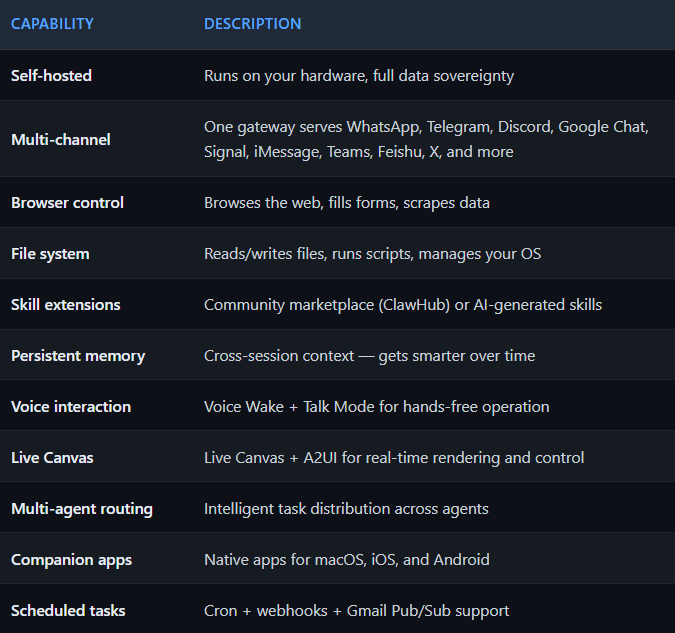
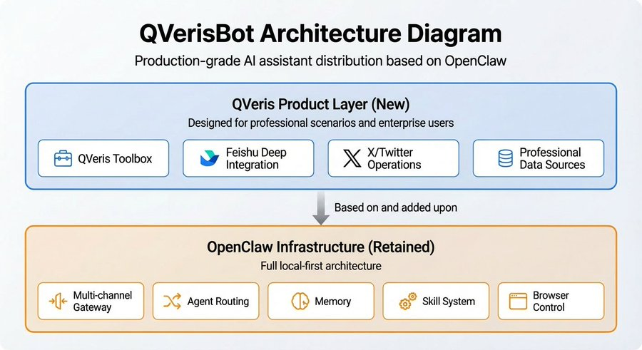
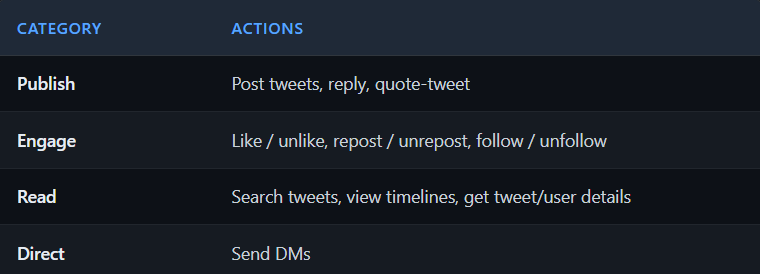
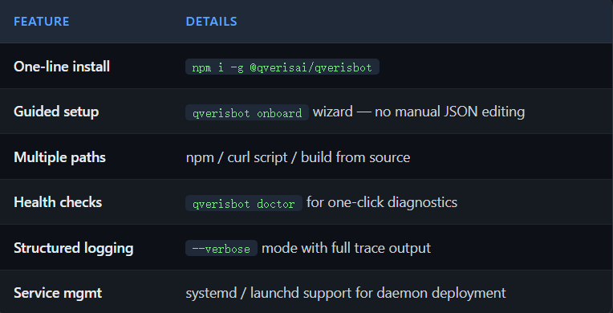
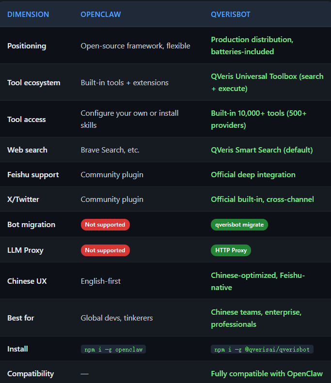
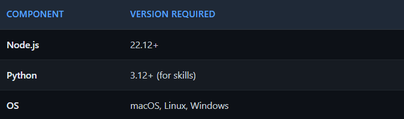
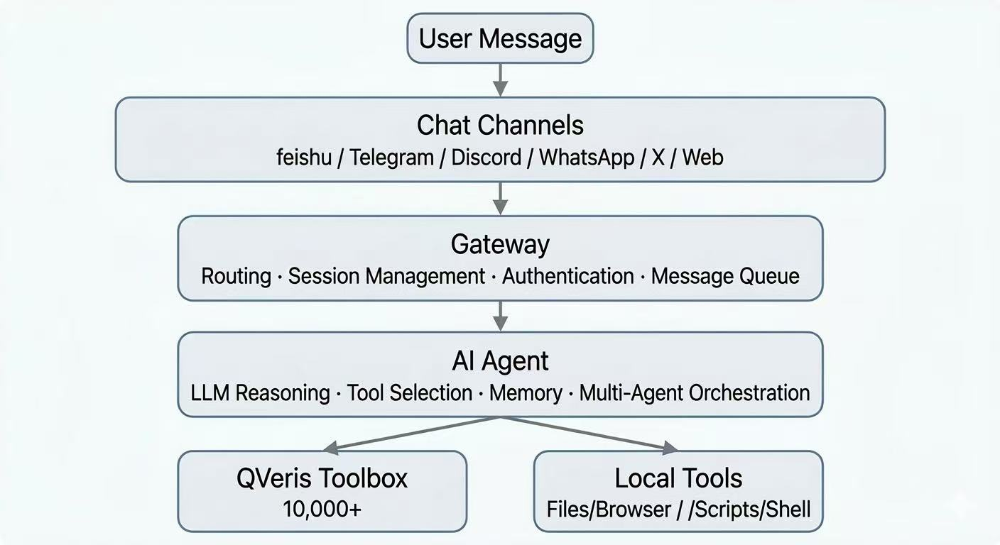
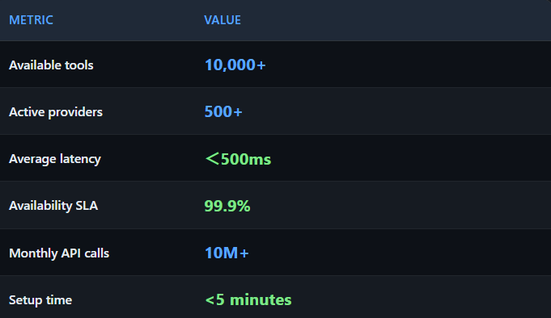
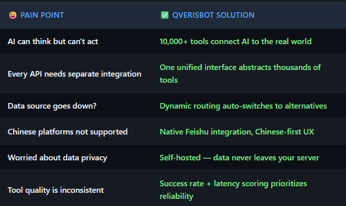

Built on OpenClaw's local-first architecture, powered by QVeris Universal Toolbox, connected across Feishu, Telegram, Discord, and more

## The One-Liner

**QVerisBot = OpenClaw's local-first architecture + QVeris's 10,000+ tool ecosystem + multi-platform messaging**

If OpenClaw is "an AI that actually does things," QVerisBot is that same AI with a universal toolbox — one that can see, reach, and act on the real world.

## First, What Is OpenClaw?

OpenClaw is the open-source personal AI assistant framework created by Peter Steinberger. Since its launch in January 2026, it has become one of the fastest-growing open-source projects in the AI space. Its core philosophy is **local-first**:

- **Runs on your own machine**: Mac, Windows, or Linux. Your data stays local.
- **Multi-channel gateway**: One process connects WhatsApp, Telegram, Discord, Slack, Google Chat, Signal, iMessage, BlueBubbles, Microsoft Teams, Matrix, Zalo, Zalo Personal, WebChat, Feishu, X — simultaneously.
- **Agent-native**: Built-in tool use, session management, persistent memory, multi-agent routing.
- **Open source**: MIT licensed, community-driven, extensible via Skills.

Users consistently say things like: ***"It's running my company"*****,*****"This is the first software in ages I constantly check for new releases"*****, and*****"After years of AI hype, nothing fazed me. Then I installed OpenClaw."***

## OpenClaw Core Capabilities



## So What Is QVerisBot?

**QVerisBot is a production-focused distribution built by the QVeris AI team on top of OpenClaw**.It keeps OpenClaw's entire local-first architecture and adds a QVeris-first product layer designed for professional and enterprise use cases:



## What Makes QVerisBot Different

## QVeris Universal Toolbox: 10,000+ Tools, Search-and-Execute

This is the single biggest differentiator.

A typical AI assistant needs developers to manually find APIs, read docs, write adapters, and handle authentication — each tool integration takes 5-30 minutes. QVerisBot has the QVeris search-and-execute engine built in:

- **Semantic search**: Describe what you need in natural language (e.g., "get Beijing weather"), and the system finds the best tool from 10,000+ options across 500+ providers
- **Unified execution**: One standard interface dispatches to thousands of heterogeneous tools
- **Dynamic routing**: When a tool goes down, automatically switches to an equivalent alternative
- **Quality scoring**: Every tool has success rate and latency stats; the system prioritizes reliable options
- **Real-world results**: In testing with the Kimi LLM, adding QVeris improved complex task completion from 33% to 68%, while reducing failure rate from 18% to 0%.

## Feishu (Lark) Deep Integration: The Gateway for Chinese Teams

QVerisBot provides first-class Feishu support:

- **WebSocket long-polling**: Real-time message delivery, zero-lag responses
- **Group + DM support**: Trigger via
- [@mention](https%3A%2F%2Fx.com%2F%40mention)
-  in groups, or chat privately
- **Rich media**: Images, files, interactive cards
- **Granular permissions**: Independent group and DM policies
- **Chinese-optimized**: Configurable `promptSuffix` for automatic Chinese prompting

This means teams in China can have a 7×24 AI assistant living inside their Feishu workspace — querying data, writing reports, monitoring markets, managing calendars — with all data on their own servers.

## Full X/Twitter Operations

QVerisBot includes a complete X (Twitter) operations suite:



The key feature: **cross-channel operations**. You can tell QVerisBot in Feishu "Reply to

[@karpathy](https%3A%2F%2Fx.com%2F%40karpathy)

's latest tweet," and it executes directly via X API — no platform switching needed.

## Production-Grade Developer Experience



## Bot Migration: Seamless Cross-OS Transfer

QVerisBot's unique `qverisbot migrate` command enables migrating your bot's complete state across operating systems:

```plaintext

bash

qverisbot migrate export # Export knowledge, memory, and skills (credentials automatically stripped)

qverisbot migrate import # Import to new environment

qverisbot migrate doctor # Diagnose migration compatibility

```

**Key features:**

- **Secure stripping**:Automatically removes all sensitive credentials and API keys during export
- **Complete preservation**: Knowledge base, skill configurations, memory, and scheduled tasks are all retained
- **Cross-platform**: Seamless switching between Mac → Linux → Windows
- **Enterprise-grade**: Supports backup strategies and version management

This is a QVerisBot-exclusive feature; OpenClaw does not support this migration mechanism.

## LLM Proxy Support

QVerisBot natively supports HTTP Proxy configuration for network-restricted environments:

```plaintext

bash

export HTTP_PROXY=http://proxy.example.com:8080

export HTTPS_PROXY=http://proxy.example.com:8080

qverisbot gateway

```

Ideal for corporate intranets and international teams.

## OpenClaw vs QVerisBot: Which Should You Choose?



**The short version**: OpenClaw is the framework; QVerisBot is the product. If you want to deeply customize, choose OpenClaw. If you want a professional AI assistant that works out of the box, choose QVerisBot.

## Use Cases

## Use Case 1: 24/7 Financial Analyst

Deploy QVerisBot in a Feishu group:

[@QVerisBot](https%3A%2F%2Fx.com%2F%40QVerisBot)

 Monitor A-share stocks with significant price movements every 15 minutes and recommend high-growth-potential picks

It automatically creates a scheduled task, connects to financial data sources (TongHuaShun, EastMoney, etc.), and pushes analysis reports in real time. When one data source goes down, dynamic routing switches to a backup — that's QVeris resilience in action.

## Use Case 2: Content Creation & Social Media Operations

- Tell QVerisBot in Feishu: "Search for the latest AI Agent news and draft an English tweet"
- It searches via QVeris, writes the tweet, and publishes directly via X API
- Set up scheduled scans of key accounts with engagement recommendations

## Use Case 3: Multi-Source Data Hub

QVerisBot integrates data from 500+ providers covering finance, research, travel, social media, and more:

- **Financial Data**: Binance, iFinD, CoinGecko, Etherscan, ...
- **Search & Content**: Brave Search, Firecrawl, NewsAPI, arXiv, PubMed, ...
- **Business Intelligence:** Crunchbase, LinkedIn, Notion, ...
- **Lifestyle Services:** OpenWeather, Amadeus, Google Maps, World Bank, ...

You: What's the current Bitcoin price? And what's the latest Fed rate decision?

QVerisBot:

- Fetches real-time BTC price via CoinGecko/Binance
- Pulls latest Fed news via Bloomberg/NewsAPI
- Synthesizes multiple sources into a comprehensive analysis

## Use Case 4: Enterprise Workflow Automation

- **Email management**: Connect Gmail/Outlook, auto-classify, prioritize, draft replies
- **Calendar**: View schedules, create meetings, send reminders
- **Project management**: Integrate GitHub/Jira, track progress, generate reports
- **Knowledge management**: Connect Feishu Wiki, search docs, organize notes

## Use Case 5: Developer's Swiss Army Knife

- Query any API data via natural language (weather, exchange rates, stocks, geocoding...)
- Auto-generate charts and visual reports
- Monitor service health, alert on anomalies
- Manage multiple servers, batch operations tasks

## System Requirements



## Architecture



## Key Metrics



## Quick Start

## Option 1: npm Install (Recommended)

```plaintext

bash

npm i -g @qverisai/qverisbot

qverisbot onboard

```

**Note**: `qverisbot` is the primary command; `openclaw` is available as a compatibility alias.

## Option 2: One-Line Script

**macOS/Linux:**

```plaintext

bash

curl -fsSL https://qveris.ai/qverisbot/install.sh | bash

```

**Windows PowerShell:**

```plaintext

powershell

irm https://qveris.ai/qverisbot/install.ps1 | iex

```

## Option 3: Build from Source

```plaintext

bash

git clone https://github.com/QVerisAI/QVerisBot.git

cd QVerisBot

pnpm install && pnpm build

pnpm qverisbot onboard

```

After `qverisbot onboard`, the wizard guides you through:

1. Model configuration (Claude, GPT, Kimi, DeepSeek, and more)
2. QVeris API key setup
3. Channel configuration (Feishu / Telegram / Discord / etc.)
4. Gateway launch

```plaintext

bash

qverisbot gateway --port 18789

```

Then send a message to your bot in Feishu/Telegram/Discord — and you're live.

## Why QVerisBot?



## About QVeris AI

QVeris AI focuses on the **action infrastructure layer for the Agent era**— building the "capability internet" that AI can understand and invoke.

**QVeris Current Positioning:** A unified interface for capability search and execute, enabling AI to discover and one-click invoke 10,000+ tools through semantic search.

**QVerisFlow (Next-Gen Product, In Development):** Responsible for complete autonomous workflow orchestration, achieving full automation from requirement understanding to task execution.

- **Website**:
- [https://qveris.ai](https%3A%2F%2Fqveris.ai%2F)
- **QVerisBot GitHub**:
- [https://github.com/QVerisAI/QVerisBot](https%3A%2F%2Fgithub.com%2FQVerisAI%2FQVerisBot)
- **OpenClaw GitHub**:
- [https://github.com/openclaw/openclaw](https%3A%2F%2Fgithub.com%2Fopenclaw%2Fopenclaw)

 "We want to be the Google of the Model Agent ecosystem. Google doesn't produce web pages but indexes all of the internet's information. QVeris doesn't produce tools but indexes and distributes all of the digital world's capabilities." — Linfang Wang, Founder & CEO, QVeris AI

***Powered by QVeris | This article is based on the OpenClaw website, QVerisBot GitHub, QVeris official site, and public reporting.***
